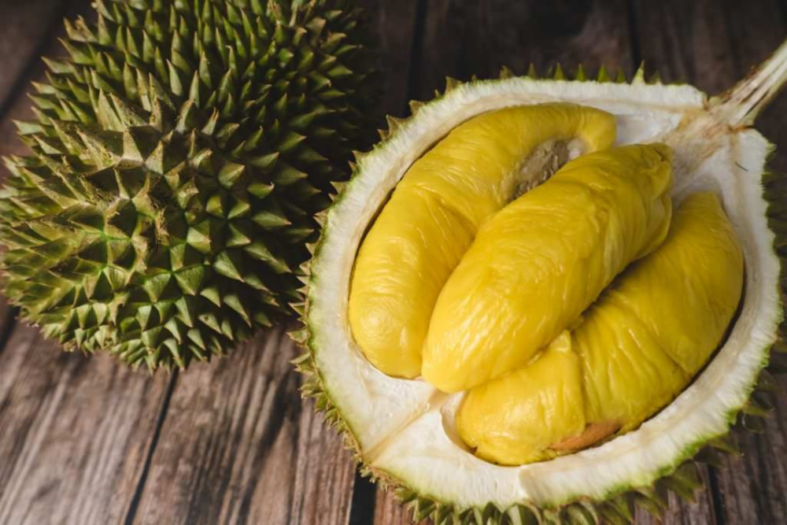
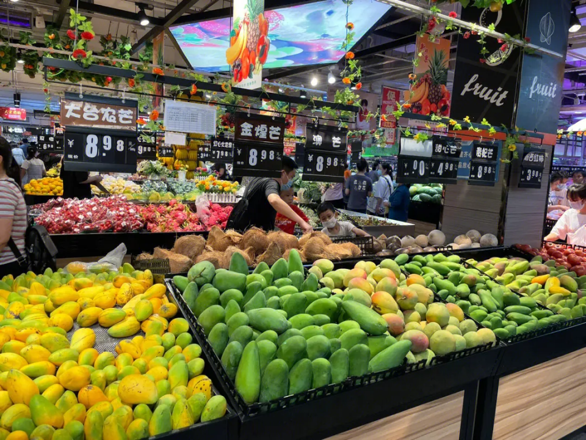
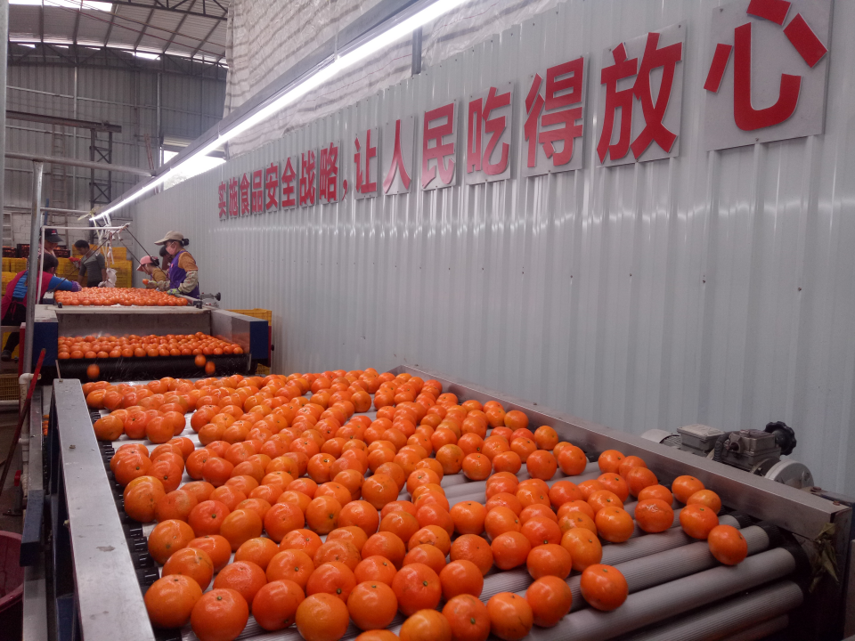

# 水果越来越贵了？专家：未来真有可能变成奢侈品，但可能是个好现象

**核心要点：**

  * _1_ 今年海南三亚首批国产榴莲已进入成熟期，但因种植条件不是特别好，所以商品率较低。指望国产榴莲迅速拉低整体价格，短期来看不太现实。
  * _2_ 果园的生产投入中除了人工，化肥、农药、包装用品、物流运输等都在涨价。
  * _3_ 我国果农的水果种植技术比较强、非常有经验，但这些经验很难用数字化来总结。
  * _4_ 水果要好吃，就要达到一个合理的糖酸比。但东方人确实比较追求甜口，很多水果也是一味求甜，所以在育种和种植管理上都朝着这个方向使劲，这就导致很多水果越来越没有风味了。

**水果价格涨涨涨！据统计，今年1月至5月鲜果同比涨幅达到8.3%，位居涨幅第一。许多消费者都在感慨还没等实现“车厘子自由”“榴莲自由”，连普通水果也快吃不起了。水果涨价背后，果农们、水果店老板们却纷纷表示不赚钱。**

**水果为什么会这么贵？钱都被谁赚走了？网红水果对市场又产生了哪些影响？腾讯新闻《一起来唠科》特约主持人段玉龙与中国农业大学农民研究所名誉所长朱启臻教授和果树技术专家、三农领域创作者魏铮一起来探索“水果贵”背后的原因，以及水果行业的困境与未来。**

一、网红水果值得高价追捧吗？

**段玉龙：说起水果贵，今年大家印象最深、讨论最多的是榴莲。它的价格一度像过山车一样忽高忽低，这背后究竟是什么原因？**

**魏铮:** 榴莲基本上是所有水果中的价格之王， 今年榴莲价格比车厘子还要高。 **榴莲贵主要是种植成本高。**
一棵榴莲树要达到丰产期，至少要五到八年的种植时间。如果在种植的时候遭遇一些气象灾害，比如暴雨、干旱、强风，都会影响榴莲的产量。

_猫山王榴莲（图源：duriandelivery）_

**榴莲分为A、B、C级。A、B级属于比较高品质的榴莲，所以泰国农业部公布的原产地收购价格都在20美金左右。在海南种植榴莲的种植户表示，目前种植猫山王榴莲，一颗苗的成本是160元，地租成本800元，再加上遮阳网和肥料成本，一亩地的榴莲大约投入1.2万，这还只是前期投入。两年后可以第一批挂果，还要再等4、5年丰产才能够售卖。高投入伴随着风险，成本自然不会低。此外，榴莲在运输过程中损耗成本也是比较高的。**

**不过影响榴莲价格最核心的因素还是供求关系。泰国每年大约有70万吨能出口我国，已经占到了整个泰国榴莲出口量的90%。但我国去年光苹果就销售了3600万吨，指望泰国的70万吨榴莲就能满足我们所有人的“榴莲自由”是远远不够的，所以今年也放开了越南的榴莲进入，后续菲律宾、柬埔寨等国家可能也会加入。但目前供应量和消费量确实还不对等，价格高也还会持续一段时间。也有人寄希望于国产榴莲。今年海南三亚首批国产榴莲已进入成熟期，但因为毕竟种植条件不是特别好，又是第一年，所以可能商品率会比较低，估计能够上市销售的也就4000斤左右。广西目前也有一些榴莲可能挂果了，但也还没有商品果，所以指望国产榴莲迅速拉低整体价格，短期来看还不太现实。**

**段玉龙: 这些年榴莲消费量越来越多，喜欢吃它的年轻人也越来越多，已经成为网红水果了。如何看待榴莲、牛油果等这些网红水果？它们值得大价钱追捧吗？**

**朱启臻:**
我记得20年前，我出差从外面带了几个榴莲给村子里的人尝鲜。可是所有人吃完以后，都表示十分厌恶，拒绝再吃，并疑惑为什么会有人愿意花那么多钱去买这么难吃的东西！现在越来越多的人接受了榴莲。我不少同学来我家乡村子里聚会，大家带的水果就是榴莲。尤其是年轻人群体，把吃榴莲当成了一种时髦。

**物以稀为贵，需求者多，而榴莲的供应相对较少，价格自然就会上涨。越贵越吃。我记得80年代到广东出差，调研的时候他们就给我们每人两颗荔枝尝一尝。因为那时候荔枝特别贵，48元一斤。你想想，那时候我一个月的工资也只有46元，可见当时荔枝是很贵的，因为产量少。但现在荔枝产量起来了，价格自然也就下去了。榴莲贵其实也是这个道理。**

**当然我们也不排除有些人通过营销、垄断等手段来制造短缺来抬高物价，这种现象也是有的，但主要原因还是稀缺。有些水果只有在特殊的气候和地理环境下才能够生产出来，那么这些特色水果就有成为网红水果卖高价的潜质。另外，有些网红水果确实讲究特殊的栽培技术。从外观上、口味上和我们一般技术产出来的产品是有差别的。有消费者愿意为此花高价，即使可能隐含一种炫耀心理，为了彰显自己的身份，这也是一种市场行为，无可厚非。**

**我记得之前看到一个新闻，说是南京有个超市卖某种橘子，标价128块钱一个。有位消费者就把超市给告了，说凭什么卖这么贵。当时有新闻媒体问我怎么看高价水果。我觉得超市是明码标价，也不是欺诈。只要这个橘子有特色，只要不是超市造假赚高额利润，只要消费者还有多种选择，就要允许特殊产品存在。**

**魏铮:**
现在的网红水果我大致上分为三个类型。一个是老品种翻新，以前的黄元帅苹果都已经被淘汰掉了，现在又火起来成为了网红。还有一些新品种，比如阳光玫瑰。再有一些国外的水果比如牛油果，刚来到中国是比较新鲜的，和其他水果的风味也不同，这样的水果也有可能成为网红水果。
**大家在推新品种的时候，可能会以较高的价格来吸引眼球，慢慢再往下降。**

**但是有一些比较特别，比如智利的车厘子，它价格比较贵的原因是消费者喜欢在冬天吃车厘子。在夏天，我们有200多万吨的大樱桃可以供大家吃，但很多消费者喜欢赶在春节的时候要吃，就只能去南半球国家进口，价格肯定下不来。**

二、水果的“奢侈品”之路

**段玉龙：今年1-5月的CPI统计数据中，鲜果同比涨幅达到了8.3%，名列涨幅第一。有报道称6月全国西瓜批发均价为2.22元/斤，创13年同期新高。水果价格涨涨涨，但水果产业链各环节却都在说利润空间不大，不挣钱。那到底钱被谁赚去了？**

**朱启臻:水果真有可能成为未来的奢侈品。**

**一个方面是工人和供给在减少。随着果农年龄越来越大，他们慢慢就种不动了，有些果园就会逐渐荒废掉，而年轻人又不愿意选择农业，导致这个行业的果农越来越少。另外，最近这些年，不少果园都把自己的果树砍掉了，有的是因为不赚钱，特别是有些搞规模生产的老板，赶上经营亏损，就把果园荒废掉了；还有的是因为占了基本农田，需要退林还耕。**

**另一个方面，是成本增加。我们现在果树的栽培机械化程度很低，像苹果种植，套袋、剪枝、采摘这些步骤都依靠人工，而人工成本又越来越贵，已经从每天的几十块已经到了几百块，而且你还不一定就能雇到人。我知道有些地方的柿子，成熟了就挂在树上没人采摘。因为采摘的人工成本高，采下来以后去卖，赚的钱甚至还不够工钱。**

**水果价格涨了之后，我们就在想到底是哪里贵了？到果农那里去问，刨去成本，他们说不赚钱。那是不是都给中间商赚啦？我们去考察，发现情况也不是如此。我们问到的每一个环节，几乎都是微利。果园的生产投入，除了人工，化肥、农药、包装用品等等，都在涨价。还有跑物流运输的，高速公路费、汽油也都在涨，甚至已经到了不超载就很难赚到钱的地步。你再看批发商、零售商，没有任何一个环节是暴利的，都是微利。**

**农业有两种，一种是保障老百姓基本需求的，价格要低，所有人都买得起，是由国家保障的！就像粮食。另一类农业是特色农业，是满足特殊人群的特殊需要，一个愿打一个愿挨，价格不受限制。是农民增收的重要渠道。**

**水果不像粮食，必须保证它的低价供应。我觉得未来水果的价格会越来越高。某种程度上，这是个好现象，特别是对果农。我是从小生长在果区，亲眼见过果农的种种惨状，水果卖不出去，眼睁睁看着它们烂掉，赶上这种时候，我们那的猪都吃水果。所以一个健康的产业，我们就必须让它实现一定的利润。**

**魏铮:**
今年水果价格上涨幅度比较大，其实也和气候因素有很大的关系。今年北方的西瓜由于霜冻，气温低，所以上市的时间就往后推迟了，导致现在西瓜价格没有回落。再像大樱桃，今年也赶上了霜冻、雨水多、冰雹等灾害，导致裂果比较严重，产量也减少了。

**像苹果、梨，价格是从年初一直在涨。这两种水果前几年大宗价格一直不高，果农都不想种了，所以产量也是减少了。今年价格高起来也属于市场调节下的正常现象。**

**从零售端来说，以前的水果一个品种就一两种，现在超市的水果五花八门，光苹果可能就有4、5种。这些都无形增加了零售端的运营成本，没法像以前一样实现薄利多销，只能卖高价。这不能说完全是坏现象，价格高了，但是可以满足你对水果的个性化需求。这也是水果产业的一个进步。**

_超市的水果种类五花八门（图源：网络）_

三、小果园胜于大农场，标准化才是水果行业未来

**段玉龙:
未来的水果产业是不是也有可能产生产品和消费分层？比如说一部分大众的归大众，大家都能买得起吃得起，还有一部分特色精品水果往品牌化发展，走高端路线卖高价。**

**朱启臻:**
一定会分层。农业安全里面有个定义，就是说所有人都应该能买得起也买得到足够的农产品。我们说水果越来越贵，甚至有部分水果可能会变成奢侈品，这没问题，因为单单某种或某几种水果并不是生活的必需品，贵一点也有其他的替代品。但如果所有水果都贵到一个阶层买不起，那肯定是有问题的。所以，我相信水果一定会实现价格分层，满足不同消费者的不同需求。有一般的西瓜也有特殊品质的西瓜，柿子有大众化的，也有特色的。有些水果是什么地方都能生产的，那它就一定会趋向便宜；而有些水果就只有某个地方才能种，那它很可能就价格高，而且也很难实现低价，这也没法强求。

**魏铮:**
不是未来会分层，其实现在已经是这个现象了。我们说日本的水果做得很贵、很高端，因为那些不符合采购标准的水果不允许上市，可能就扔掉了。但在我们国家，有这么大的消费群体，对水果的需求量是很大的。如果我们也采取像日本这样统一的方式，把不符合标准的扔掉，那就意味着可能有一部分消费者就吃不到水果了，所以只能分层来卖。根据水果品质分出价格的分层，好的就卖贵一点，差一点就便宜些。比如我们说的阳光玫瑰葡萄，也是分大众版和奢侈版，奢侈版的可以卖到一百到两百元一斤，而大众版的话基本十几块钱一斤就能买到了。现在，基本上所有的水果都会向这个方向发展。

**段玉龙：顺着消费分层往下说，水果的高端化品牌化，必然对应着一整套严格的标准。比如我们从新西兰进口的猕猴桃，它基本可以实现上市的猕猴桃从个头到口感都差不多。从种植到市场，高端水果背后的技术含量有多高？如何看待国内水果高端化的道路？**

**朱启臻:**
和其他的农作物相比，水果种植的技术水平要求可以说是最高的。同样一种水果，因为栽培方式不同、栽培技术不同，果品的质量也可以呈现出天壤之别。我们的水果要走向高端化道路，就必须培养出一支非常强的专业的果农队伍。

**果树的种植，需要长期的经验的积累。我接触过很多种水果亏大钱的案例，根据咨询公司给他的可行性报告，以为能赚大钱。结果一千多万投进去，没几年就赔光出来了。为什么？因为这帮搞水果的人不懂水果种植，也没有找到懂种植的人去帮他们。有经验的老农，果树出现问题，一看心里就清楚，往往能用很小的代价就及时地解决了。我有时候跟果农聊天，听他们讲仅仅给水果套袋都很有讲究。要给哪个水果套、套在什么位置上等等，都不是我们想当然的就能够做的。**

**魏铮:**
新西兰的猕猴桃为什么能做得这么好，原因就在于标准化。第一是它的品种，选育出来的品种是比较优秀的。我们要想实现水果标准化，一定要从品种上入手。然后是种植技术。
**我们国家的一些果农，其实种植技术是非常强的，也是非常有经验的，但这些经验很难用数字化来总结。这就类似西餐和中餐的区别，我们的厨师是凭着感觉炒菜，西餐可能是拿仪器量，精确到加多少糖、加多少盐。但也可能，是凭着感觉做出来的菜更好吃，所以国产水果有时候就像开盲盒，你有可能花很贵的钱买到很难吃的，也可能很便宜就买到了特别好吃的，不够标准化。**
现在的问题是，以后这些有经验的老果农干不了了怎么办？就只能学西方那种机械化和标准化种植。

**总体来说，我们国家的水果种植技术还是比较强的，主要是在水果采后处理上还有欠缺。比如水果采摘之后的分级，小农户可能就是肉眼看一看大小，稍微有实力的可以搞一个简单的分拣仪器，也是简单的比大小。比如说我们的大樱桃，如果要更好地保持它的风味，就需要在采摘两小时之后进行预冷，但我们现在很少有人这么做。整体上分级都不太符合标准。未来我们的水果要实现标准化，还是需要一些更高科技的分拣设备，加强采后处理。比如现在已经有了无损的测糖仪器，可以在分拣的时候直接测水果的糖度，分级就不再只是看大小了。其实分级做好了，国产水果也可以很好吃。在水果标准化上，我觉得更多是产业链的问题。只是一味在种植上做提升，采后不提升，到消费者那里还是一样有问题。**

_武鸣沃柑的标准化生产线（图源：广西壮族自治区农业农村厅）_

**段玉龙：刚刚也提到后续水果从种植到采后处理，对高科技设备的要求越来越高。那水果业未来会不会越来越趋向集约化经营，全都由大的水果生产集团去做？**

**朱启臻:** 我认为恰恰相反。大集团种水果不太现实。真正的把水果生产领域管好需要丰富的经验，需要个体农民的高度责任心，很多大果园的失败都在这个环节。
**未来果树的高品质生产一定是微型的家庭农场。高水平的种植加上综合性、规模化的服务，才有可能实现真正的高品质。**
一些采后的处理、包装加工，可以通过合作社或者公司的规模化服务来实现。生产端还是交给最适合的农户或者家庭农场，这是一个比较理想的选择。

**魏铮:** 现在很多人觉得大规模的果园种植成本低，这是完全错误的。
**从实际情况来看，大型果园的种植成本远远要高于小果园。地租、人力特别是高技术的人员要付出很大的成本。**
不过发展大果园也有一个好处就是抗风险能力强。比如大樱桃，一下雨就容易开孔，国外有些是直接直升机开去烘干，这是大型果园的优势。

**不过从成本上看，小果园未来还是更有优势，因为它成本确实低。其实不存在说谁取代谁，以后可能是两种模式并行，有的是集团化的生产，有的是小果园类似合作社这种模式，两种都会有。**

**段玉龙：还有不少网友反应现在的水果好像变得越来越甜了，是因为加了什么“科技”吗？**

**朱启臻:**
其实是栽培水平提高了，比如化肥的应用。过去老百姓用的化肥很简单，主要就是氮肥。现在水果都有专用化肥了，确实是更精细化了。过去我们特别崇尚不用化肥的农产品，认为口感更好，最近我有一个观念的转变，科学施用化肥口感反而更好。

**魏铮:**
再有一个核心的原因是品种。一般来说，水果好吃是要达到一个合理的糖酸比。但现在我们很多水果是一味求甜。比如我们说的阳光玫瑰葡萄，大家吃起来都觉得甜嗓子，就是因为这个品种一味追求甜度，糖的占比太高了，这就是它品种选育的方向。

**我在国外吃当地的一些水果，比如苹果什么的，很多都是酸的。但东方人确实比较追求甜口，消费者就是喜欢吃甜，所以育种啊、种植管理啊也都朝着这个方向使劲。但一味吃甜也会腻，所以现在也有一些消费者反馈水果越来越没有风味了，一个原因就是糖酸比没有控制好，只有甜。水果只有甜的话，它的味道其实也是非常寡淡的。这就像中国菜，大多数都是复合味的，各种酸甜苦辣复合在一起，这样才比较好吃。**

**嘉宾介绍：**

**整理人：罗怡然**

**本文系腾讯新闻《一起来唠科》独家稿件，未经授权禁止媒体转载，但欢迎转发至个人朋友圈。**

