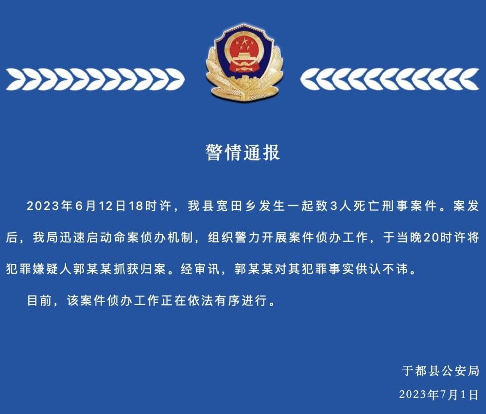

# 江西于都警方通报“一家3小孩被杀害”：犯罪嫌疑人已抓获归案

7月1日，于都县公安局发布警情通报，2023年6月12日18时许，我县宽田乡发生一起致3人死亡刑事案件。案发后，我局迅速启动命案侦办机制，组织警力开展案件侦办工作，于当晚20时许将犯罪嫌疑人郭某某抓获归案。经审讯，郭某某对其犯罪事实供认不讳。

目前，该案件侦办工作正在依法有序进行。

据澎湃新闻此前报道，江西赣州市于都县宽田乡6月中旬发生一起凶杀案，一户人家3名小孩遇害。案发当晚凶手被抓。“小孩最小的才几个月大。”宽田乡一名村民说，案发时小孩的父母在外地务工，小孩由奶奶照顾。

