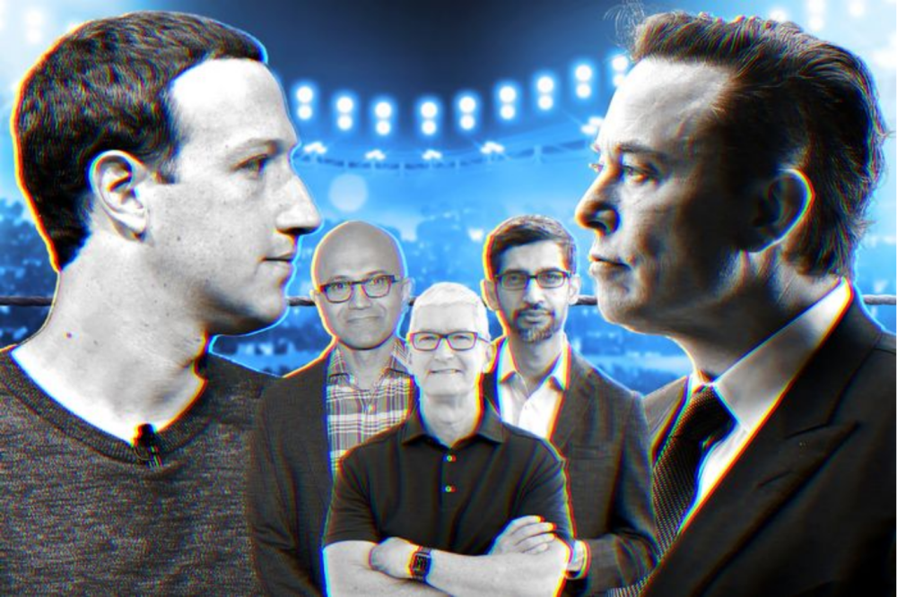

# 美国科技巨头们忙着约架，这是企业家该干的事吗？

**划重点：**

  * _1_ 马斯克与扎克伯格已经相约“铁笼大战”，但其背后凸显的却是人工智能时代来临导致竞争加剧的无奈。
  * _2_ 目前，科技巨头们正在搜索、社交媒体、平台、云计算、电子商务以及流媒体等诸多领域展开较量。
  * _3_ 随着人工智能技术的发展，它将对传统竞争格局产生颠覆性影响。
  * _4_ 未来十年，主宰我们生活的可能不再是传统的大型科技公司，而是从未听说过的初创企业。

腾讯科技讯 特斯拉、推特老板埃隆·马斯克（Elon Musk）和Meta首席执行官马克·扎克伯格（Mark
Zuckerberg）已经约好“铁笼大战”，至少双方在社交媒体上都表现得战意昂扬。

然而，不管这场笼斗是否能真会上演，它都凸显了大型科技公司之间竞争加剧的趋势。在疫情、科技股崩盘和生成式人工智能到来之后，这些竞争只会变得越来越激烈。

哥伦比亚大学教授、美国总统乔·拜登前竞争和技术政策特别助理Tim
Wu表示，人工智能“让每个人都感到焦虑”，“很有可能会有一家公司突然冒出来，把这些长期存在的老牌公司活活吃掉”。

人工智能只会加剧这些科技巨头之间的竞争。它们不再是亦敌亦友的关系，而是彻底变成了敌人。这对普通用户意味着什么？

01 当前多领域竞争格局

我们可以称当前的局势为“科技大战101”，在这个领域，我们通过几十年的创新和战略来加速推进，以打破竞争：

**1.搜索：除了谷歌还是谷歌**

谷歌占据了全球搜索引擎市场93%的份额，而微软必应的市场占有率只有3%。微软推出基于ChatGPT的新搜索引擎，进军生成式人工智能领域，至少在某种程度上是为了重启搜索大战。

搜索对我们用户来说非常重要，因为我们需要回答诸如“为什么狗不穿裤子?”这样的烧脑问题。这对科技公司来说同样重要，因为他们可以卖狗裤的广告。

**2.社交媒体：Facebook和Instagram都属于Meta**

除了Meta旗下社交应用，TikTok、推特、LinkedIn以及Snapchat等，他们都想出了办法，让我们不停地浏览没完没了的文本、照片和视频。过去，社交媒体是用户互相交流的地方，但最近更多的是我们被灌输表情包和令人上瘾的视频。这些公司争夺我们的眼球和时间，原因又是广告。

这就是马斯克和扎克伯格之争的部分原因。Meta正准备推出一款与推特竞争的应用，这款新应用与Instagram集成，但侧重于基于文本的更新。

**3\. 平台：优秀的老式操作系统，头显大战将开启**

如今，苹果iOS和谷歌的Android主导了这场战斗。这些公司希望你购买他们的硬件（智能手机、平板电脑、电脑）、软件（邮件、笔记、信息等）和服务（应用商店、音乐、电影等）生态系统。他们靠这些东西赚钱。

微软放弃了移动领域，但Windows仍在笔记本电脑和台式机领域展开竞争。包括Meta和TikTok母公司字节跳动在内的竞争对手正在武装自己以对抗苹果，准备下一场大型平台之争——混合现实头显。

**4.云计算：企业云系统技术竞赛**

全球各地的公司都在使用谷歌云(Google
Cloud)、微软Azure和亚马逊旗下AWS来支持其云服务，包括网站和其他人们常用的工具。然而，这些系统基本上对用户来说是不可见的，它们基本上为互联网提供动力。

就在上周，谷歌向美国联邦贸易委员会（FTC）提交了一份申诉，指控微软在云计算市场使用不公平的做法来排挤竞争。微软发言人对此表示，该公司已经做出了改变以解决人们的担忧，并为云提供商提供更多机会。

还有很多类似的竞争，比如亚马逊主导的商业竞争和流媒体混战（Netflix、YouTube等）。

02 即将到来的人工智能大战

现在看看上面的竞争格局，你会发现它们中的每一个都将受到人工智能的打击，让我们从搜索开始：

现在，很多人会跳过谷歌，直接去OpenAI的ChatGPT上寻找简单的食谱和各种问题的答案。

然后是微软的必应，一个几乎被遗忘的搜索引擎重新变成了有趣的新玩具，并可能对谷歌构成新的威胁。微软通过向OpenAI投资了100多亿美元，优先将ChatGPT技术整合到必应中。虽然微软的“老好人”萨蒂亚·纳德拉（Satya
Nadella）和谷歌的桑达尔·皮查伊（Sundar Pichai）并没有走向真正的拳台，但他们也进入了虚拟拳击场，只不过用语言攻击代替了出拳。

谷歌急于发布生成式人工智能产品，包括其聊天机器人Bard和目前处于测试阶段的新搜索体验。到目前为止，这场战斗的赢家是用户。波士顿大学下属技术与政策研究项目的执行董事吉姆·贝森(Jim
Bessen)说：“科技巨头之间的激烈竞争可能对消费者有利。”

社交媒体和平台也是如此。Meta发布了人工智能模型和研究成果。微软旗下职业社交网站LinkedIn已经整合了人工智能工具来改进帖子，Snap的应用程序中引入了基于OpenAI技术的聊天机器人。微软已经开始在Windows、Word、Excel和其他产品中整合人工智能功能。谷歌在文档、表格等方面也做了同样的事情。你可以期待，苹果很快也会这么做。

云计算业务也将从人工智能中受益匪浅。据悉，亚马逊、微软和谷歌都把生成式人工智能放在了企业-企业（B2B）销售宣传的核心位置。

对我们所有人来说，真正令人兴奋的是：未来十年主宰我们生活的公司可能不是任何一家传统的大型科技公司。

一年前几乎没有人听说过OpenAI，现在它已经家喻户晓。当然，OpenAI获得了微软的支持，但它正在与微软以外更多的应用程序和服务合作，整合ChatGPT和其他人工智能工具。

哥伦比亚大学教授、美国总统乔·拜登前竞争和技术政策特别助理Tim
Wu说：“如果在这次变革中，我们能加入些新鲜血液，那就太好了！”这可能意味着更少的笼斗，无论是真实的还是想象的。他表示：“真正的企业家不会有时间做这种事情，他们会努力想办法推出更好的产品。”（文/金鹿）

