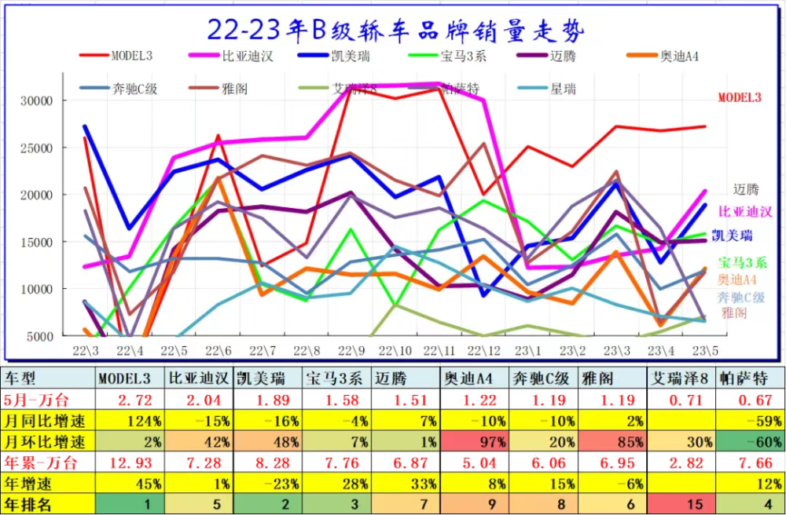

# 被围攻的中级车市场，谁能拿下新一轮定价权？

得中级车者得天下，一直是汽车行业里的共识，虽然市场多年来风起云涌，依然未曾改变。

如今，竞争最激烈中级车市场，却成了合资品牌/外资品牌最后的“护城河”。

在自主品牌集体崛起、新能源车渗透率不断提升的当下，中级车市场销量前十的车型中仍有八成是外资车型。

乘联会公布的数据显示，2023年5月，自主品牌国内零售份额为50.2%，同比增长4%；德系品牌零售份额20.6%，同比下降2.4%；日系品牌零售份额18.0%，同比下降2.9%。

从市场份额上看，自主品牌正在进一步蚕食合资品牌的市场。然而，在自主品牌逐渐占领A级轿车、A级SUV、B级SUV、C级SUV甚至MPV市场后，中级轿车市场却依然被外资品牌牢牢把控。

在乘联会统计的5月中级车销量排行前十中，除了比亚迪汉与艾瑞泽8两款自主品牌车型外，其他均为外资品牌车型。尽管多款车辆销量出现同比下滑态势，但短时间内，合资品牌的地位优势依然难以撼动。‍‍‍‍‍‍‍‍‍‍‍‍‍‍‍‍‍‍‍‍‍‍‍‍‍‍

_图片来源：乘联会_

一直以来，中级车对内承担着车企内部上下游车型技术承上启下的重任，对外是神车最多的细分市场，打造出一款神车后就可以确保企业数年的销量，所以素有“得中级轿车者得天下”之说。而这一说法，在新能源时代显然依然适用。

回看过往中级车市场格局的几次起伏，除了产品力的颠覆之外，定价权也是决定一代车型的市场表现力走向。在百年未有之大变局下，想要再次夺取这一市场的定价权甚至标杆地位，需要的远远不止于车型实力。‍‍‍‍‍‍‍‍‍‍‍‍‍‍‍‍‍

**市场格局惊变**

在过去很长一段时间里，中级车市场一直围绕着日系与德系车型的竞争。但进入新能源时代后，特斯拉、比亚迪的强势崛起，生生撕开了中级车市场的口子，逐渐形成三分天下的格局。‍‍‍‍

根据乘联会的数据，Model 3销售了2.72万辆，同比增长124%，登顶
5月中级轿车销量排行榜；比亚迪汉销售了2.04万辆，同比下降15%，排至第二位；凯美瑞销售1.89万辆，同比下降16%，排名第三。随后依次是宝马3系，5月销售1.58万辆，同比下滑4%；迈腾销售1.51万辆，同比增长7%；奥迪A4销售1.22万辆，同比下滑10%；奔驰C级销售1.19万辆，同比下滑10%；

雅阁

销售1.19万辆，同比增长2%；艾瑞泽8销售0.71万辆；

帕萨特

销售0.67万辆，同比下滑59%。

“近期中高级车较强，日系表现相对平稳，电动车和插混组合的比亚迪汉表现很好，豪华车在中高端表现突出。”乘联会秘书长崔东树表示。

在崔东树看来，合资和豪华品牌在新能源中级车市场产品比较稀缺，这就给了自主品牌机会。并且自主品牌在智能化体验、人机交互领域也做得很好，所以获得了消费者认可。

目前，合资品牌已经意识到了这个“短板”，且开始反攻。‍‍‍‍5月15日，全新

别克君越

正式上市，新车欲“以油电同享的智能科技，迎接新智能汽车时代的到来”；5月20日，

广汽本田

全新雅阁正式上市，首次推出e:PHEV强电智混车型，并开始实施“油电同价”策略。

君越与雅阁均是全新一代车型，其中雅阁改变的更为彻底。不仅是国产24年来第一次真正意义上的“来电”，也是广汽本田第一款插混轿车。

据乘联会分析，传统燃油车在10-20万元价格区间的表现相对较强，形成了差异化分布的特征，尤其是混合动力的分布相对较窄，属于中高价区间的产品为主，而插电混动产品则属以主流车型为主。也就是说，插电混动或将成为中级轿车未来的主要竞争产品之一。‍‍‍‍‍‍‍‍

除此之外，中级车市场油电混合车型、纯电版车型也在不断推陈出新。截止2023年5月，中级车市场的新能源渗透率已经提升到36%，相较2022年的28.9%，年均提升速度相对较快。

_图片来源：乘联会_

数据显示，中级轿车5月批发22.49万辆，占批发份额25.16%，同比增长6%，零售同比增长27%。1-5月，批发数量114.13万辆，累计增幅13%，零售数量102.68万辆，累计增幅10%。

中级车的竞争，方兴未艾。‍‍‍

**价格体系重塑？**

在今年比亚迪业绩发布会后的一场投资者沟通会上，比亚迪董事长王传福表示：“在10～20万元的产品价格带，比亚迪有定价权。但公司也希望平稳一点，不要搞得大家很难受、别人都没活路。”

事实也确实如此。2月10日，比亚迪以“油电同价”策略推出了

秦PLUS DM-i

冠军版，不到10万元的起售价几乎刷新了插电混动车型的价格。随后，甚至引起了一阵价格体系混乱，越来越多的车型在各细分市场刷新价格新低。

华泰证券认为，‍‍‍‍‍‍‍‍‍‍‍‍在燃油车时代，大众、

别克

、

福特

等合资品牌的销量主力车型多在 20 万元以上，合资车企占据了20万元以上的大部分市场。而从2018
年开始，合资品牌竞争力受到挑战，开始通过大额优惠来稳定市场份额。

据统计，日系品牌在2022年以前折扣率基本稳定在2-7%左右，但是从2022年末开始，品牌折扣力度达到了10%以上；而大众品牌的折扣力度过去几年保持在10-15%左右，2023年上半年提高到20%；以别克等为代表的二线合资品牌的折扣率从2018-2022年的15-20%不等提高到2023年3-5月的22-25%。

不过，5月折扣率已经有收窄迹象。乘联会数据显示，5月中旬乘用车总体折扣率约16.9%，与4月持平。当下价格战或已告一段落，终端价格或趋于稳定。

但对于中级车市场而言，新一轮的争夺才刚刚开始。

全新别克君越上市，入门版车型价格下调近4万元；雅阁主打“油电同价”，插混版售价与燃油版高配价格重合......

在业内人士看来，国内换车人群不断增长，为中高级轿车提供了大量潜在用户。在我国，绝大多数中高级轿车的销售是通过换购方式实现的。中级轿车市场成长空间巨大，利润率高，所以即便竞争压力很大，中级车仍然会是生产厂家的必争之地。

华泰证券的一份研报中显示，2020年-2023
年1~4月，轿车增速分别为-9%/+7%/+3%/-3%，中级轿车增速分别为+6%/+12%/+9%/+6%，A 级轿车增速分别为
-18%/-3%/-2%/-7%，中级轿车显著跑赢轿车行业。

而从市场份额来看，小型车的份额占比开始萎缩，中大型车的占比从2022年的32%提升到2023年1-4月的35%。其中，2023年1-4月B
级车（中级车）份额较2022年增加2%至29%；C级车份额较2022年增加1%至6%。

“标杆”意味着“定价权”和“溢价权”，无论是日系三杰还是德系三强，都在不断强调自己的标杆地位。但在新能源时代，崔东树曾表示：“新能源车价格调整主要看市场供需，现在新能源车企大多数仍处于亏损状态，市场竞争较为激烈，少数车企掌握着定价权。”

随着特斯拉、比亚迪对于供应链、产业链不断深入的控制，规模效应已经足以掌控市场的定价权。而“油电同价”时代的开启，或许也将拉开中级车市场新一轮“定价权”之争。

记者：郑宇

