# 马斯克不让AI白嫖数据了：“封闭”推特，不登录不能看

鱼羊 发自 凹非寺

量子位 | 公众号 QbitAI

现在，不登录推特账号，就看不了网页版推特内容了。

就是说，原来可以直接点开推特网址，全都会被重定向到注册页面。

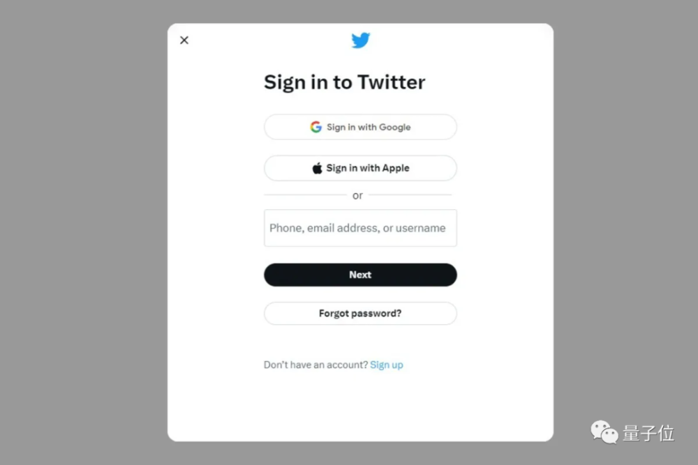

用惯了国内App的胖友们可能感知不强，但外国网友已经炸了锅……

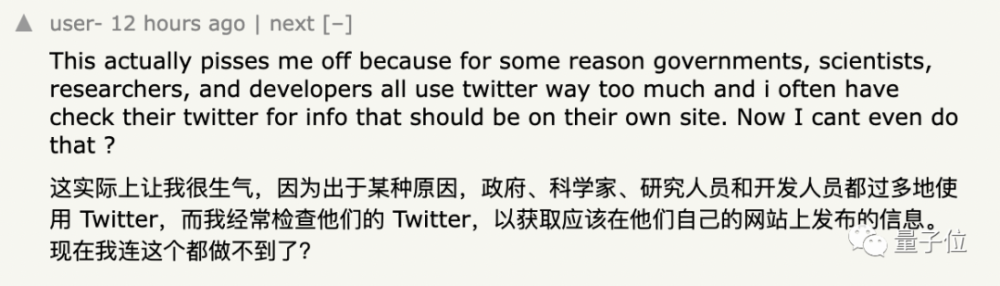

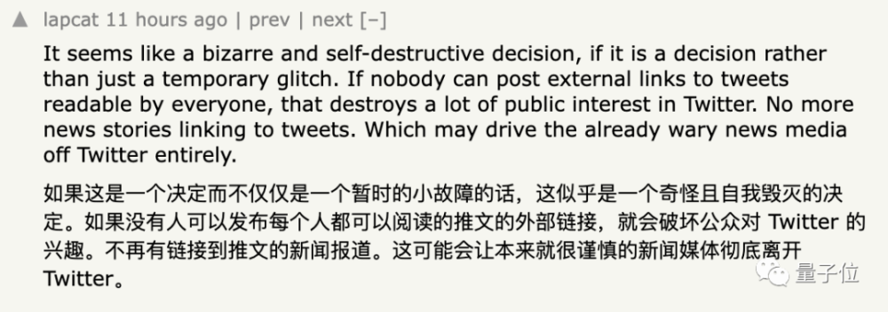

事情一闹大，马斯克赶紧出面解释：这只是 **临时举措** 。

他抱怨说：

几乎所有人工智能公司都在疯狂抓取数据。推特需要立即采取行动。

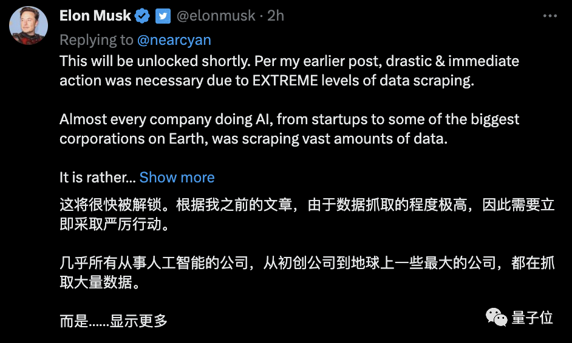

在另一条推文中，他还进一步解释说，这种抓取数据的行为已经影响了推特用户的体验。

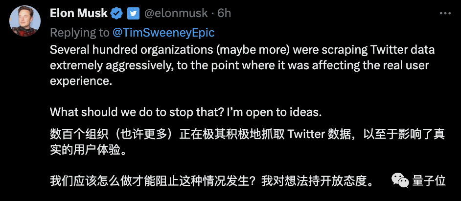

事实上，早在4月份，马斯克就曾向微软、OpenAI呛声，甚至放话要告微软：

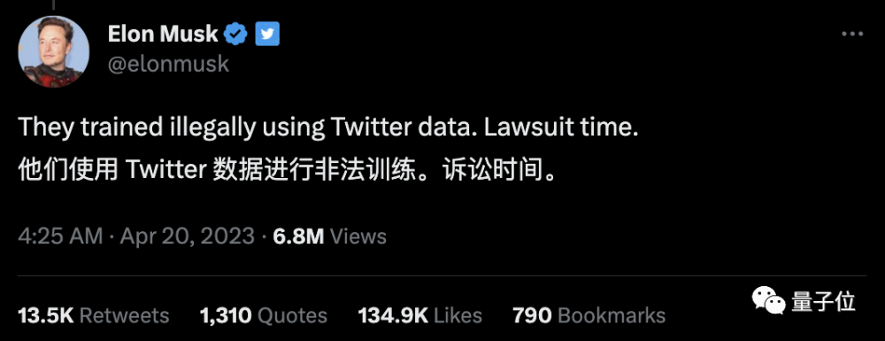

而更早之前的2月份，马斯克已经决定，要把推特免费开放的API改成收费模式。4月29日起，这个收费计划全面启动，并且不咋便宜：

企业订阅推特API，每个月4.2万美元起。

网友已炸锅

但甭管马斯克怎么解释，网友的怒火算是被点着了。

有人不惮以恶意揣测推特的“突然袭击”：

我猜他们是故意的，并会在1-2天之后就解除这种登录限制。这是一种增加注册用户的快速而肮脏的手段。

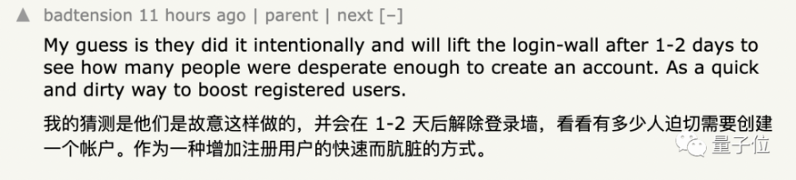

而这种推测似乎很快得到了马斯克本人的佐证……

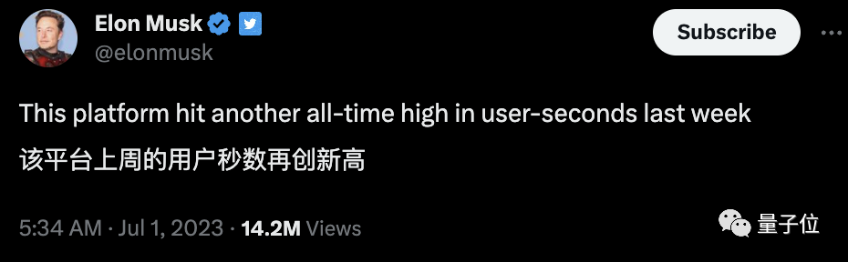

在不少“弃用推特”的声音之中，还有人干脆直接安利起了推特的竞争对手：

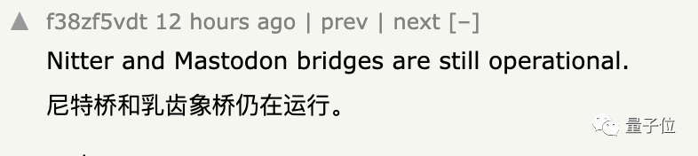

不过，也有网友对马斯克表示理解：

如果这是反对AI抓取数据的措施，我可以理解。

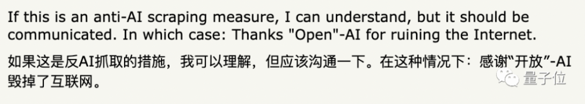

推特希望保护其数据不被白嫖是可以理解的。不过这无疑会降低推特的影响力和曝光度，并引发一些隐私问题。

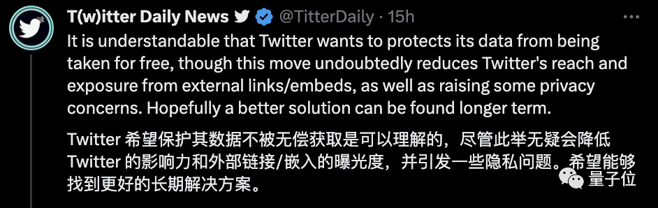

另一种让人难以忽视的担忧则是，推特此举一出，只怕Reddit等也要有样学样了。

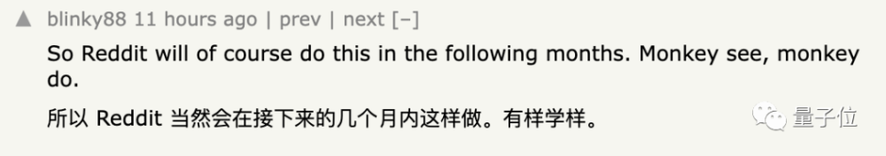

此前，Reddit同样曾因API涨价事件引起轩然大波。

Reddit老板给出的理由同样是：

我们的数据非常有价值，不想免费提供给科技巨头们。

参考链接：

[1]https://www.theverge.com/2023/6/30/23779764/twitter-blocks-unregistered-
users-account-tweets

[2]https://news.ycombinator.com/item?id=36535822

— 完 —

