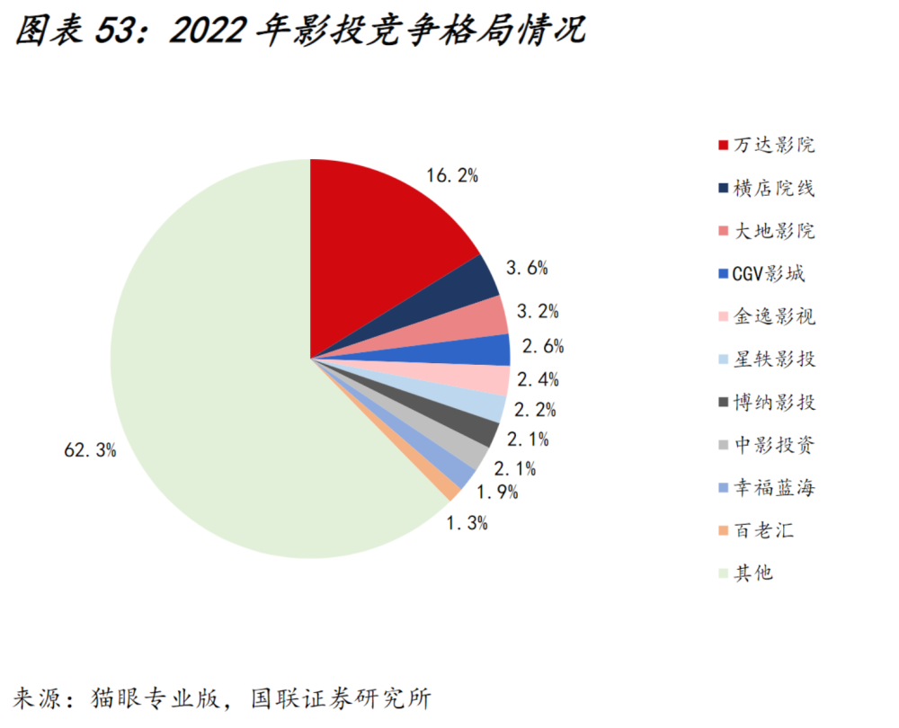
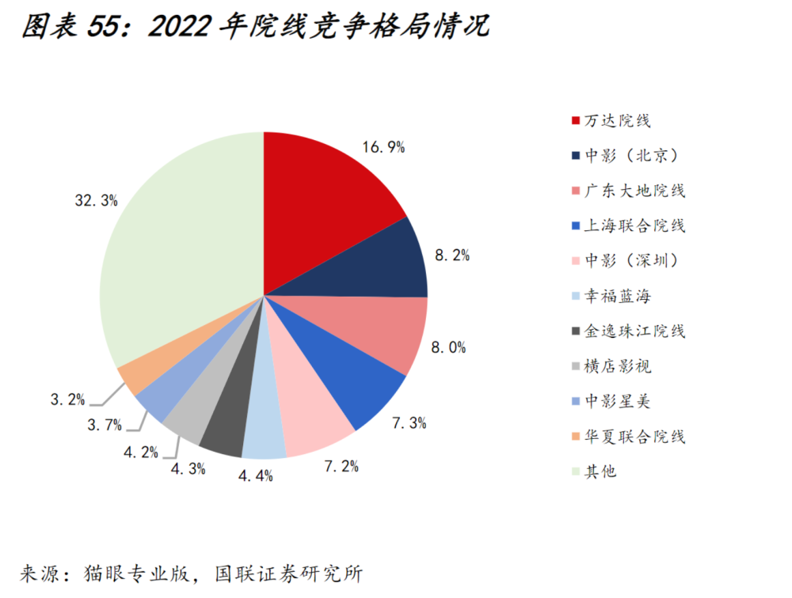

# 暑期档票房或将重回百亿时代，影投和院线双料龙头股价却“不见起色”

**财联社7月2日讯（编辑 刘越）** 暑期档的前战已经打赢。猫眼专业版显示， **今年端午档总票房达9.11亿元，位列中国影史端午档票房收入第二位**
。其中，上海电影参与出品的《消失的她》成为内地影史端午档国产电影票房冠军，横店影视、中国电影和上海电影共同主控的《我爱你！》票房过亿。业内人士表示，
**《消失的她》档后票房涨势依旧“猛烈”，端午档影片仍有长尾输出的空间** 。

前哨吹响，7月将迎来暑期档影片的密集上映，包括横店影视联合出品的《扫毒3:人在天涯》、北京文化主控的《封神第一部》等，业内人士预计今年暑期档票房或将重回百亿时代。

**《消失的她》大火出圈，暑期档影市有望迎“盛夏”，但影投和院线双料龙头万达电影的股价却“无动于衷”。** 《消失的她》属悬疑题材，
**万达电影有多部类似题材电影储备**
，其在5月的业绩说明会上表示，公司主投的犯罪题材电影《三大队》有望今年上映，电影《误杀3》也已筹备拍摄，同时已重启了《唐人街探案4》项目的开发制作。

万达电影股价 **自2015年底历史最高点一路下探，累计最大跌幅超8成，2019年迄今长期横盘** 。业内人士表示，依赖节假日造成头部效应明显，
**平日票房进一步萎缩**
。今年春节档创造了历史第二高的票房成绩，但从3月1日至五一档开始前，大盘票房不足40亿，相较2019年同期60-80亿的水平有明显差距。此外，观影人数变少，需求端仍未恢复。

从竞争格局来看， **万达电影在影投和院线市占率均维持行业第一** 。影投方面， **横店影视、金逸影视、博纳影投、中国电影和幸福蓝海**
等次之。院线方面， **中国电影、幸福蓝海和横店影视** 等次之。

▌ **上海电影等今年股价大涨但Q1业绩尚未恢复至2019年同期水平 分析人士认为AIGC等炒作噱头盖过产业真实情况**

回顾过去，电影行业遭遇七年寒冬后，终于迎来复苏苗头。
**今年以来，上海电影股价累计大涨超三倍，中国电影、横店影视和幸福蓝海股价累计最大涨幅分别达64.76%、51.72%和70.69%** 。

但从业绩来看，上述电影公司尚未恢复至2019年水平。 **中国电影**
一季度净利1.82亿元，2019年同期净利3.55亿元。此外，公司2022年度营收腰斩，净利亏损2.15亿元。 **上海电影、横店影视和幸福蓝海**
今年一季度净利分别为0.36亿元、1.49亿元和0.03亿元，2019年同期净利分别为0.46亿元、1.59亿元和0.13亿元，而前述三家上市公司去年全年净利均亏损超3亿元。

分析人士指出，今年股价上涨的背后驱动力来看，疫情放开是大背景，而
**开年以来的AIGC、ChatGPT及国内大模型混战，则是科技创新带来的预期进一步推高了估值** 。整体而言， **炒作噱头盖过了产业真实情况**
。安信证券传媒首席焦娟认为，AIGC固然能够提升生产力，但对于内容行业而言， **“降低成本”只是一个小逻辑** 。

▌ **前5个月相比2019年同期少了2亿人看电影 暑期档单部票房冲30亿有点难 新片扎堆假期档致平日票房进一步萎缩**

数据显示，今年前5个月，在平均票价上涨了接近1元的情况下，该时期整体票房221.6亿元，相较2019年同期仍下滑超18%。观影人次方面，
**今年前5个月总观影人次5亿人，较2019年同期6.9亿人减少了近2亿人次** 。

行业人士指出，截至5月，相比较2019年以前， **今年观众整体更成熟** 。而
**年轻人的线下观影习惯减弱，导致线下电影市场新消费潜力的挖掘将变得更困难** 。

值得注意的是，今年暑期档票房预测超百亿，而2015年-2019年，暑期档票房在120亿-170亿左右， **百亿仅恢复到2014年的水平** 。

产业链上游制片方对投资更为谨慎，导致电影更加依赖有票房保证的假期档期，从而 **使头部效应更加明显**
。今年仅票房第一的《满江红》和第四的《熊出没·伴我“熊芯”》（昨日被《消失的她》总票房破20亿赶超）就已是45亿量级和15亿量级的悬殊差距。而去年暑期档总票房超90亿，其中《独行月球》票房达31亿。分析人士认为，
**今年暑期档的头部片子不少，但估计很难出现像往年一样单部票房冲30亿的电影** 。

此外，平日票房进一步萎缩。分析人士指出， **观众平日周末观影习惯减弱**
，是近几年持续的趋势，而这会反过来影响新片的定档决策，从而导致今年新片扎堆假期档。

（财联社 刘越）

