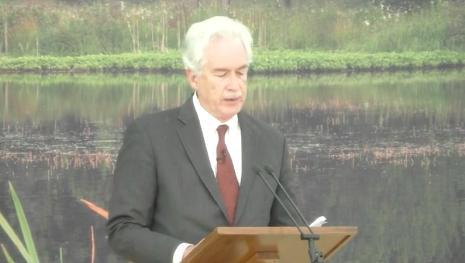

# 美中情局长英国演讲提19次“中国”，称“脱钩是愚蠢的”

（观察者网讯）据路透社报道，当地时间7月1日，美国中央情报局(CIA)局长威廉·伯恩斯(William
Burns)在英国牛津郡演讲时表示，鉴于各国在经济上高度相互依赖，与中国“脱钩将是愚蠢”的，美国应该努力实现供应链的多元化。

这位此前不停渲染“中国威胁”的美国高官当天在演讲中并未放弃炒作所谓中国的“战略竞争挑战”，但否认要采取“脱钩”行动。

_美国中央情报局局长威廉·伯恩斯（图源：法新社）_

当地时间7月1日，伯恩斯出席了第59届英国迪奇雷基金会年度演讲，发表了主题为“世界变革与情报的作用”的讲话。

在长达8页的演讲稿中，这位美国中情局局长一共提到了19次“China”。

他称，俄罗斯的特别军事行动构成了严峻的考验，“但是，中国是唯一一个既有重塑国际秩序的意图，也在经济、外交、军事和技术方面越来越有实力这么做的国家”。

_当地时间7月1日，伯恩斯在英国演讲（视频截图）_

伯恩斯称赞了中国过去50年的变革，称中国人民值得被称颂，声称这也是“美英两国支持的转变”，随即提到了英国外交大臣克莱弗利4月阐述英国对华立场时的说法，“一个稳定、繁荣、和平的中国有利于英国，也有利于世界”。

接着伯恩斯话锋一转，宣称“问题不在于中国的崛起本身，而在于伴随崛起出现的行动”，开始炒作中俄“无限合作伙伴关系”和台海问题。

他补充称，在这个新时代，竞争是在经济相互依赖和商业联系密切的背景下进行的，这对美英两国自身、两国经济和全球都有益，“但也造成了战略依赖、严重的脆弱性以及对我们的安全和繁荣的严重风险”。

“当今世界，没有一个国家愿意发现自己在关键矿产和技术上受一个垄断联盟摆布，特别是一个已经表现出有意愿和能力加深这些依赖并将其武器化的国家。”伯恩斯声称，“解决这个问题的办法不是与中国这样的经济体‘脱钩’，那将是愚蠢的，而是通过确保有弹性的供应链、保护我们的技术优势、投资于工业产能，来明智地降低风险并实现多元化。”

在这场演讲中，伯恩斯还称，如美国总统拜登所说，世界正处于一个“拐点”，后冷战时代已经结束，美国现在的任务是塑造未来——在基础优势上投资，与盟友一起为共同事业而努力。

他表示，此目标能否成功主要取决于能否应对好三个挑战，第一个就是美国中情局惯常炒作的所谓的中俄两国带来的挑战。

“首先就是来自崛起且雄心勃勃的中国的战略竞争挑战，以及来自俄罗斯的挑战——俄罗斯不断提醒我们，衰落中的大国可能与崛起中的大国一样具有‘破坏性’。”伯恩斯声称。

他列举的另外两个挑战是全球性问题（气候危机、流行病等）以及技术革命带来的风险。

一段时间以来，部分美国政客在国际上大肆鼓吹“脱钩”，以所谓“战略竞争”定义中美关系。值得注意的是，自今年4月以来，“与中国脱钩”的措辞逐渐从拜登政府高官口中淡出，取而代之的是“去风险化”。

美国国务卿布林肯6月访华时称：“试图遏制中国并在经济上与中国‘脱钩’的指控与我们实际在做的事情之间存在非常明显的区别。在供应链领域是具有风险性，也是多元性的。”

此前，中国外交部发言人毛宁曾在例行记者会上指出，中方一向认为，中美关系不是你输我赢、你兴我衰的零和博弈。中美各自取得成功，对彼此是机遇而不是挑战。宽广的地球完全容得下中美各自发展，共同繁荣。中方不回避也不惧怕竞争，但我们反对以竞争定义整个中美关系，打着竞争的旗号对一国进行污蔑抹黑，限制别国的正当发展权利，甚至不惜损害全球产业链供应链，这不是一个负责任大国的所为。

而对于所谓“去风险化”的提法，中方也多次批驳。

5月31日晚，中国外交部部长助理、发言人华春莹在社交媒体推特发文，一针见血地指出——“去风险化实际上就是脱钩。”

“想想看：他们试图孤立的国家，是一个占据世界五分之一人口、拥有超过5000年文明、作为世界140多个国家主要贸易伙伴、世界第一大外国投资目的地、世界第一大制造商和第一大电动汽车出口国......这就像几条溪流偏要绕过并孤立长江和黄河一般——它们最终只会干涸。”

6月19日晚，外交部美大司司长杨涛就美国国务卿布林肯访华向中外媒体吹风并答问。关于“去风险”，杨涛表示，首先要搞清楚的是，什么是风险？风险来自哪？中国向世界注入的是稳定性、确定性和正能量，怎么就成了风险？不管怎么包装，美方的“去风险”仍是“脱钩断链”，本质上是“去中国化”，最终是去机遇、去合作、去稳定、去发展，不仅解决不了美国自身的问题，还会反噬自身，拖累世界。

复旦大学国际政治系教授沈逸此前也告诉观察者网，相比于“脱钩”，如今西方所谓“去风险化”的概念范围更大、边界更模糊、主观阐释性更强，甚至更难做到，美欧国家不断通过搞“话语标签战争”使其自身行为“合法化”，而在前期“脱钩”全面趋向于失败的背景下，“去风险化”在更多的时候，不过是其用来“挽回尊严”向选民交代，并继续进行政治操弄的一种类似“PUA话术”。

**本文系观察者网独家稿件，未经授权，不得转载。**

