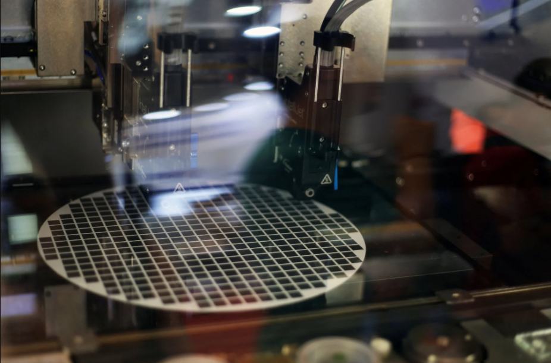

# 芯片2纳米大战开启之际，美国荷兰日本对中国连环出手

这个夏天，美国、日本和荷兰要连环出击，进一步限制对中国晶片厂商出口晶片制造设备，号称要“防止中国利用他们的技术增强解放军军力”。

最新动作来自西欧的荷兰。

荷兰政府星期五宣布，对部分先进半导体制造设备实施新的出口管制措施。荷兰贸易部长施莱纳马赫发表声明说，这些设备可能用于生产军事器材，“为了维护国家安全，我们决定采取这项措施。”

新措施定9月1日生效，先进芯片制造设备的公司必须获得许可证，才能把有关设备卖到海外。新宣布附带一份技术文件，详细说明哪些设备需要许可证。

施莱纳马赫说，只有极少数公司与设备款型受新条例影响，他估计一年的出口许可证申请只有约20个，对受影响公司的冲击也很有限。

他还说，这些管制措施是“国家中立的”。也就是说，荷兰自己声称所有举措并没有针对特定国家。

但大家都知道这种说法的虚伪。英国《金融时报》就说，实际上，出口商预计中国公司将是少数被拒绝许可的公司之一。

《金融时报》还说，美国、日本和荷兰希望形成统一战线，以剥夺中国生产最先进芯片的能力。此举是在美国施加巨大压力之后采取的，将主要影响制造世界上最先进半导体制造工具的ASML。
这些控制措施类似于日本最近实施的控制措施，其中包括能够生产45纳米及以下芯片的机器。

荷兰半导体设备制造巨头阿斯麦（ASML）当天表示，预计它的第二先进等级的深紫外线光刻设备（DUV）也需要出口许可证。这些设备用于制造电脑芯片。

据报道，ASML的四个浸没式光刻系统中的三个将受到新规则的限制，使中国芯片制造商无法以商业规模制造小于28纳米的芯片。

连不是最先进的设备都开始管了，这说明对中国的打压正在升级。

在这之前，荷兰已限制阿斯麦对华出口最先进的极紫外光刻机（EUV）。

《金融时报》援引知情人士的话说，中国公司从ASML订购的几十台机器原计划在未来几年交付，现在已经不太可能交付。
自2019年以来，ASML最现代化的机器已被禁止进入中国。2022年，中国约占ASML销售额的15%。

另据路透社报道，美国预计也要在7月底公布新条例，要求美企向六家华企出口芯片制造设备时必须申请许可证，包括中国最大芯片制造商中芯国际运营的一家晶圆厂。

美国去年10月出台措施，以维护国家安全为理由，限制美企对华出口芯片制造设备，也禁止美国公民为中国芯片厂商工作。在推出限制措施后，美国也游说其他晶片设施生产国也采取类似限制。

美日荷是制造先进半导体所需的机械和专业知识的主要来源。美国的泛林集团、应用材料公司及科磊股份有限公司是全球的主要芯片设备生产商。日本大型光学仪器制造商尼康和半导体制造设备巨头东京电子也是关键供应商。日本已通过23种半导体制造设备出口限制条规，这些规则将在7月23日生效。

在美国日本荷兰连环出手之际， 世界芯片2纳米之战已经开启。

据报道，韩国三星电子最近公布了2纳米半导体量产和应用时间表，预计于2025年量产，之后在2026年将2纳米半导体应用于高性能计算产品上，并于2027年扩展到汽车领域。

对于2纳米芯片，台积电方面称，台积电旗下2纳米技术进度比预期好，能实现2024年试产、2025年量产的目标。

另外，美国的英特尔公司，以及日本芯片企业Rapidus也都瞄准了2纳米技术。

韩国《东亚日报》报道称，2纳米时代即将到来，国家和企业间之所以展开这场没有硝烟的战争。

在这些巨头们争夺2纳米芯片制高点时，美国却联合盟友想剥夺中国制造几十纳米芯片的能力。中国芯片产业面临的形势相当严峻。

“随着美国收紧对华芯片限制，一些中国芯片制造专家近日在一次会议上宣布‘全球化已死’”，香港《南华早报》报道说，
清华大学教授魏少军表示，中国是半导体行业“去全球化”的最大受害者，当全球化被摧毁时，行业模式有很大的缺点，因为中国无法实现全球资源配置。

报道同时说，还有一些人希望中国能够找到一种不同的方法来嵌入跨境供应链，
“传统的产业合作模式正面临新的挑战和机遇，”但中国可以专注于芯片材料和组件，以及发展制造先进芯片的能力。

