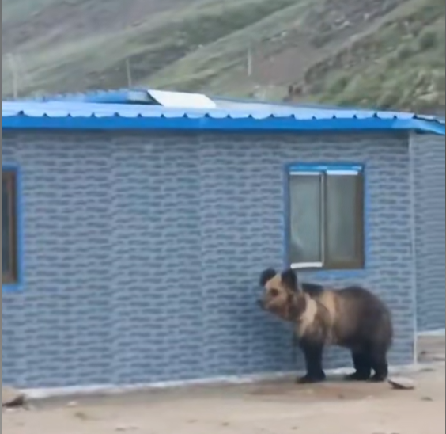
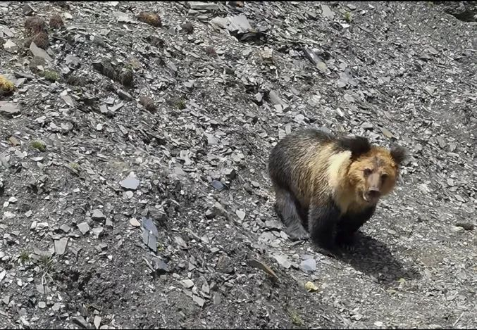
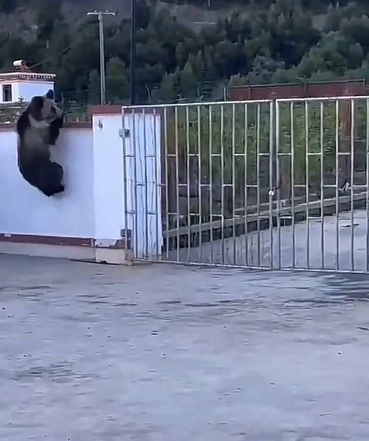
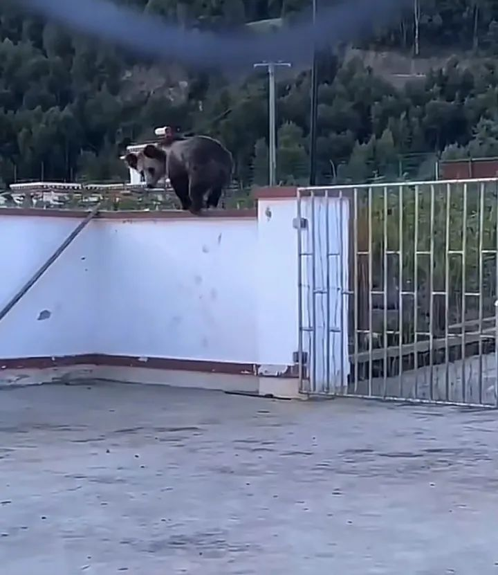
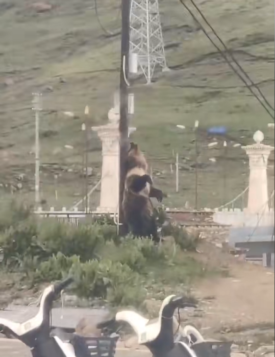

# 西藏一地频现“熊出没”且见人就追，当地：国家二级保护动物，不敢动

**连日来，多条关于“熊出没”的视频引发关注和热议！**

6月30日周五，西藏那曲巴青县当地人士发视频称，一只熊出现在大街上，见人就追。

昨天（7月1日），又一只熊出现在巴青的城区大街上，疑似前天同一只大熊。

视频显示， **大熊在街道上出现，见到有人路过立刻紧紧追赶，路人急忙拔腿就跑，大熊没追上。**

随后，大熊对路边一间简易房子产生“兴趣”，掀翻了窗户下方的墙壁后闯入。

橙柿互动注意到，在当地，大熊出没的现象已经是很多次了。

今年5月深夜，多只棕熊出现在巴青县贡日乡检查站门口，驱赶吓跑了犬只，又掀翻了大铁门闯入。

警方人士称，检查站的门已经被熊撞坏了几次，放鞭炮驱赶后又会跑回来。每次碰见熊出没，政府都会通知群众夜间尽量不外出，并制定驱离方案。

因为熊出没频繁，一些熊被人拍到后发到视频平台上，甚至成了网红。

去年8月，有驴友在那曲路上，偶遇一只“网红熊”，位置在558国道到夏曲卡镇的路边。

去年8月，又有人在边坝县拍到了一只大熊， **脚爪敏捷爬上了围墙，对墙头安装的玻璃碎片没有畏惧，直接翻过了围墙。**

有标识为“北京林业大学”的网友，讲述了西藏地区熊出没的状况——

“当时我驻地所在的村子。在几年前修建了垃圾场，因此引得棕熊聚居。”

“听当地工作人员说，曾经夜间在垃圾场的车内向外数熊，数目有二十只之多。我们黄昏时驾车外出，也会在山间车道看到有熊出没。”

**巴青县一人士告诉橙柿互动，“去年，有人上山挖虫草，和棕熊遭遇！受伤了。”**

今天（7月2日）上午，橙柿互动就“熊出没”现象，联系了巴青县自然资源局。

工作人员介绍说： **这里出现的棕熊都是野生的，属于国家二级保护动物，我们会提醒大家遇到熊最好避开，不要伤害。**

**这种情况已经不是一两次。今年4月份，也有棕熊出现在城中心跑进了单位大院。**

工作人员解释，近几年，棕熊的数量越来越多，这和保护力度有关。在2010年之前，巴青是很少看到熊出没的。

工作人员称，“也接到过基层单位的反映，希望能适当控制一下棕熊的数量，但因为是保护动物，除了驱赶和提醒大家避开，目前没有更好的办法。”

巴青县政府办工作人员表示，目前已经发了有关注意事项公告。

资料显示，西藏棕熊（学名：Ursus arctos pruinosus），哺乳纲、熊科、棕熊的亚种之一，亦称马熊和蓝熊。体长约1.8-2.1米，肩宽约1米

西藏棕熊亦称藏蓝熊，是世界上最稀有的熊亚种之一。它也被称为藏棕熊、马熊、喜马拉雅蓝熊、喜马拉雅雪熊和山熊）。

**Ursus arctos pruinosus（棕熊西藏亚种）于1854年由英国动物学家艾德华·布莱（Edward
Blyth）首次分类。有传说它是传奇雪人的起源。**

西藏棕熊的皮毛是黑色的，通常带有淡蓝色，这就是它的英文名称“Tibetan Blue Bear”（藏蓝熊）的来源。

**保护级别为CITES（濒危野生动植物种国际贸易公约） 附录Ⅱ级，中国二级重点保护动物。**

橙柿互动·都市快报记者 程潇龙

