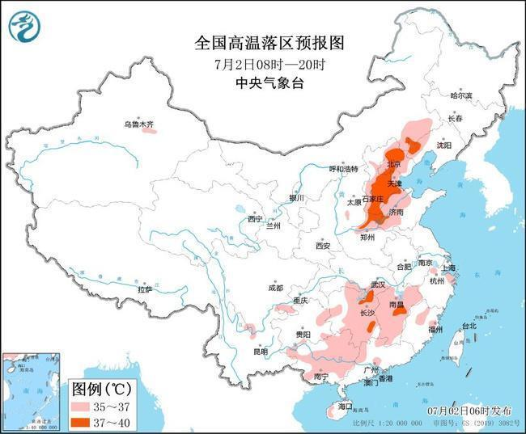

# 高温黄色预警：13省区市将现高温天气，京津冀等地或达39℃

中央气象台7月2日06时继续发布高温黄色预警：预计7月2日白天，北京、天津、河北、河南北部、山东西部、内蒙古东南部、辽宁西部以及湖北南部、湖南中东部、江西、广西、广东西北部、福建北部等地有35℃以上的高温天气，其中，北京、天津北部、河北、河南北部、辽宁西部等地的部分地区最高气温可达37～39℃。

防御指南：

1、有关部门和单位按照职责做好防暑降温准备工作；

2、午后尽量减少户外活动；

3、对老、弱、病、幼人群提供防暑降温指导；

4、高温条件下作业和白天需要长时间进行户外露天作业的人员应当采取必要的防护措施。

来源 中国天气网

编辑 高晨晨

流程编辑 刘伟利

