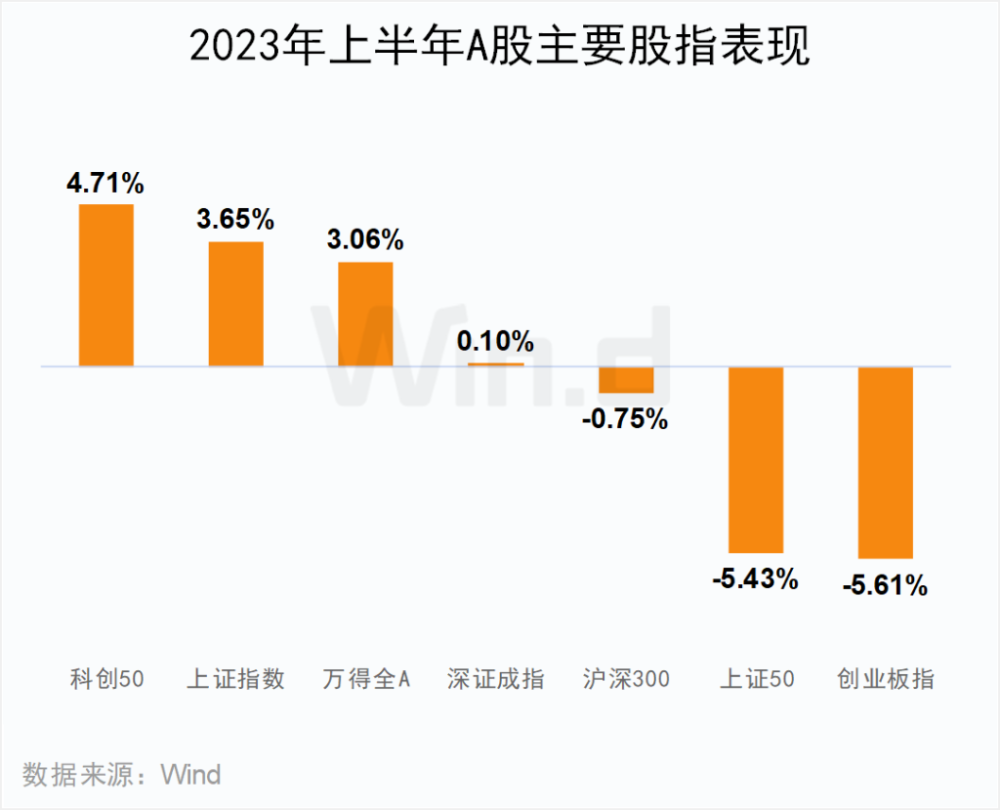
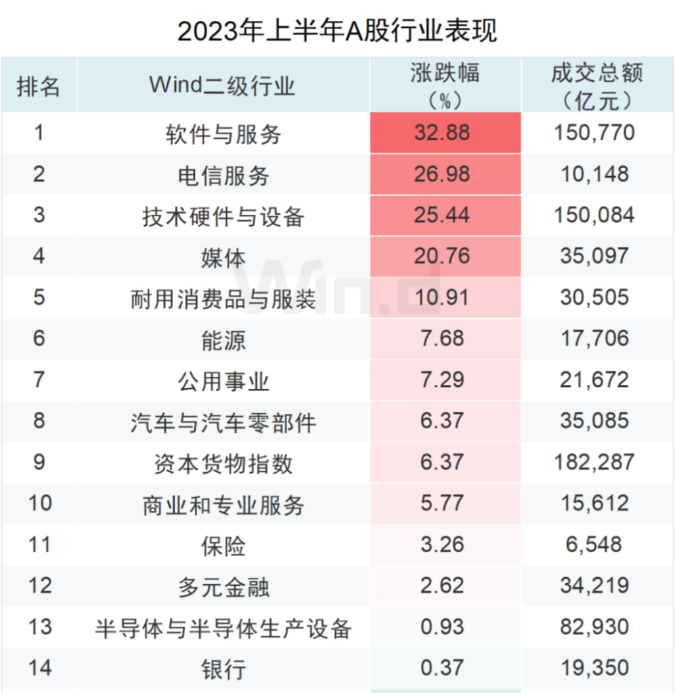
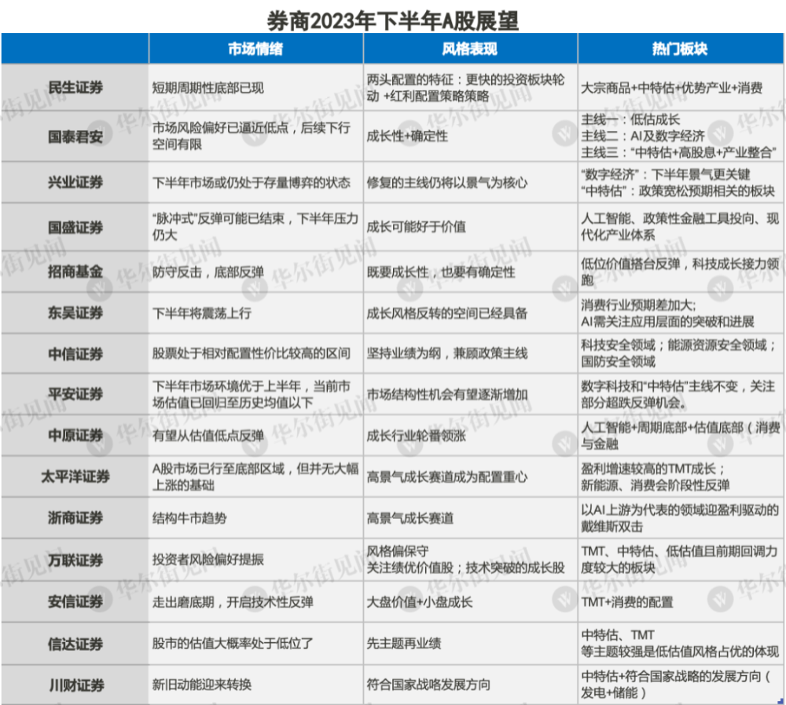
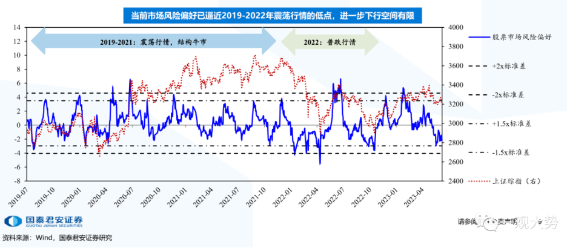
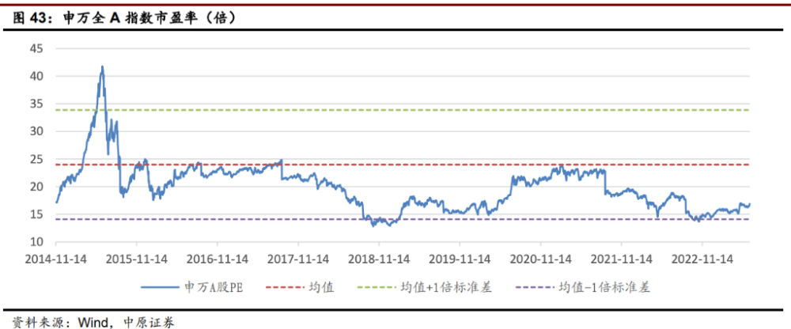
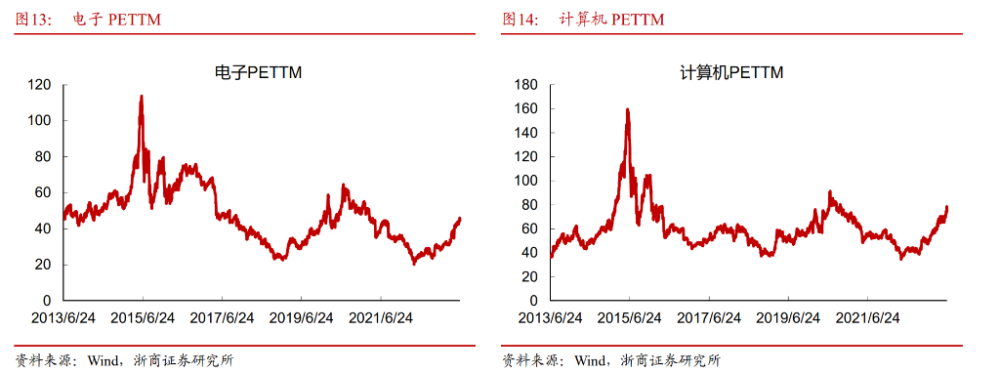
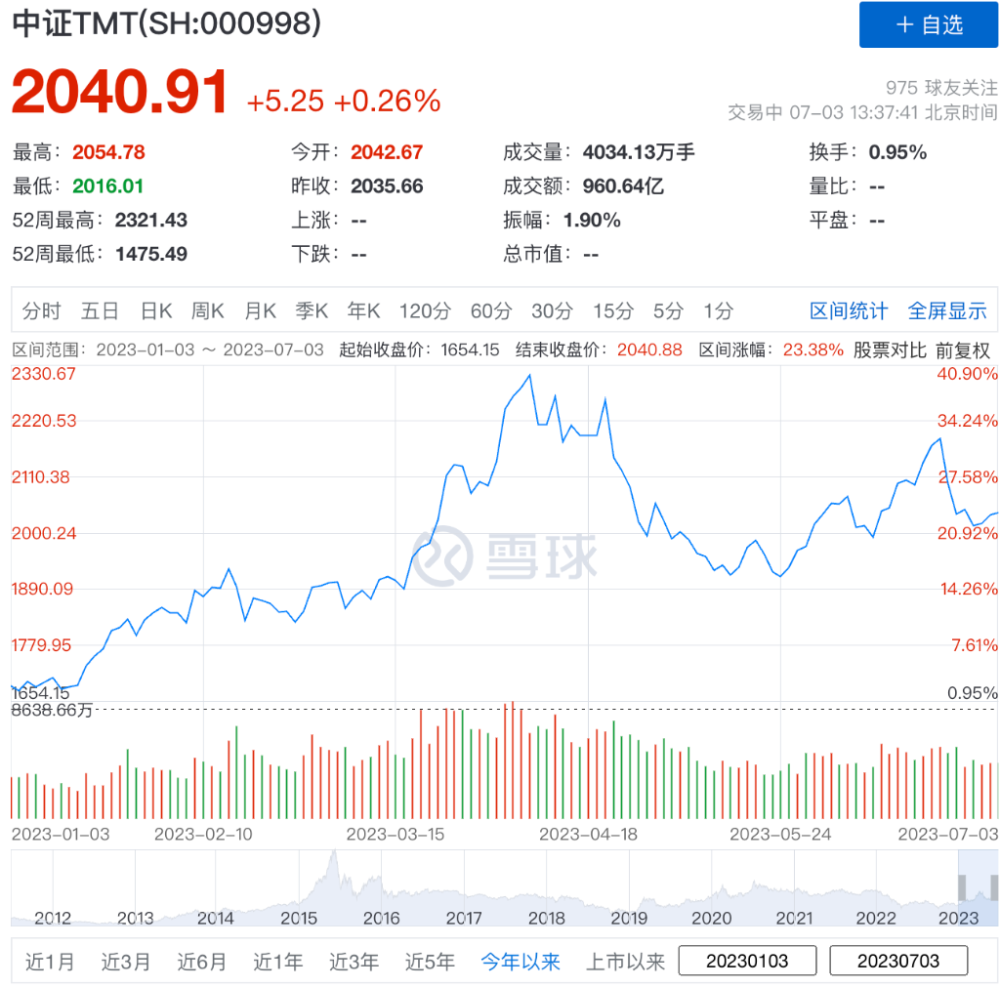
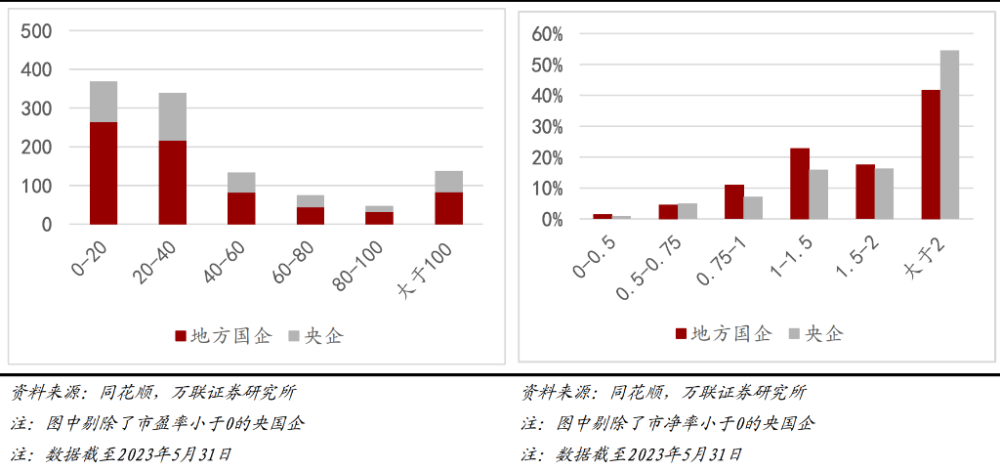

# 15大券商展望下半年A股港股：“数字经济”＋“中特估”成共识

A股港股在持续震荡中走过了2023年的上半年，如今又到了券商机构分析师们总结过去预判未来的时候。

今年上半年，A股呈现先扬后抑的走势格局，年初沪指一度涨超3400点。不过进入二季度，市场走势出现分化。上半年科创50表现亮眼，截止6月30日，累计涨幅近5%。

整个上半年，AI热浪席卷全球，A股的TMT板块在上半年狂飙，软件与服务业涨幅超30%、电信服务、技术硬件与设备、媒体行业涨幅居前。

**2023年下半年的主题似乎更容易预测。** 从最近大量国内经济和市场策略角度来看，研究机构的观点相对一致。

多数券商都对A股和港股的下半年走势表达了乐观的态度，认为随着市场风险偏好已逼近低点，后续进一步下行的空间有限，下半年不论是A股还是港股都将在下半年震荡反弹。

从板块来看，A股将延续“中特估”+“数字经济”的热潮，港股的互联网和中特估也将继续成为市场的焦点。

A股具备估值优势

对于下半年的A股走势，多家券商都表达了出了积极态度，国泰君安总结称，市场风险偏好已逼近低点，后续进一步下行的空间有限。

东吴证券指出，美债利率走势和内需政策是关键， **从这两方面看下半年A股将震荡上行** ：

一方面，未来A股资金面的关键要看美债收益率走向。若美债收益率回落带动中美利差缩小、人民币走强，叠加国内政策预期提升或后期稳增长政策实际落地，外资将有望重回流入，为A股注入流动性。

另一方面，美债利率的下行将使得国内政策空间打开，下半年刺激内需政策值得期待

中原证券分析称，2023年一季度盈利增速有所下降，但A股依然具备估值优势，有利于做中长期布局：

从市盈率估值看，申万全A指数市盈率16.8倍，处于历史分位数27.0%的水平；申万沪深300指数市盈率14.4倍，处于历史分位数29.2%的水平；申万创业板指数市盈率36.9倍，
处于历史分位数 14.8%的水平。

安信证券对后续市场走势评判也较为乐观，报告指出， **目前对A股下半年的走势暂时界定为：走出磨底期，开启技术性反弹** ：

进一步，从政策推动经济复苏预期的定价来看，我们维持反复强调 6 月 7 日中期策略会提出的“经济预期修复配置消费，消费下半年超额比上半年好”的大观点。

中原证券表示， **当前市场处于估值底部，值得长期战略配置。2023 年下半年市场有望从估值低点反弹：**

1.国内央行已经着手降低利率以推动经济发展，可能将明显提升市场偏好。

2.由于美国通胀水平依然高于其政策目标水平，预计2023年下半年还将加息1次，使美国政策利率达到5.5%，而如此高利率的环境必然打击美国经济。

3.美国经济在2024年进入衰退是大概率事件，美联储届时必然通过降息应对，全球无风险利率下行预期也存在可能。

信达证券认为，投资者对盈利的担心很多，即使用偏悲观的预期（即盈利下降的时间还要持续很久）， **股市的估值也大概率处于低位了：**

比如2011-2015 年，A股ROE中枢大幅下降，但估值的下降主要是在2011-2012 年。而2013-2015 年，在盈利下降的背景下，
股市估值中枢反而抬升了。2018-2019 年，A 股 ROE 下滑了2年，但股市底在2018 年Q4，2019 年股市也是估值抬升。

中信证券对于后续的走势则稍显保守，报告称，预计当前市场情绪和经济预期正处谷底，配置上 **建议以业绩为纲，兼顾政策主线。**

国胜证券相对来说稍显悲观，报告指出，下半年约束仍多，一是短期负循环亟待打破，居民谨慎、物价走低、企业利润承压；二是中长期约束凸显，赚钱效应下居民理财需求增加，预计债市走强、债券配置力量改善：

一季度央行问卷调查显示，居民储蓄意愿下降，投资意愿增强，反映赚钱效应下居民理财需求增加，有望为债市带来增量资金。综合看，债市走强、债券配置力量改善，对利率影响偏正面。

太平洋证券表示，尽管 **居民收入、** **消费者信心指数**
**、商品房成交等与疫情前仍有差距，但走出底部的迹象明显，不必过于悲观。消费存在阶段性的二次复苏行情。**

TMT——“风浪越大，鱼越贵”

从具体板块来看，多数券商都继续看好在上半年持续火热的TMT、AI、中特估等概念被券商普遍看好。

太平洋证券用“风浪越大，鱼越贵”来形容TMT行业。长期来看，TMT行业中的AIGC（生成式人工智能）仍是首选，从产业的发展来看，AIGC仍然处于初创期，这一阶段以估值驱动和主题投资为主，
**属于大行情上涨的第一阶段：**

从中长期来看，TMT行情只是大的上涨周期的起点，

1）同样的高通胀银行破产的宏观环境中，与科技革命相关的小票表现亮眼，科技板块在未来45年中拥有超额收益；2）行业周期处于初创期，只属于大周期上涨的第一阶段；

3）从资金调仓来看，资金向TMT行业的倾斜并未结束。

安信证券直言，基于当前的环境“TMT不会输”，TMT行情的第二波已经启动，顶部在今年第三季度的可能性较高，三个逻辑支撑：

1、2023年TMT释放业绩是大概率事件；

2、泛新能源离均衡仓位仍存在一定距离；

3、历史上大级别产业主题投资多为双顶结构，顶部间隔4-5个月。

今年以来，ChatGPT的出现让人工智能成了市场焦点，AI板块热度居高不下。以反映沪深市场人工智能主题证券表现的中证人工智能50指数为例（以下称“AI50指数”），截至6月30日，AI50指数自年初以来已涨达38.75%。

受人工智能热潮影响，TMT热度也在年内不断攀升。从中证TMT指数来看，截至6月30日，自年初以来已涨23.2%。

浙商证券指出，结构牛市已经开启，整体而言尽管TMT今年大涨，但估值仍处合理水平，随着财报季拉开维度，预计以AI上游为代表的部分领域有
**望迎来盈利和估值双升的戴维斯双击行情** ：

复盘结构牛市的估值规律， **盈利增速的提升往往驱动估值的进一步提升** 。具体来看，计算机、半导体、电力设备板块的 PE-TTM 在牛市启动均在 30
倍左右，随着中报、三季报、年报的盈利陆续确认，三轮结构牛市的PE-TTM同样迎来持续提升。

具体来看，观察PE-TTM，电子目前为 45 倍、计算机 75 倍、传媒50 倍、通信 35
倍，相较于此前高点的114倍、160倍、142倍、95倍的水平仍有较大的增长空间。

东吴证券指出，从新供给侧的角度来看，政策驱动下，AI等数字经济主题是我国现在面临的行业结构性机遇，AI的发展正加速赋能行业创业升级：

一方面，数字产业化、产业数字化有望挖掘潜能，打造为两大GDP驱动引擎；

另一方面，我国人口红利是建设数字化中国的宝贵财富，数据要素和设施投入打造“数据红利”：据国际数据公司测算，预计到2025年，中国产生的数据总量将达48.6ZB，对国内生产总值增长的贡献率将达年均1.5至1.8个百分点。

信达证券指出，后续来看， **主题行情如果能够升级为赛道，往往需要经济企稳** ：

我们认为，即使是历史上较强的两次成长股牛市，成长产生超额收益较强的阶段经济也是偏强的。

2019-2021
年成长股牛市期间，成长股在2019年的超额收益并不是很大，期间经济是下行的，而2020年-2021年，成长股的超额收益逐渐走强，期间的经济也是逐渐走强。

中特估魅力不减

去年11月北京举行的金融街论坛年会上，证监会主席易会满在发表主题演讲时首次提及“探索建立具有中国特色的估值体系，促进市场资源配置功能更好发挥”。

在此之后，中特估概念开始升温，相关指数不断攀升，以中证国新央企综合指数为例，截至7月3日，其自年初以来已涨5.25%，中证中央企业红利指数自年初也已涨8.56%。

平安证券认为，“中特估+”板块可分为“中特估+”板块即“中特估+分红” （金融/能源/通信/公用事业等）和“中特估+景气”
（先进制造/“一带一路”/数字经济等）。

万联证券指出，央企和地方国企PE和PB的分布规律类似，多数企业主要分布于低估值区间，在“稳增长、扩内需”基调下，大型基础设施建设类央企、国企业绩增长预期走高，
估值提升空间较大：

截至5月31日，从央企和地方国企估值分布情况来看，大多数央企和地方国企PE集中于0-20倍区间，其次为20-40倍区间。

其中在0-20倍市盈率区间，包含央企105家，地方国企264 家；

在20-40倍市盈率区间中，包含央企124家，地方国企215家。从市净率来看，央 企和地方国企PB多数在2倍以上，其中有
243家央企PB>2，占全部央企数量的54.48%， 有381家地方国企PB>2，占全部地方国企数的41.73%。

科技创新、绿色发展、数字经济等多个领域中央企、国企 加速布局，在政策支持下，市场对未来业务的发展寄予厚望，成长性可期。

安信证券总结称，“中特估”行情来看，1倍PB和5%股息是重要择时判断，若市场预期转弱， **“高分红中特估”** 大概率不出错（银行、电力）；若市场预期强，
**“业绩增中特估”** 大概率有希望（一带一路、 运营商）。

信达证券指出，从“中特估”来看，政策是比较重要的催化剂，本质是长期估值偏低的修正， **有望持续2年，可以持续关注。**

招商基金在报告中指出，“中特估”未来发展趋势为提高分红和回购，改善股东回报和再投资收益。

港股估值修复再次启动

多数券商认为，多重迹象指向港股再次进入超跌状态，港股估值迎来了流动性和风险偏好主导的修复。

中信建投在研报中指出，今年年初以来港股的涨跌主要由估值贡献，随着交易量的逐步萎缩以及卖空水平的不断上升，
**到了6月初多重指标暗示港股再次进入超跌状态，随着港股估值再度回到极具吸引力的水平，新一轮估值修复与扩张已经开启：**

恒生指数PE再次跌至历史均值减1倍标准差下限附近，前向PE跌破1倍标准差下限，恒指ERP靠近历史均值加1 倍标准差上限附近，恒指PB 再次破净。

股快速上涨的原因主要在于随着6月FOMC
暂缓加息预期的扩散，以及中美关系的阶段性缓和，港股估值迎来了流动性和风险偏好主导的修复，未来指数和估值扩张的持续性取决于盈利预期能否接棒，即下半年国内经济复苏的韧性以及企业盈利增速的弹性。

安信证券总结道， **下半年随着中国经济进一步复苏，美国经济走弱，宽松预期增强，港股开启震荡上行** 。

招商基金指出，港股市场后续整体偏震荡的概率较大，目前重点关注以下板块：

**（1）互联网电商板块** 。在消费刺激下，大促销给电商产业链相关公司二季度业绩带来的弹性值。其次，
AIGC（人工智能内容生成）发展下，互联网平台具备数据和研发优势，将有望持续受益；

**（2）电力运营商板块** 。由于非电企业下游需求不足叠加电厂库存较高，煤炭价格短期回落，火电企业
盈利端将迎来修复。近期输配电改革是较好的信号，逐步将电力市场化向用户侧推进，有助于辅助服务市 场以及容量市场的发展；

**（3）“中特估”主题** 。行情可能仍将持续一段时间，应关注阶段性机会。

