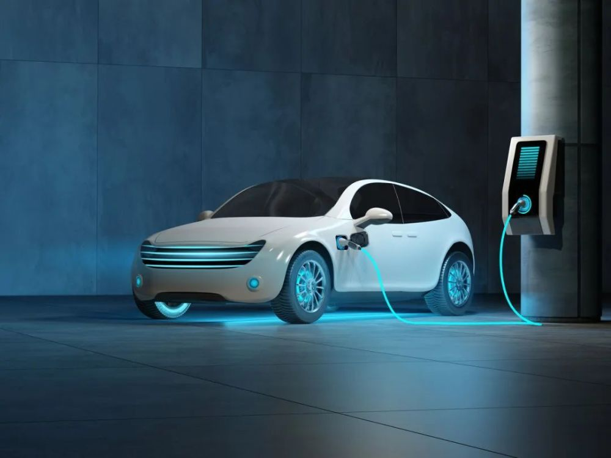
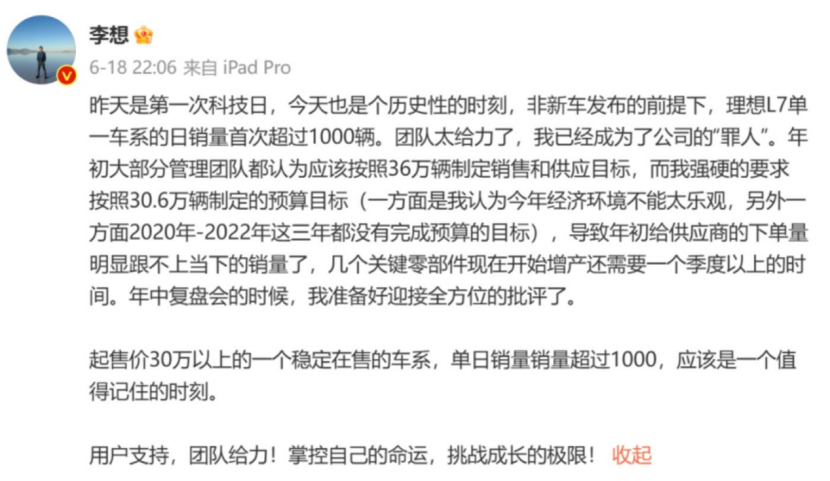

# “蔚来”们穷疯了：10天融了270亿，可还是不够

原创首发 | 金角财经

作者 | 塞尔达

有掉队危险的蔚来们正疯狂圈钱。

6月20日晚，蔚来汽车宣布与阿布扎比投资机构CYVN Holdings签订股份认购协议，后者将对蔚来汽车战略投资总计约11亿美元。

无独有偶，6月9日，阿维塔发布增资计划，拟募资总额不高于40亿元；6月13日，岚图汽车宣布获得包括中国工商银行、交通银行等六家银行联合授信150亿元。

在不到十天时间内，已经有三家公司迫于经营压力最终“摊牌”，颇有在下半年进行最后一搏的态势。

但在行业大打价格战、库存积压去化难、市场增量空间有限等疲软大环境下，叠加企业自身资金紧张、负债高企等因素，蔚来们最终能否活下去，依然面临严峻的挑战。

**触碰不到的规模效应**

历经半年洗礼之后，新能源车市场座次逐渐明晰，有掉队危险的品牌开始“搞钱”。

无论是阿维塔、蔚来这样的造车新势力，还是岚图这种传统车企转型的代表，均短期内无法冲破月销三万的门槛，进而难以实现规模效应来降低成本，从而缓解现金流压力。

生产一辆汽车，伴随而来的成本可以分为浮动成本和固定成本。所谓规模效应，是指当销量不断增加时，每辆车要摊分的固定成本会越来越小，从而推高毛利率，使企业由此实现盈亏平衡甚至开始盈利。

举例说，车企每年造车的固定成本10亿元，一年只卖1万辆车，每辆车摊分的固定成本高达10万元；但当销量达到10万甚至20万辆时，每辆车摊分的固定成本就降低到1万元甚至0.5万元，单车盈利能力就会大幅提高。

至于新能源车企销量要达到什么级别才有规模效应，自媒体锦缎在最近文章《电动车的“36万辆奇点效应”》中测算过，
**这个数字大概是月销量在3万辆左右，也就是一年要达到36万辆。**

因此，华为消费者业务CEO余承东此前为AITO问界定下的年销售目标，就是30万辆；理想汽车董事长兼CEO李想最近在社交媒体称，他年初制定的2023年销售目标为30.6万辆，而大部分管理团队认为目标应该设在36万辆，即月均3万辆。

理想今年业绩在造车新势力中独领风骚，主要原因就是销售量上去后获得了规模效应，该公司在2023年头5个月已累计交付10.65万辆新车，且截至6月27日，6月份销量累计达2.73万辆，十分接近月销3万辆数据。

当然，每个车企的技术、成本构成、营销方式不同，不能一概而论，但根据上述分析，要取得规模效应实现盈亏平衡，年销20万辆算是保底销量。

率先踏出融资活动的蔚来们，即使是数据最好的蔚来，头5个月的月均销售量连9000辆都不够，离年销量20万辆甚至30万辆还有相当长的距离；至于销量3000左右的岚图，以及1000出头的阿维塔了，情况就更严峻了。

汽车流通协会数据显示，阿维塔11今年前5个月的销量分别为1415辆、2018辆、2221辆、1610辆和1738辆；该公司定下的目标是2023年达到10万辆销量，从目前进程看，完成销量目标几乎不可能。

成立于2018年的岚图汽车作为东风汽车旗下高端新能源品牌，目前已经推出三款车型，覆盖了轿车、SUV和MPV市场。

乘联会数据显示，岚图汽车月均销量维持在3000辆水平，与主流造车新势力之间存在较大差距。原本应承担销量重任的新车型岚图追光最新月交付量仅为144辆，表现未及预期。

相比阿维塔和岚图，蔚来的销售情况相对较好，但却遭遇了高开低走，急需扭转势头。

今年一季度，蔚来汽车交付量环比减少22.5%至3.1万辆；在刚刚过去的4月和5月，蔚来汽车销量分别为6658台和6155台，远低于2月和3月的12157台、10378台。

在6月9日晚举行的财报会议中，蔚来CEO李斌承认二季度产品销量和预期确实有差距，直言市场竞争更加激烈导致部分消费者转向竞品车型。

**融资续命**

销量不甚理想，难以获得规模效应，蔚来们长期处于卖一辆亏一辆状态，面临巨大资金压力。

阿维塔财务数据显示，2023年一季度，其总资产达到97.54亿元，负债总额76.51亿元，营业收入10.99亿元，净利润为亏损6.43亿元；2020-2022年，阿维塔分别亏损1.5亿元、2.1亿元、2亿元，加上今年一季度，在三年多时间内已经亏损超过12亿元。

岚图汽车A轮融资时披露的财务信息显示，2021年和2022年上半年，岚图汽车净利润亏损分别为7.03亿元和7.38亿元。截至2022年6月30日，岚图汽车的资产总额为74.13亿元，负债总计65.29亿元。

三家之中品牌知名度最高的蔚来同样不理想，2023年一季度，蔚来亏损48.04亿元，相比去年同期亏损18.25亿元，亏损金额同比扩大了163.2%。

此外，今年一季报显示，蔚来账上现金比去年末减少超过50亿元，只剩下147.63亿元；但短期内要支付的“流动负债”却超过400亿元，其中仅“短期借款”和“应付账款及票据”合计就超过240亿元，都已经远高于账上现金。

更重要的是，蔚来账上的140多亿元并非全部用来应付流动性压力，还要拿去“烧”的。

蔚来虽然没有公布一季度现金流情况，但据其去年财报，2022年蔚来经营现金流净流出接近40亿元；随着降价促销活动展开，蔚来毛利率将进一步承压甚至变负数，亏损幅度也有可能扩大，未来一年的经营现金流净流出相比去年恐怕不降反增。

这意味着，蔚来未来一年要还的钱超过400亿元，保守估计在经营上还要烧40亿元，但账上只有140多亿元，资金缺口接近300亿元。

面对庞大的资金压力下，蔚来们能应对的办法并不多。

现金流主要由三部分构成——经营现金流、投资现金流、融资现金流。

从经营现金流角度看，未来一段时间，蔚来们大概率还是维持在卖一辆亏一辆的状态，卖车在短期内要实现盈亏平衡都不现实，更不用说可以“自主造血”应对流动压力。

另一方面，投资现金流角度看，蔚来们通过处置资产还债的可操作性也不大。

以蔚来为例，截至一季度末，蔚来物业、厂房及设备接近160亿元，仅仅略超上述计算的300亿元资金缺口的一半，况且也不可能大量处理这部分非流动资产，因为如果把一家公司最核心的资产都处置了，这家公司后续就难以去画饼和炒概念了。

因此，蔚来们最主要的输血来源，是第三个现金流——融资现金流，这也是为什么在经营不善、面临资金压力下，这些新能源车企把主要目光都放在对外融资圈钱。

6月9日，阿维塔在重庆产权交易网发布增资项目。项目介绍显示，阿维塔科技拟实施企业增资，拟募资总额不高于40亿元，项目募资用途为“用于研发设计、产线投入、市场品牌发展、渠道建设等方面，及补充企业流动资金需求”。

值得注意的是，这次增资特别表示原股东会参加增资；增资后，长安汽车和南方资产合计持股比例不超过50%。

除了六家银行的150亿元联合授信，岚图在继去年11月获得一笔近50亿元A轮融资后，又密集推进B轮融资，为后续产品研发补足资金。岚图汽车相关人士向媒体回应称，首轮融资后，岚图汽车在有计划地进行下一轮融资，同时也有IPO的规划。

6月20日晚，蔚来汽车宣布与阿布扎比投资机构CYVN Holdings签订股份认购协议。CYVN
Holdings将通过定向增发新股和老股转让的方式对蔚来汽车战略投资总计约11亿美元。

增发和老股转让交割后，CYVN Holdings将拥有蔚来汽车已发行股份总数的约7%，有权向蔚来汽车董事会提名一位董事。CYVN
Holdings是由阿布扎比政府占有多数股权的投资主体，业务重心为先进、智能移动出行领域。

**下沉不易**

暂时获得融资的蔚来们，算是缓了一口气，但倘若要真正生存下去，还需要销量能达到获取规模效应的级别。

以目前新能源车的市场情况来，一二线城市已接近饱和，是卷无可卷的存量市场，唯有三四线城市乃至村镇市场尚有增量空间。但实际上，下沉市场能拉动的量其实也相对有限，所谓红利最后只能救活一两家企业。

此外，在巨大库存压力下，新能源车下沉也成为了各大车企去库存的重要选项。

2022年，中国有80.6万辆新能源车积压在厂家和经销商的手里；2023年的一季度，库存车又增加了25.7万辆，平均每个月都有8.5万辆的新增积压库存车；这也使得截至今年一季度末，中国新能源汽车库存量超过了106万辆。

即使是龙头车企比亚迪，库存水平同样十分高。今年前三个月，比亚迪新能源汽车新车上险量为11.8万、14.6万、18.3万辆，与公布的销量数据分别差3.34万、4.76万、2.38万辆。也就是说，一季度比亚迪就新增库存车10.48万辆。

这样一来，下沉市场能拉动的销量就显得杯水车薪了。

以被寄予厚望的“新能源车下乡”为例，西南证券在基于“农村人均可支配收入每年同比增长3%”等乐观假设基础上，预测2023-2025年新能源车下乡存量分别为288.9万辆、318.2万辆、347.9万辆。

这也意味着，乐观预测2023年“下乡”带动的销量，也就22.9万辆，是比亚迪今年一季度新增库存量的两倍左右；
**而2024-2025年“下乡”带动的销量，上述报告预测均不足30万辆**
，对于目前我国新能源车行业现存超百万辆、月增过8万辆的库存水平来说，规模并不大。

正如前面提及，一家新能源车企能获得规模效应，一般来说需要年销量保底为20万辆， **这也意味着所谓“新能源车下乡”的红利，其实也就能救1家车企** 。

此外，对于蔚来们来说，在僧多粥少的下沉市场还要面对传统燃油车的不断挑战。

从目前情况看，三四五线城市和农村市场，传统燃油车依然占据主导地位。

首当其冲的原因是成本优势，新能源汽车的电池成本居高不下，占到整车成本的40%以上。电池上的昂贵成本所造成的价差，就可以满足一辆燃油车开10年的油费了。

在价格战打响后，

日产轩逸

重新夺回了轿车榜冠军，大众

朗逸

也跻身第二，比亚迪秦跌至第三。此前，燃油车已经连续实现了3个月的正增长，尽管总体竞争力有所下滑，但在下沉市场还是能给新能源汽车造成巨大压力。

除了成本，蔚来们还受困于销售模式，这三家企业均定位中高端，且以一二线城市的中产人群作为核心人群去营销。

新能源车的销售模式往往是线上预订与新直营模式，这种模式更适合城市，在农村买车更多依靠熟人推荐或者去当地4S店、经销商门店等大背景下，就可能显得水土不服。

此外，经销商体系的不完善也导致了售后环节不足，进一步对新能源车销售端产生负面影响。这也是解释了为何在5月初的国常会上，会议就专门提出在鼓励新能源车下乡方面，要引导企业下沉销售服务网络，鼓励高职院校面向农村培养维保技术人员。

最重要的是，蔚来们动辄二三十万元的售价，对于下沉市场的消费者来说偏高，除非这三家拿着融资而来的资金来大打价格战。

简单点说，蔚来们定位中高端市场，且用尽浑身解数也没有在上半年的一二线城市卷过比亚迪、

特斯拉

和理想，转换攻坚重点同样困难重重，目前已经处于上下两难的境地。

参考资料：

界面新闻《岚图汽车密集推进B轮融资 此前A轮融资近50亿元》

穿透公司《阿维塔迎来最大增资达40亿 一季度营收超10亿亏损超6亿》

牲产队《为什么新能源汽车要下乡？》

