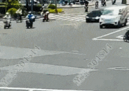
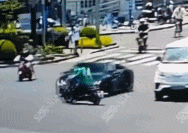
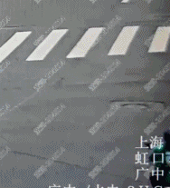
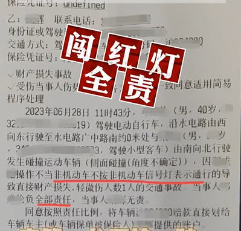

# 上海一男子被跑车撞飞，被判负全责赔数十万车损，交警判罚获赞

电动自行车省钱省油，快捷不堵车，可谓是“出行神器”。随着电动自行车使用群体的日渐庞大，“碰一碰”的交通事故时有发生。有事故就会涉及责任与赔偿，
**电动自行车事故频发的背后，该由谁“买单”？**

一直以来，在机动车与非机动车的事故认定和经济赔偿中，大家似乎都有一个印象，就是机动车保险全、保护措施足，多少要在事故中承担一点责任。现在小坊可以负责任地告诉你：你想多了！

2023年6月28日，上海市虹口区发生了一起交通事故，电动自行车驾驶人 **因没有遵守交通规则而要承担事故的全部责任，需赔偿几十万车损。**

事故发生时一辆跑车绿灯正常过路口时， **突然有一辆电动自行车从左侧横过路口，** 虽然跑车驾驶员采取了立即刹车的措施， **但还是未能避免相撞。**
电动自行车驾驶人邓某被撞飞上引擎盖后摔落在地，幸运的是只受皮外伤。

经交警调查， **邓某系闯红灯通行，负事故全部责任，需承担跑车高达几十万的车损。** 邓某对此后悔不已，如果遵守法规，就不会有这样的结果。

该事故被公安部交通管理局公开报道普法， **底下多条留言被高赞，第一甚至点赞有2500+**

“终于看到赔汽车钱的案子了”

“闯红灯必须全责”

“希望全国的交警都向你们学习”

事实上，今年4月上海交警部门就透露，自2022年以来，全市适用一般程序处理的机、非事故中，非机动车承担同等及以上责任的已经占到了近6成，当时就公布了4起非机动车闯红灯酿事故承担全责的典型案例。

（戳这里回看小坊此前报道>>>）

交警提醒：

与汽车相比，非机动车没有金属外壳保护，两者之间发生事故，受伤更重的一定是非机动车一方。请广大非机动车驾驶人一定要遵守交通法规，不闯灯，不与汽车抢行！

各位电动自行车骑行者

请时刻牢记

红灯停、绿灯行

佩戴好安全头盔

按规定各行其道

是对自己、家人和他人的负责

更是为城市交通的文明有序

贡献自己一份力量

-END-

本文编辑｜小门耳

消息来源｜新闻坊综合公安部交通管理局、第4焦点上海交警微发布、此前报道

