# 世界上第一个拥有猪心的人死亡，科学家花了一年时间找原因

2022年3月10日，全球首位接受转基因猪心脏移植患者离世，距手术约2个月。然而这位世界上第一个拥有猪心的人，究竟是怎么死的，完全成谜。柳叶刀顶尖科学家花了整整一年时间，原因终于找到了！

真的很遗憾！

首先致敬这位病人，为人类医学事业做出了贡献。

这次患者存活了2个月，已经有了很大的进步。

1984年，一个濒临死亡的婴儿曾移植了一颗狒狒的心脏，活了21天。

后来几十年，研究者在狒狒身上进行了大量的猪心移植手术，存活时间最长的超过900天[1]。

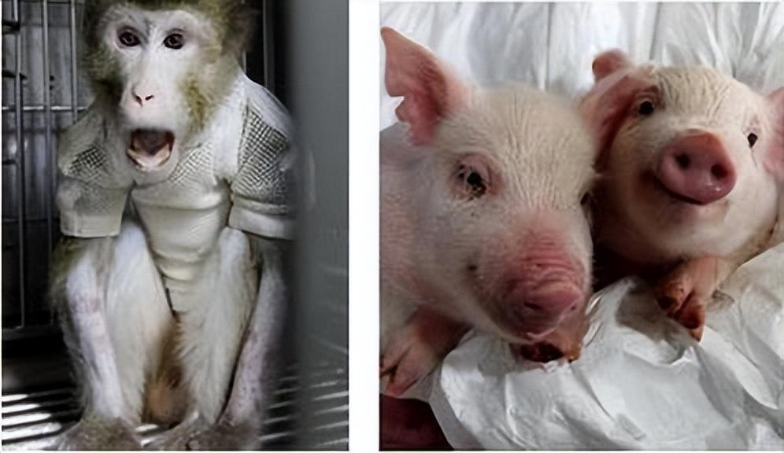

**不得不说，人与狒狒的差异还是十分巨大的。**

人与人之间的心脏移植已经取得了不错的预期生存率：

中国一年的生存率在97%左右，三年生存率大于90%，五年生存率大于85%。不仅高于国际平均水平，也高于美国。当然，这不是技术差距，因为中国每年心脏移植手术大约500例左右，而美国每年是2000~3000例。中国拥有更多患者死于心脏衰竭，而没有器官移植的机会。

心脏移植存活率也存在两性差异（以下是10年前国际平均数据）：

1年:88.0%(男性)，86.2%(女性)

3岁:79.3%(男性)，77.2%(女性)

5岁:73.2%(男性)，69.0%(女性)

可以看出，人类异种移植还需要较长的路要走。

全球首例接受猪心脏的患者之所以选择猪心移植，是由于他心力衰竭和心律不齐，不符合人类心脏移植或心脏泵的条件，所以不得不选择猪心。

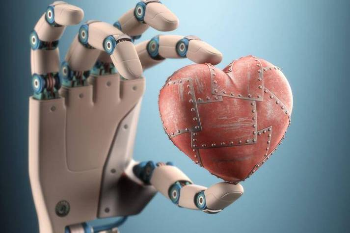

**为什么要用猪的心脏，而不用其它灵长类的呢？**

其实，医学研究者，最开始考虑的的确是黑猩猩，它们不仅和人类有着最近的亲缘关系，器官大小相近，而且血型也匹配。但由于黑猩猩是濒危动物，所以才选择其它物种替代。

后来研究者拿狒狒尝试过，但心脏过小，O型血罕见，生育期长，这些都不合适。

除此之外，其它灵长类也和人类有着很多共患疾病，会增加疾病传播风险。

而猪相对来说，和人类有着较近的系统发育，但又远到足够降低大多数共患基因疾病风险（大约8000万年的亲缘差距）。

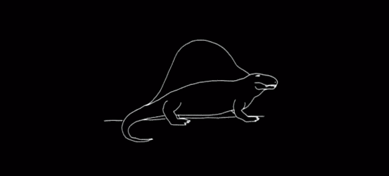

除此之外，猪心脏大小适中，妊娠期相对较短，产仔数较大，易于繁殖，容易获得，价格低廉，适用基因编辑工具CRISPR……总的来说，二师兄几乎是完美的异种器官来源。

而在非人体试验中，科学家已经通过把猪移植在狒狒身上，进行了很多的尝试。例如本次给患者进行手术的医生，在此之前，已经给50只狒狒做过猪心移植手术[2]，可达到两年的生存周期。

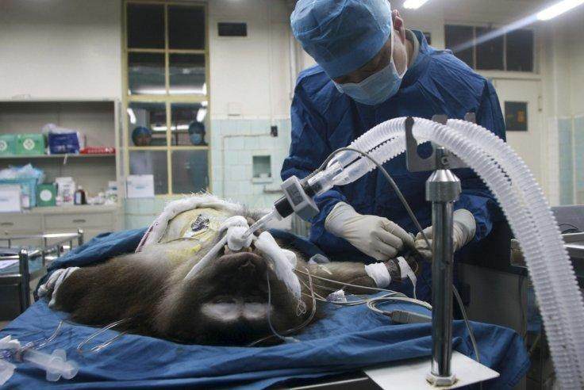

**患者死亡的具体原因正在等待解剖结果，但它可能是极其复杂的综合原因，总体上来说，可能有以下几点：**

1、异种感染：

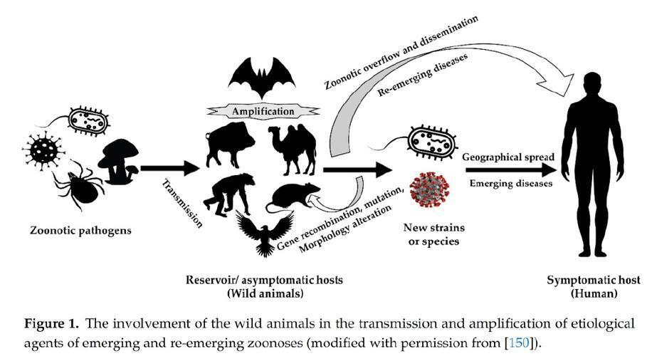

“人畜共患病”病原体（包括内源性逆转录病毒）是异种感染的最大威胁，这些微生物和内源性病毒可能导致致命感染，同时异种感染也会导致器官排斥。

但作为如此重要的器官移植手术，异体病原体应该会得到最大程度的解决。例如，本次移植的猪心脏便淘汰了数十个内源性逆转录病毒。

2、器官排斥：

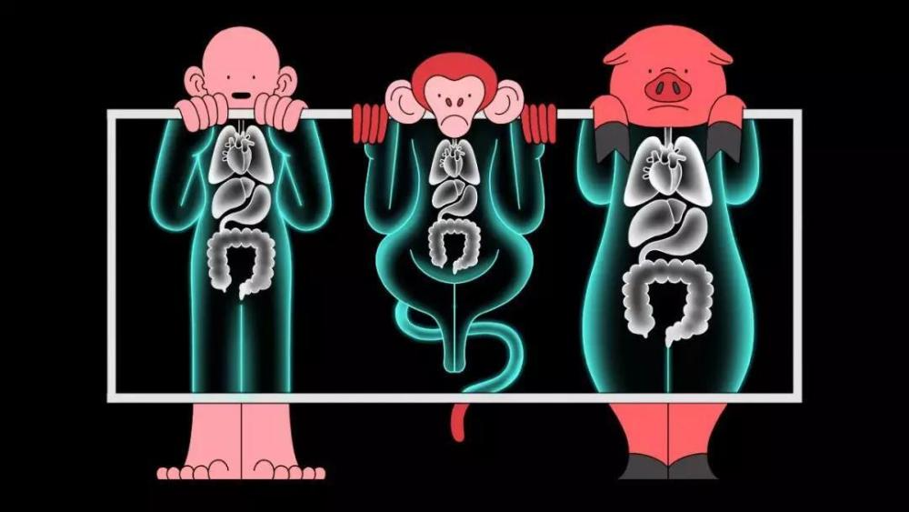

异种移植的排斥反应，往往比人与人之间严重很多，甚至可能导致立即死亡。

主要反映为：

超急性排斥反应、急性血管排斥反应、细胞排斥反应，以及慢性排斥反应。

快速、暴力的 **超急性排斥反应**
源于异种反应性天然抗体(XNAs)[3]，以疫球蛋白M为主，反应过程会导致移植器官内皮损伤、炎症、血栓形成和坏死，其通过体液免疫迅速传遍全身。

所以，这又称为全身炎症反应综合征，，宿主可在术后几分钟到一个小时内死亡。

XNAs发生超急性排斥反应时，靶向的是一种半乳糖（galactose-alpha-1,3-galactose，缩写αGal）

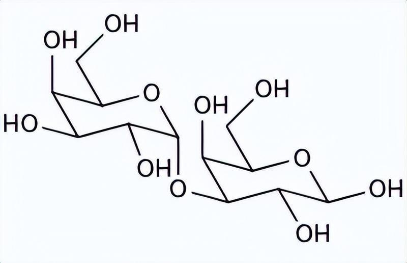

这种半乳糖的酶在绝大多数非灵长类都存在，当然也在猪身体内存在。所以人体会把猪身上的αGal视为抗原。人失去了相关蛋白表达的GGTA1基因，所以会把猪身上的相关蛋白视为具有严重威胁的入侵抗原体。

本次异种移植，医生提前修饰了猪心脏细胞中表达半乳糖蛋白的GGTA1基因（同时修饰的还有CMAH和β4GalNT2基因）。患者术后三天反应良好，且存活了两个月，可见修饰相关基因后，取得不错的效果。

但也不能绝对保证没有发生超急性排斥反应，因为该反应也有很高比例在3个月内发生，甚至在几个月1年后发生。

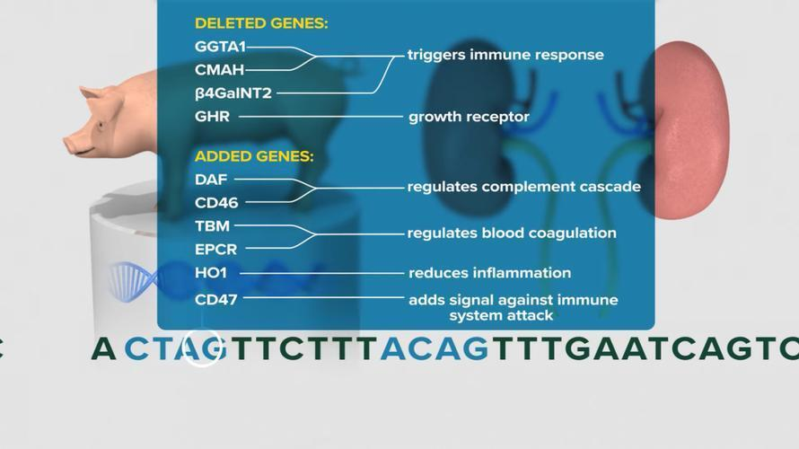

**急性血管排斥反应**
大致在术后2~3天发生，原因比超急性排斥反应复杂很多（有的也与XNAs有关）。该反应需要从头合成蛋白质，通过猪心脏内皮细胞和患者的抗体、巨噬细胞和血小板之间发生相互作用。

这种反应表现主要表现为炎症反应，如巨噬细胞浸润和自然杀伤细胞浸润，从而进一步导致血管内血栓形成，以及血管壁的纤维素性样坏死 。

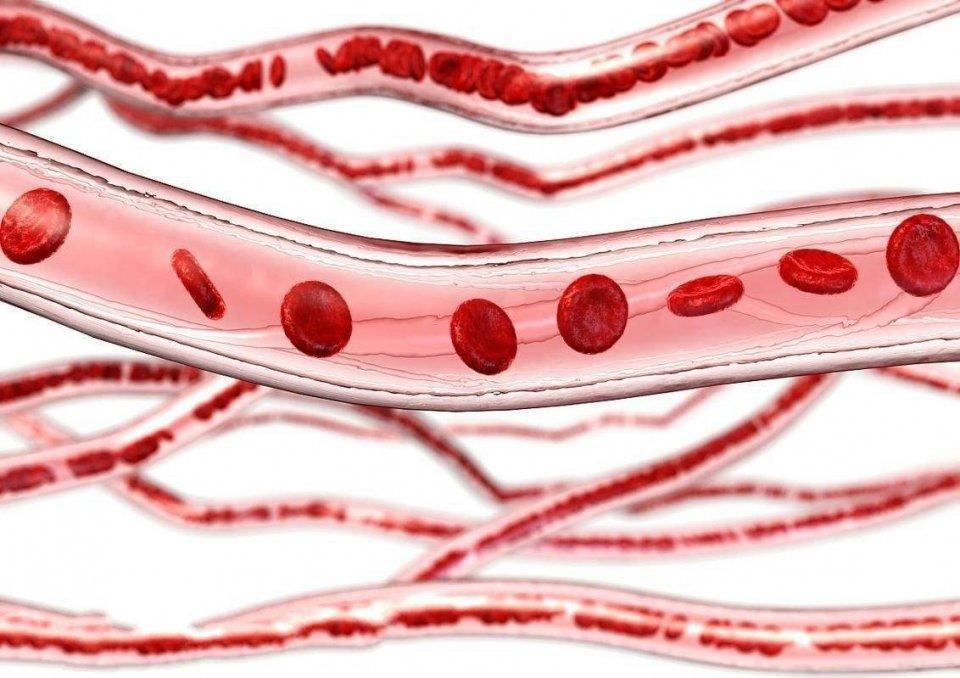

**细胞排斥反应** 同样是由XNAs引发的，基于细胞免疫，强度受限于不同种动物之间肽的差异。

**慢性排斥反应** 原因更为复杂，机制也不是十分清楚，主要表现为低水平的特异性免疫持续破坏，引起血管炎症，导致硬化、变窄，最终导致供体器官的衰竭。

不过慢性排斥反应发生的时间，主要在几个月之后。

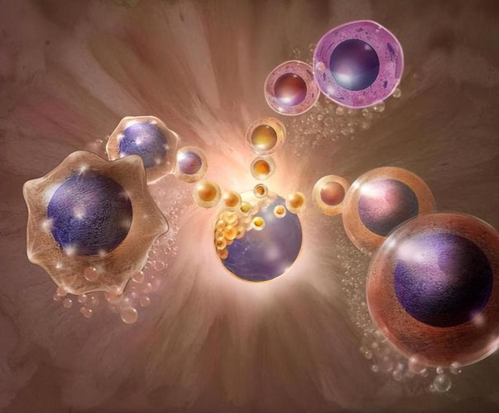

本次猪心脏移植所修饰和敲除的10多个基因，还包括参与逃避自然杀伤细胞和抗炎基因的，以及与补体、凝血级联相关的基因。

其实医学研究者已经尽量针对性解决人类已知可能器官排斥的原因。

但患者依旧死亡，的确令人遗憾。

这例手术其实颇为严谨，为了让猪心脏适应人类身体，除了修改包括GGTA1基因在内的10基因，敲除或灭活生长基因在内的4个基因。为了让人体免疫系统能耐受外来组织，还插入了6个人类的基因。

作为首例猪心脏移植患者，在移植后三天情况良好，当初医学界一度振奋。

这个手术的成功，被认为解决人类器官危机更近了一步。

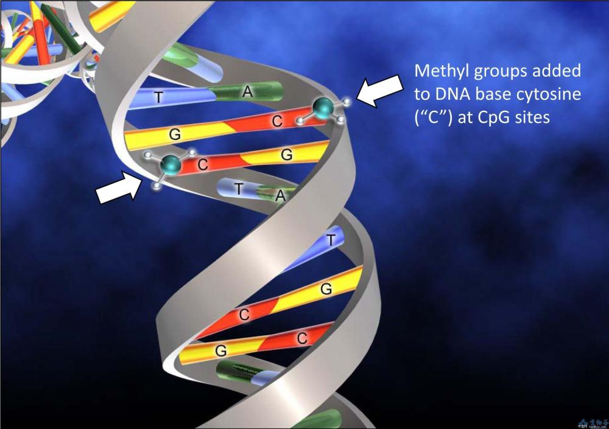

**时隔一年，柳叶刀的科学家，有了更加确定的结果[3] ：**

对于这些原因，科学家更加倾向认为最后一个原因为主，那就是所移植的猪心中存在病毒。

但个人认为，其它的原因也是不容忽视的。即便猪心没有存在病毒，要解决抗体介导的排斥反应、以及异体免疫反应，都还有很长的一段路需要走。

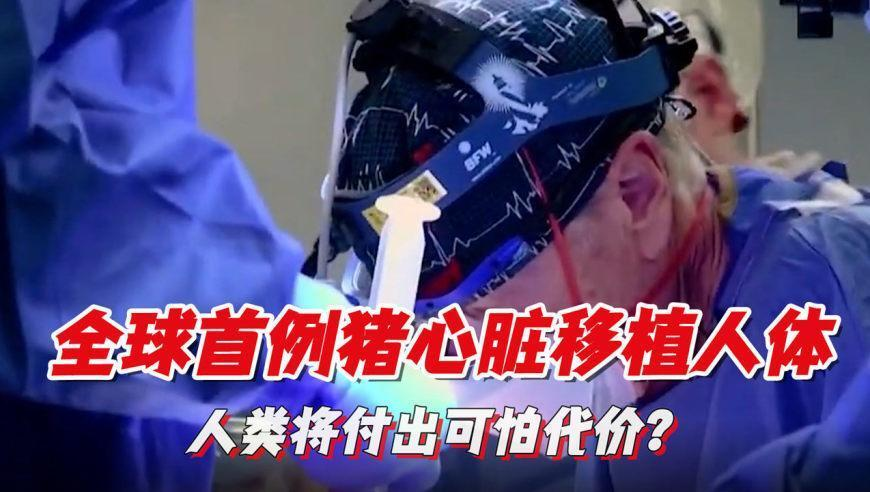

猪心首次移植在人类身上，的确是跨时代的意义，它打开了全新的格局。

希望研究者能尽可能解决死亡问题，这样异种移植有可能打开一个崭新的世界。

总的来说，找出死亡原因是无比重要的。

其实，作为猪器官移植的第一人，本身就带着“小白鼠”的性质，虽然很遗憾，但他也算是为了人类的医学事业做出贡献了。

致敬。

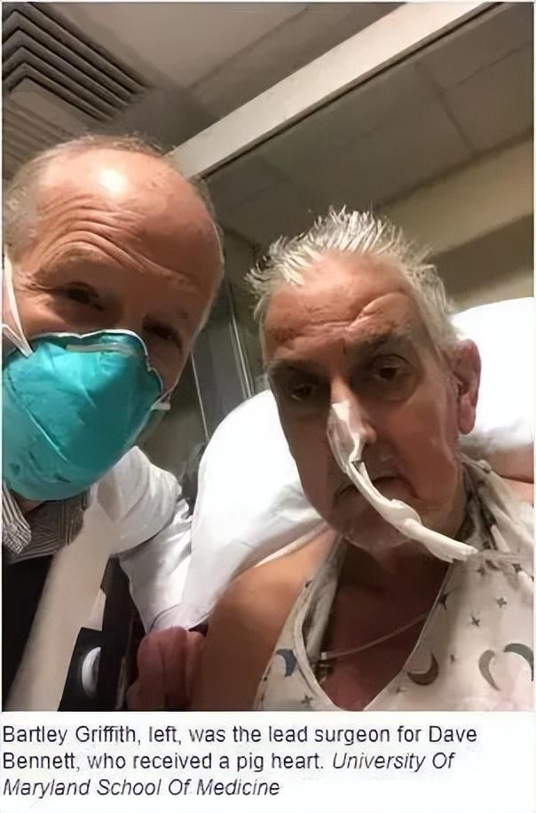

参考

^Gianello P . Xenotransplantation: past, present and future[M]. 2013.

^ "In 1st, US surgeons transplant pig heart into human patient". Associated
Press. 2022-01-10. Retrieved 2022-01-10.

^MD Dooldeniya, Warrens A N . Xenotransplantation: where are we today?[J].
Journal of the Royal Society of Medicine, 2003, 96(3):111-7.

^Mohiuddin M M, Singh A K, Scobie L, et al. Graft dysfunction in compassionate
use of genetically engineered pig-to-human cardiac xenotransplantation: a case
report[J]. The Lancet, 2023.

