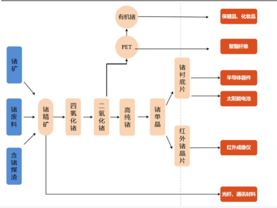

# 中国为何宣布对镓和锗实行出口管制？专家：或许意味着一种对等反制

【环球时报-环球网报道
记者倪浩】为维护国家安全和利益，7月3日，中国相关部门发布公告，决定自8月1日起，对镓和锗两种关键金属实行出口管制。中国在这两种广泛应用于战略新兴产业的金属原材料上，不但储量丰富，而且是全球的供应大国。接受《环球时报》记者采访的专家认为，中国通过出口许可制，可以厘清这些关键金属出口的最终用户和用途，以规避危害国家安全和利益的风险。另外，在美国打压中国高科技的背景下，中国的出口管制或许意味着一种对等反制。

为什么是镓和锗？

7月3日晚间，商务部、海关总署联合发布公告，对镓和锗两种金属相关物项实施出口管制。公告称，根据《中华人民共和国出口管制法》《中华人民共和国对外贸易法》《中华人民共和国海关法》有关规定，为维护国家安全和利益，经国务院批准，决定对镓、锗相关物项实施出口管制。

根据公告，镓相关物项中，金属镓（单质）、氮化镓、氧化镓、磷化镓等，以及锗相关物项中的金属锗、区熔锗锭、磷锗锌、二氧化锗等未经许可，不得出口。出口经营者应按照相关规定办理出口许可手续，通过省级商务主管部门向商务部提出申请，商务部自收到出口申请文件之日起进行审查，或者会同有关部门进行审查，并在法定时限内作出准予或者不予许可的决定。而对国家安全有重大影响物项的出口，商务部将会同有关部门报国务院批准。

根据公告，对镓和锗两种金属相关物项的出口管制将于8月1日起正式实施。

公开资料显示，镓和锗都是新兴的战略关键矿产，均已被列入国家战略性矿产名录中。两种金属矿产无论是在储量还是在出口上，中国均在全球占据领先地位。

《环球时报》记者查询到的中国地质科学院矿产资源研究所2020年的一份报告显示，镓早在第二次世界大战期间就被认为是一种战略性和关键金属，目前镓的世界总储量约
23 万吨，中国的镓金属储量居世界第一，约占世界总储量的
80%-85%。其中被列入出口管制中的砷化镓作为第二代半导体材料的代表，在高频、高速、高温及抗辐照等微电子器件研制中占有主要地位；半绝缘砷化镓材料主要用于雷达、卫星电视广播、微波及毫米波通信、无线通信（以手机为代表）及光纤通信等领域；氮化镓作为典型的第三代半导体材料，是目前世界上最先进的半导体材料，是新兴半导体光电产业的核心材料和基础器件，在手机快充、
5G通信、 电源、 新能源汽车、LED 以及雷达等方面具有远大的应用前景。

报告显示，中国是金属镓的最大生产国，主要供应美国、欧盟、日本和韩国等发达经济体。但中国镓产业一直处于出口初级产品，进口核心技术深加工产品的尴尬境地。

锗作为另一种关键金属也被多国列入战略储备物资的重要战略资源。据东方财富证券刚发布的一份报告，锗常被应用于红外光学、纤维光纤、太阳能电池、聚合催化剂及医药等高新技术领域。未来在芯片、太阳能电池、生物科技和武器制造中具有极其重要的潜在价值。

美国地质调查局2016年曾发布过一份统计数据，全球已探明的锗保有储量仅为 8600
金属吨，主要分布在美国、中国和俄罗斯。其中美国占全球的45%，其次是中国，占全球锗储量的41%。中国锗的产出主要来源于褐煤矿，开采便利，因此在全球锗产量中位居前列，近十年来累计供应全球
68.5%的锗。而美国虽然是全球最大的锗资源储量国，但自 1984 年以来，就将锗作为国防储备资源进行保护，尤其是近几年已基本不再进行锗的开采。

专家：对两种金属相关物项实施出口管制，或是一种对等反制

中国现代国际关系研究院世界经济研究所研究员陈凤英在接受《环球时报》记者采访时表示，关键矿产资源因为扼守着战略性新兴产业发展的咽喉，因而在复杂的地缘政治环境下，成为大国博弈的一块新战场。

一位匿名业内人士告诉《环球时报》记者，欧美日等西方发达国家近年来纷纷制定战略，不断发布并完善战略性矿产资源目录，以维护本国在尖端高科技领域的战略安全。中国与美欧之间对关键矿产的竞争关系到产业发展和大国竞争，已不可避免。

_锗生产链条示意图（图片来自东方财富证券）_

在全球范围内，美国拜登政府炮制拉拢盟友合伙打压中国的一贯政策，通过签订“能源资源治理倡议”“矿产安全伙伴关系”（MSP）等筹划供应链和产业链联盟,构建“小院高墙”，企图与中国脱钩断链，并阻滞全球化进程。

眼下，在关键金属下游的半导体产业上，美国对中国的打压正愈演愈烈，美国不断拉拢胁迫盟友组成共同战线。日本在5月底宣布对23种半导体设备和材料进行出口限制，7月23日起正式实行。荷兰作为全球最大的光刻机生产国6月30日宣布，进一步收紧光刻机出口政策，高端DUV光刻机9月1日起将限制向中国出口。

陈凤英在接受《环球时报》记者采访时表示，国际上很多稀有的关键金属都是由中国向外供应的，那么为什么中国供应给一些西方国家，制成芯片反过来卡中国的脖子呢？陈凤英认为，7月3日晚，两部门公告对两种金属相关物项实施出口管制，或是一种对等反制，也是维护国家安全和利益的一种做法。

对两种金属相关物项实施出口管制有法律依据

《中华人民共和国出口管制法》第十条规定，根据维护国家安全和利益、履行防扩散等国际义务的需要，经国务院批准，或者经国务院、中央军事委员会批准，国家出口管制管理部门会同有关部门可以禁止相关管制物项的出口，或者禁止相关管制物项向特定目的国家和地区、特定组织和个人出口。第十三条规定，国家出口管制管理部门综合考虑相关因素，对出口经营者出口管制物项的申请进行审查，作出准予或者不予许可的决定，国家安全和利益被列在了第一条。《中华人民共和国对外贸易法》第十六条规定的可以限制或者禁止有关货物、技术出口的第一个原因就是维护国家安全。第十九条规定，对限制进口或者出口的货物，实行配额、许可证等方式管理。

上述业内人士告诉《环球时报》记者，7月3日晚间对两种金属相关物项的出口管制是依据了出口管制法，而出口管制法的核心要义就是维护国家安全。因此中国对两种金属相关物项实施出口管制是有法律依据的。该人士认为，根据两部门的公告，出口者需要向商务部说明最终用户和最终用途证明，以及进口商和最终用户情况介绍。如果涉及到军事用途或者应用于危害到中国国家安全和利益的场合，那么相关部门有权力对出口做出不予许可的决定，从而实现对国家安全和利益的维护。

陈凤英表示，近几年来，美国为打压中国高科技，在全球拉拢盟友，构建小院高墙，进行脱钩断链。尤其是日本和荷兰在美国的胁迫下，先后收紧了对中国的半导体的出口管制。现在美国又在酝酿收紧AI芯片的出口，在这种欺人太甚的情况下，中国两部门的出口管制也算是一种对等反制方面的安排。另外，陈凤英认为，资源是有限的，开采资源也意味着较大的环境成本，通过出口管制实现对有限资源的保护，也是维护国家安全与利益的一种体现。

