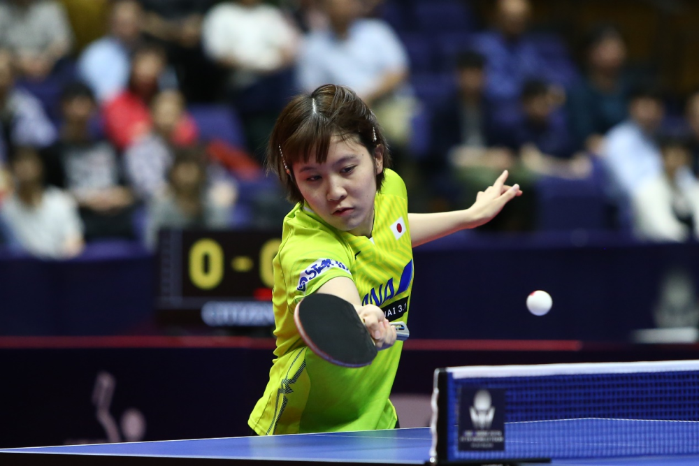
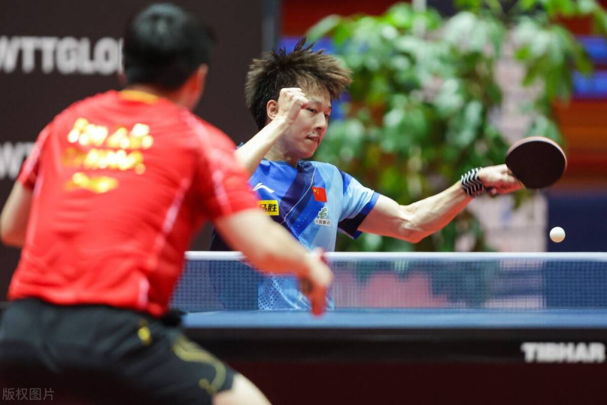
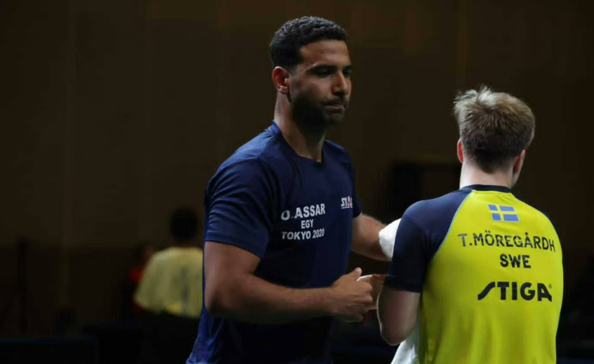

# 体谈丨孙颖莎不敌平野美宇引发焦虑？国乒被日本卷总比内卷好

男女乒世界第一在同一天输掉金牌。与樊振东不敌林高远的中国内部竞争相比，孙颖莎不敌日本选手平野美宇的结果引起了球迷的些许焦虑。在日本大力发展乒乓球运动，备战奥运的背景下，他们的进步会对中国在乒坛的地位产生怎样的影响？

**撰文丨于睿寅**

**编辑丨冯小**

距离德班世乒赛结束才一个多月，樊振东和孙颖莎——这两位同日加冕男女单冠军、又在国际乒联排名中稳居第一的中国选手——就在同一天输了球。

在北京时间昨晚结束的WTT萨格勒布站上，樊振东男单决赛3-4被队友林高远逆转，遗憾丢金，不过这毕竟只是“内战”输了；孙颖莎在女单决赛同样苦战7局，输给跟自己一边儿大的日本选手平野美宇，就让有些球迷不太痛快了——4年外战不败的新一代“大魔王”，就在这一站翻船了？

可樊振东、孙颖莎才没有时间耽溺在遗憾的叹息中，因为卢布尔雅那站在今天就打响了，中国男女队都是尽遣主力出战。顶尖赛事密集的好处就在于，高手交锋前脚刚冒出的对手、结下的恩怨，后脚有机会就能用实力再比个高下，不用等个漫长的4年。

_图说：输给平野美宇结束多年的“外战不败”，对孙颖莎而言并不是坏事。_

战胜樊振东的林高远虽然每逢大赛都是“压线进主力”的角色，但也是国内乒乓球迷们再熟悉不过的名字。刚结束的德班世乒赛上1/4决赛输给马龙，近6年的各路大赛基本都是被“自己人”打出局，此番却在决赛中力压世乒赛夺冠后调整期的小胖，也算是“逆天改命”了一把。

倒是战胜孙颖莎的平野美宇值得着重提一下。这位千禧年出生在日本乒乓世家的年轻姑娘，其实是“出道要趁早”这句话的绝佳写照。2014年不满14周岁时就和伊藤美诚搭档，在德国公开赛上获得女双冠军，成为史上最年轻的女子巡回赛世界冠军；从2016年10月到2017年4月这半年间，又接连把世界杯女单冠军、日本全国女单冠军、亚锦赛女单冠军这3项“最年轻”的头衔揽入囊中——完成上述壮举时，她距离17周岁生日才刚过去1天。

但平野的职业生涯有些高开低走的味道，最近5年里除了随日本女团拿到的名次，其余时间在大赛中毫无建树，世界排名也落到20名开外。究其原因，当然和过早地冒尖和中国队的重视不无关系。2017年亚锦赛夺冠那会，她可是从进入8强起连克丁宁、朱雨玲、陈梦3位中国主力而一举夺冠，当时刚刚升任国乒总教练的刘国梁是第一次现场看她打球，忍不住感叹道：“平野在打法先进性和成型的体系上已经超过了以前所有的日本选手，甚至和我们这些年轻运动员的直接对抗上已经表现出来了。她靠的是实力，而不是我们说的爆冷，我们确实要客观地面对。”

_图说：平野出道很早，但2017年以来一直有些“高开低走”。_

可一旦被“不懂球的胖子”给研究透了，新冒尖儿的国外选手就很难保持住对中国选手的挑战力。平野在那之后大赛中遇上丁宁、刘诗雯（2018、2019世乒赛）还有孙颖莎（2018青奥会），都很难再占到便宜。一直到今年3月的新加坡大满贯上，低调了许久的她战胜了王艺迪，才又找回打中国顶尖选手的感觉（不过旋即又输给了国乒陪练张瑞）。直到这一回，她又是从进入8强起连续战胜刘炜珊、蒯曼、孙颖莎3位中国选手，时隔6年后又来了一回“三串一”。

在社交平台上为孙颖莎打气的球迷中，有一个呼声挺有代表性：“这5年（指2018年青奥会交锋以来）你在明处，她在暗处。”的确，虽然平野这一路有刘洁、张成、王锐（中泽锐）等中国出去的乒乓教练提携辅佐，她本人在出道后的2017年还曾短暂来乒超锻炼，但在最近几年日本乒乓球队成长为国乒最强劲对手的过程中，平野也未像伊藤美诚、早田希娜那样构成实质的威胁。2年前的东京奥运会，她也只是作为三号选手获得了女团亚军。这一回战胜孙颖莎，对于国乒算是提了个醒——国外对手的强弱亦是有“周期律”的，打平野的秘籍就要更新了！

这对于还有一年多就要出征巴黎奥运会的国乒，其实并非坏事。2021年在东京的赛场受到东道主强劲挑战，丢掉一枚混双金牌后，国乒虽然又在近两年的世乒赛上包揽7金，但外部的挑战者依旧势头凶猛。去年10月的新乡世乒赛，女单波澜不惊，男单王楚钦决赛4-2战胜张本智和赢得并不轻松，而樊振东被奥恰洛夫挡在四强门外，更是让国乒警醒欧洲之虎仍不容小觑；11月的曼谷亚洲杯，女单王艺迪突围夺冠，而林高远、王楚钦出战的男单则一个也没进四强……

_图说：樊振东3-4输给林高远，“小胖”在世乒赛夺冠后也处于调整期。_

就当天赋溢出的中国年轻选手，每届大赛都要为了参赛名额而“内卷”，感叹着“拿世界冠军比拿全国冠军容易”时，看似波澜不惊的夺金历程中，世界各路高手带来的“外卷”威胁也从未消散过。有些对手的存在的确让国乒经历了肉眼可见的成绩下滑（如上世纪末直至雅典奥运会男子项目多次大赛失手），而更多则是让国乒迅速形成针对性的方案，靠着实战实施调整，将“外卷”的威胁化为“内卷”的动力，从而常葆乒乓梦之队的统治力。

从今年的德班世乒赛和巴黎奥运周期内的其他大赛成绩来看，非但日本、韩国、中国台湾、德国、瑞典等传统对手仍保持着十足的韧性，诸如埃及（奥玛·阿萨尔）、葡萄牙（若奥·格拉尔多）、丹麦（安德斯·林德）、巴西（雨果·卡尔德拉诺）、斯洛伐克（塔蒂娜·库库洛娃）乃至波多黎各（阿德里安娜·迪亚兹）等原先在乒坛名不见经传的代表队，也都有跻身单项十六强甚至八强的选手诞生。让世界大赛更精彩多元的同时，不难在他们的选手背后，找到中国乒乓球员和教练“援外”的影子。

这对于乒乓球在世界范围内的普及和推广当然是有益的。至于一站比赛两位世界第一同日丢金，如果称得上“焦虑”的话，那这样的“焦虑”在最为关键的巴黎奥运会前，来得越早越好。因为我们针对重点对手迅速制定、调整应对策略的效率，不妨让这几十年间敢和国乒掰手腕的高手们来现身说法，早就不是秘密了。

