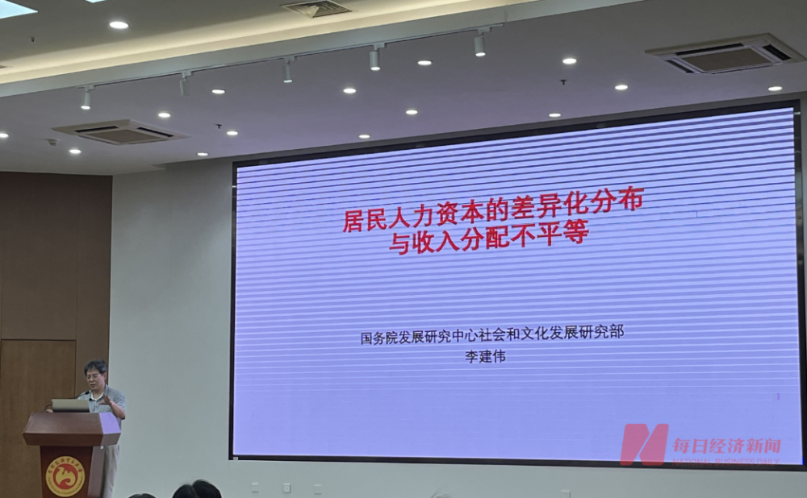

# 国务院发展研究中心专家：尽快研究出台遗赠税，弱化财富两极分化走势

每经记者：李彪 每经实习记者：石雨昕 每经编辑：陈星

7月2日，由中国社会科学院经济研究所和首都经济贸易大学主办的第十七届中国经济增长与周期高峰论坛（2023）暨中国城市生活质量指数发布会在京举行。本次论坛的主题为“提振信心、释放潜能、防控风险”。

与会专家围绕会议主题展开充分深入讨论，认为推动中国经济高质量发展的关键在于加快构建新发展格局，需要以创新驱动数字经济发展，重视技术创新、制度创新以及经济发展过程中的理论创新，在宏观政策“三策合一”理论框架下着力提高全要素生产率，注重新形势下全球创新网络演化及风险治理，面对数字经济为经济分析与治理带来的双重挑战，应当推动中国特色社会主义经济学体系的构建用以解释、指导中国的经济实践。

国务院发展研究中心社会和文化发展研究部部长李建伟也就减少贫富差距，提高居民收入等问题接受了《每日经济新闻》（以下简称NBD）记者专访。

李建伟表示，城乡经济发展首先要解决农村居民收入问题，以此缩小城乡差距，这是最核心的。此外，应尽快研究出台遗赠税，弱化财富两极分化走势及其代际遗传对居民财产性收入差距的负面影响。

_国务院发展研究中心社会和文化发展研究部部长李建伟作主旨发言
图片来源：实习记者 石雨昕 摄_

拓宽综合所得年度汇算覆盖范围

**NBD：** 从城乡经济发展的角度来看，您认为接下来减小贫富差距的工作重点是什么？

**李建伟：** 城乡经济发展首先要解决农村居民收入问题，以此缩小城乡差距，这是最核心的。缩小城乡居民内部差距要采取哪些措施？这就需要从各种收入来源讨论。

拿工资性收入来说，要注意怎么处理好创新发展与收入差距之间的矛盾。

在收入分配秩序方面，怎么去保护劳动者权益、怎么打击或者取缔非法收入、怎么规范灰色收入等问题都比较重要。

规范财富积累机制，多渠道增加居民财产性收入。尽快研究出台遗赠税，弱化财富两极分化走势及其代际遗传对居民财产性收入差距的负面影响。这对缩小财富差距和财产性收入差距有比较大的作用。

此外，我们也要 **完善税收征管机制，拓宽综合所得年度汇算覆盖范围，将资本市场投资所得纳入综合所得计税范畴，促进各类所得税负公平。**

目前，有很多财产性收入是不纳入纳税基数的，也就是免税，比如资本市场投资所得等，但具体算起来对财产性收入影响是很大的。这一部分财产性收入是不是可以视同工资性收入来缴纳个人所得税。

这一部分的免税规定是我国过去基于市场发展的考虑决定的，现在它的影响越来越大，在这一阶段是不是可以考虑恢复所得税的征收。

减少生育和养老对家庭收入差距的影响

**NBD：** 社会保障一直是大家关注的重点，我们如何通过社会保障来缩小不同群体的收入差距？

**李建伟：**
目前国家已经基本统一了城乡居民养老保险，城乡居民养老保险缴费标准总共分为12个档次，中央和地方政府对参保人员缴费会给予补贴。这个补贴就是鼓励大家去选择比较高的档次缴费，但是无形中也会加大保障性收入的差距。

居民养老保险和职工养老保险如何对接也是非常重要的问题。建议首先尽量把居民养老保险的账户设置和职工养老保险的账户设置统一起来。因为现在居民养老保险只有个人账户，各种补贴都在个人账户里，慢慢地可以把政府补贴部分放在统筹账户，这样就可以跟职工养老保险对接起来，在整个保险制度里自由转换。

其次，随着人口结构的变化，大部分人都纳入职工基本养老保险，那么居民和职工之间的差距也就自然缩小了。

最后，根据我国经济发展状况和财力状况，逐步提升居民统筹账户的保障能力。目前我们还没有设立居民养老保险统筹账户，可以在设立之后慢慢加大补贴力度，缩小两者之间的差距。

**NBD：** 从加强“一老一小”政策支持力度的角度看，您认为哪些措施可以减少生育和养老对家庭收入差距的影响？

**李建伟：**
人口快速少子化老龄化是我国经济社会发展面临的重大挑战，也是影响居民收入差距的基础性因素。生育和养育成本过高会导致人们的生育意愿很低，应从提高生育补贴、加强托育教育服务等方面降低生育养育成本，在鼓励生育的同时，降低生育对家庭收入的影响。

此外，加快老年服务业发展，建议将失能半失能老年人护理等老年服务纳入基本公共服务范畴，逐步弱化人口老龄化对家庭收入差距的影响。

每日经济新闻

