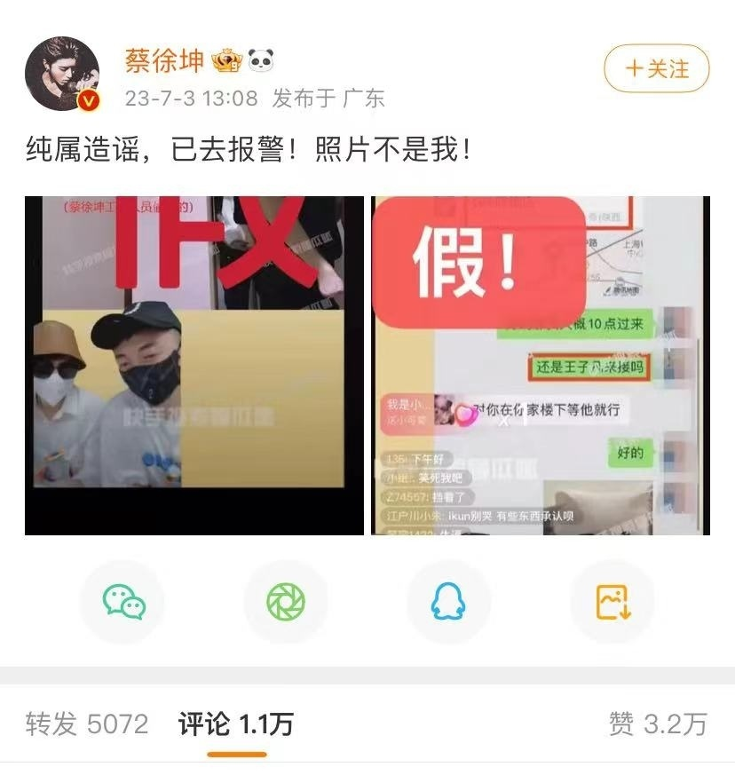
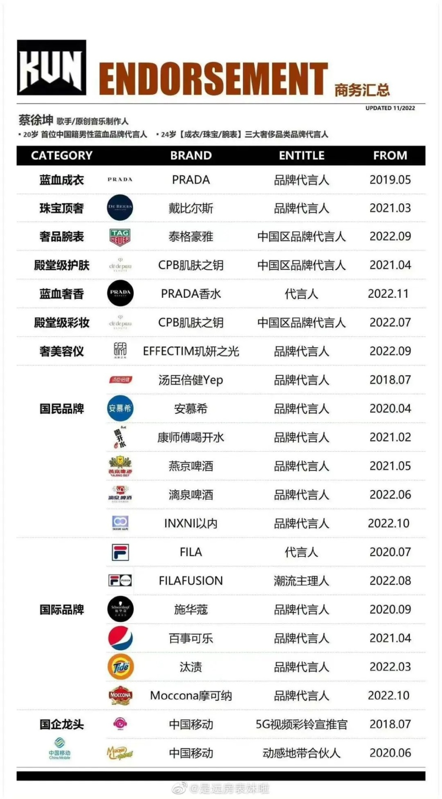
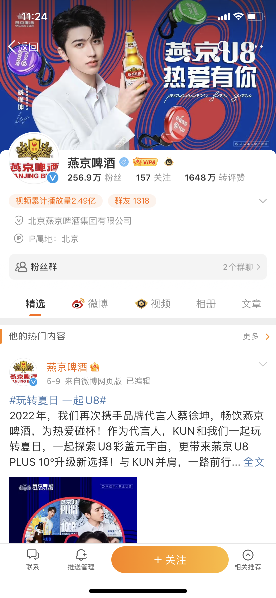

# 多品牌官微下架蔡徐坤相关内容！暂无品牌宣布解约

近日，蔡徐坤私生活事件持续发酵。7月3日午间，娱乐博主“懂瓜呱”“超能摄影阳阳”在快手直播间中称蔡徐坤曾与未成年粉丝发生关系，并发布了疑似两人的亲密照、聊天记录等图片。随后蔡徐坤立即发布微博回应称，“纯属造谣，已报警，照片不是我！”

与此同时，九派财经记者发现，以往与蔡徐坤曾有商业合作的欧莱雅、维达、雀巢中国、VIVO、汰渍等品牌官方微博中，已无法搜索到蔡徐坤相关内容。

据猫眼专业版数据显示，蔡徐坤出道以来共持有42个商务代言，其微博、抖音相关话题阅读量超过6000亿次。九派财经发现，截至发稿，并未有品牌宣布与蔡徐坤解约。且燕京啤酒、汤臣倍健等品牌官方微博的置顶博文、封面图等仍为官宣蔡徐坤代言人相关图文。

据了解，早在2021年5月，燕京啤酒官宣蔡徐坤成品牌代言人，2022年又官宣蔡徐坤为U8创意总监与代言人，如今，U8已成为燕京啤酒的一大核心单品。财报显示，2023年1-3月，燕京啤酒该公司营收35.26亿元，同比增长13.74%，净利6456.38万元，同比激增7373.18%。

就在今日娱乐博主“懂瓜呱”直播开启前，蔡徐坤在个人官方微博首次回应此轮负面事件称，“双方之间的私事已经在2021年妥善解决，彼此没有进一步的纠葛。我和C女士的交往均属双方自愿，不涉及违法行为。这两年的时间里，我也在自责和懊悔中。再次向一直支持信任我的歌迷们道歉”。

与此同时，蔡徐坤工作室也表示，现已经完成侵权证据保全，第一批针对侵权行为的诉讼已经提交法院立案，后续会根据法院庭审进度及时披露。

此前7月1日晚，北京广告协会明星代言规范委发布关于对中国内地男歌手蔡某某舆情发酵的风险提示。同日，蔡徐坤豆瓣个人主页的简介、音乐作品等一度被清空，而他参与的综艺等作品演职员名单中，也撤掉了蔡徐坤的姓名。7月2日，央视频已下架了歌手蔡徐坤的相关视频。在央视频APP、央视频微博、央视网搜索“蔡徐坤”，均无相关结果。

据企查查app显示，6月28日，北京市通州区市场监督管理局因“通过登记的住所或者经营场所无法联系”，将北京蔡徐坤影视文化工作室列入经营异常名录。

**九派财经记者夏雯琪**

**编辑李宛珊**

【来源：九派新闻】

