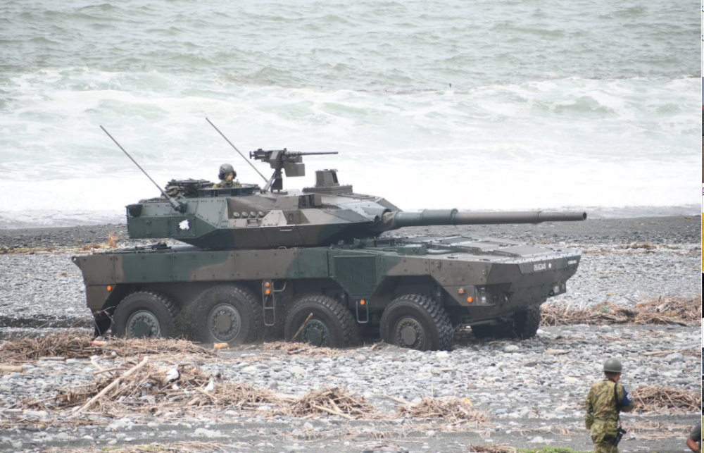

# 日本自卫队拟使用“星链”应对战时干扰，俄打造“俄版星链”反制

日本自卫队将使用美国的“星链”系统，这是为何？

日本媒体日前报道称，未透露姓名的政府消息人士表示，日本自卫队正在测试美国的“星链”卫星互联网服务，着眼于下一财年采用该技术。

日本防卫省今年3月与提供该公司服务的代理商签约，将天线等通信器材配备到陆海空自卫队。除十余处基地和驻扎地以外，还在训练中使用，以验证是否存在使用问题。日本防卫省目前发射了2颗自主研制的位于3.6万公里地球静止轨道的“X波段通信卫星”，但使用近地轨道民用卫星网络尚属首次。防卫省本年度还计划与其他提供类似服务的企业签订合同。在确认通信性能后，最终判断是否正式使用。

_“星链”在轨运行示意图。_

**美日看上“星链”的军用潜力**

6月22日，美国SpaceX公司在范登堡太空军基地使用一枚四手“猎鹰”9火箭成功将47颗“星链”1.5版本卫星送入预定轨道。一级助推器成功着陆在海上回收船。本次任务将发射的“星链”卫星总数增加到4642颗，其中约4312颗仍在地球轨道上运行。

史上空前的发射数量和马斯克的明星效应让“星链”成为大众熟知的卫星，也已经成为低轨道卫星通信系统的标杆。“星链”最初的目标是近地轨道上部署多达42000颗卫星，为全球尤其是偏远地区提供低成本的互联网覆盖。但被批准发射进入太空的卫星数量并没有那么多，第一代“星链”最终调整为4408颗，第二代“星链”接近3万颗，2020年5月，SpaceX正式向FCC提交“二代星链”星座（Gen2）的申请，总数为3万颗。

_“星链”采用“一箭多星”发射方式，目前发射总数为4642颗。_

目前，第一代“星链”有两个版本：1.0版本和1.5版本。1.0版本采用平板设计，安装有4部高通量相控阵天线和单翼式太阳能电池板，自带霍尔推进器，用于轨道保持，采用Ku波段通信和Ka波段通信重量约260千克。1.5版本于2021年9月14日开始发射升空，每颗重量约260千克，相对1.0版本的主要变化是装备了卫星间激光通信设备，具备卫星间激光通信能力。早期的星链卫星是没有办法互相直接通信的，卫星之间如果要进行通信必须通过网关地球站中转，这会导致星链服务无法覆盖到没有办法建立地球站的地方，而1.5版本星链卫星最大的改进之处就是具备了卫星间激光通信能力。

相比以往发射的昂贵的高轨道通信卫星，低轨道通信卫星以组网的方式具备几乎覆盖全球的能力。“星链”卫星的最大优势在卫星数量多、成本低，可覆盖除地球南北极外大部分地区，由于卫星数量众多，整体生存能力强比高轨道卫星更强，此外还具有数据传输速率高和地面终端尺寸小等优势。

一种技术如果能用于军事大概率都会被用于军用领域，而航天技术是军民两用界限最为模糊的一个领域，比如在这次俄乌冲突中，大量的商业遥感卫星的照片被双方采用，尤其是乌克兰，西方国家的商业遥感卫星在政府的要求下直接为乌军服务，“星链”一出现也被美国军方盯上，展开了各种测试。美空军从2018年开始在军用加油机/运输机平台应用进行“星链”测试评估；2022年3月，美国空军驻犹他州希尔空军基地的第388战斗机联队对支持F-35A隐身战斗机在前线的敏捷作战部署进行了高速通信测试，而其中的关键就是“星链”卫星。这次测试项目的细节包括F-35进行降落和备战时的数据传输，数据从“星链”卫星传输到终端，再从终端传输到空军数据转接器，最后传输给F-35进行作战数据和信息的更新。试验结果证明，通过“星链”卫星，数据传输速度比之前提升了30倍。美陆军也重视“星链”的军用用途，从2020年5月对“星链”卫星跨网络数据传输能力进行为期3年的合作研发测试。

_为了增强两栖作战能力，日本组建了“水陆机动团”。_

**日本自卫队为何看上“星链”？**

日本媒体的分析报道则将日本自卫队使用“星链”系统的原因指向外界。报道称，日本此举意在强化军事通信能力，因为俄罗斯等国可使用电子装置从地面对其他国家的通信卫星进行干扰，如果通信卫星受到攻击则会失去功能，自卫队的指挥就会陷入瘫痪。而卫星网络发射多颗卫星，即使其中几颗卫星被攻击，整体网络使用不受影响。世界各国都在寻求增强抵御能力，以应对冲突时通信受干扰或卫星受到攻击的风险。

日本自卫队很长一段时间都使用民用通信卫星，2017年开始发射专用的军用通信卫星。2017年，日本成功发射“煌-2”军用通信卫星，2018年4月，日本防卫省宣布，“煌-1”军用通信卫星当天升空，第三颗卫星原计划在2022年发射，可能因为疫情推迟。3颗“煌”系列军用通信卫星全部发射成功之后，日本自卫队的卫星通信的格局从“借助民星”转变为“以军为主，民星为辅”，目的是大幅增强自卫队的卫星通信能力，可为日本自卫队提供24小时的全球通信服务。

日本发射军用通信卫星也是自卫队加强琉球群岛等西南岛屿军事部署的军事需求。近年来，日本提出了一系列加强西南岛屿军事部署的计划，比如在多个岛屿部署防空导弹、岸舰导弹等武器，组建针对两栖作战的“水陆机动团”，购买两栖作战装备。在增强军力的过程中，日本发现自己原先用于防备苏联登陆进攻的军事指挥体系面临着相当大的问题，日本防卫省高级官员称，自卫队从北部向西南方向调动期间，需要保持持续不断的通信，而“煌”系列军用通信卫星则可以满足这一需求。

随着“星链”的出现，加上日本自卫队认为几颗高轨道通信卫星一旦被干扰，指挥通信就会存在很大问题，需要提高卫星通信的冗余，而去中心化且终端便于携行的“星链”
系统恰好能满足需求，这就是自卫队看上“星链”的主要原因。

_离岛作战对卫星通信的需求非常大，自卫队采用“星链”系统就是为了满足这种需求。_

值得一提的是，中国台湾地区也在关注“星链”的军用潜力。据参考消息今年1月报道，台湾地区正寻求海内外投资者来打造自己的卫星通信供应商，以期在战争等特殊事态发生时，有本土版“星链”可供使用。台数字发展事务主管部门声称，台湾地区见识到了SpaceX开发的“星链”在俄乌冲突中的成功经验，打算推动“台湾太空中心”的相关低轨道卫星服务在几年后开始运作。有分析认为，除了本土版“星链”，台军很可能引入“星链”系统。越来越多的军事力量盯上“星链”，也引发了战时如何反制这种系统的讨论。

对付卫星无非有两种方式，一是硬摧毁，即使用反卫星导弹、自杀式卫星、激光等武器物理上摧毁卫星；另外一种是软杀伤，即使用卫星干扰系统、网络战等手段让卫星或通信终端无法发挥有效的作用，对卫星不会损坏，除非通过网络手段让卫星离轨进入大气层烧毁。硬摧毁的好处是可以一劳永逸，但“星链”卫星数量众多，硬摧毁造成的太空垃圾和国际影响不可忽视，尤其是小规模的军事冲突或局部战争，并不适合用这种暴力手段。

俄罗斯主要使用干扰手段反制“星链”，并取得了一些效果。根据相关资料，俄军使用了“提拉达”-2s、“披肩”-K等移动式地基通信卫星干扰系统对“星链”通信卫星星座进行了干扰。“提拉达”-2s系统主要在地球表面来干扰3GHz-30GHz频段的卫星通信，还具有干扰军用无人机和卫星之间通信的能力。“披肩”-K系统能够压制“星链”系统通信中继设备，即能够压制在各个用户之间自主选择的空闲信道。SpaceX公司曾在2022年3月发文称，在冲突地区，一些“星链”终端被堵塞干扰了几个小时。在“星链”系统受到干扰的第二天，SpaceX公司称其迅速“抛出一行代码并成功修复了‘星链’，使干扰失效”，但是升级却造成了“星链”终端通信的延迟。

除了硬摧毁和软杀伤，还可以“用魔法打败魔法”，即部署类似于
“星链”系统的低轨道通信网络，满足国家经济和安全方面的需求。2022年7月12日，在“强大的俄罗斯-2022”商业峰会推介会上，俄航天局第一副总经理尤里·乌尔里奇奇称，4月6日，俄罗斯已经批准拨款960亿卢布（约16亿美元）用于建造“球体”卫星群。“球体”的一大特点是具有通信、导航、遥感及物联网等多种能力，其定位是一个“空间服务应用的综合生态系统”，可以说是俄罗斯版“星链”系统。

