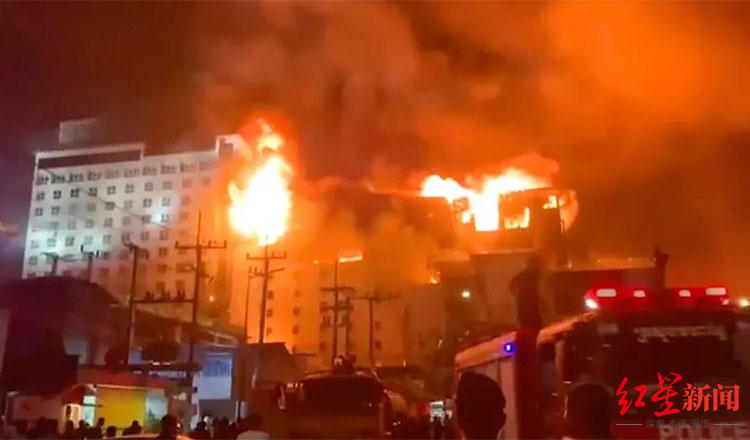
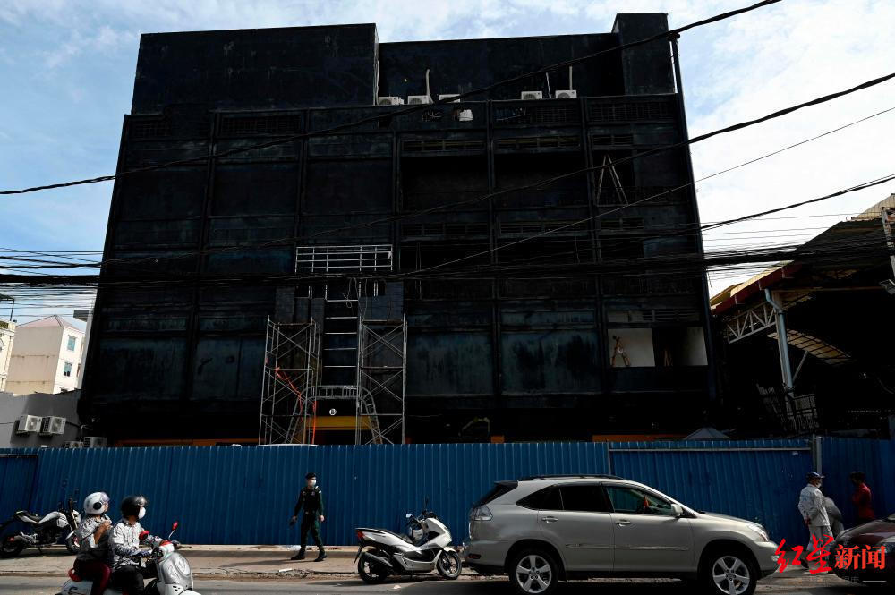
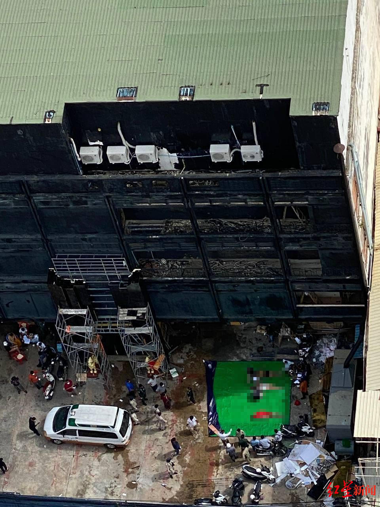
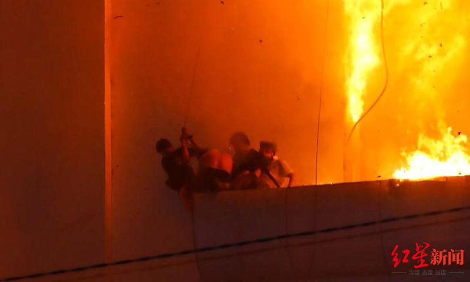

# 柬埔寨夜店起火8人死亡，包括6名中国人 警方：火灾由电线短路引发，遇难者为装修工人

综合当地媒体报道，7月1日，柬埔寨首都金边一处正在装修的夜总会大楼发生火灾。当局2日称，火灾造成8人死亡，其中有6名中国人（5男1女）、2名越南人。

身亡的中国女子为曾某（29岁，来自湖南）。5名中国男子分别为陈某（30岁，来自广东）、温某（25岁，来自广东）、杨某（23岁，来自广东）、欧某（27岁，来自广东）、许某（46岁，来自香港）。另外2名死者均为越南人。当地防火和救援警察办公室表示，火灾是电线短路引发的。

_↑火灾现场_

另据新华社2日报道，金边市警察局发言人山索·塞哈称，截至周日早上，死者总数达到8人（6男2女），“根据法医检查，这8人是窒息死亡。”他补充说，遇难者是装修工人。

塞哈说，周六晚上，柬埔寨首都金边吐谷区夜总会五楼发生火灾。当时，这些遇难的装修工人正在翻修大楼内部。警方已对这起事故展开调查，并已拘留4人。

_↑熏黑的夜总会大楼_

根据柬埔寨国家灾害管理委员会（NCDM）的数据，2022年，柬埔寨全国共发生454起火灾事故，造成42人死亡、55人受伤。

去年12月28日，柬埔寨靠近泰国边界的钻石城大酒店和赌场失火，造成26人死亡，一些人被迫跳楼逃生，有人当场坠亡。

_↑去年12月28日，钻石城大酒店和赌场失火现场_

红星新闻记者 邓纾怡

编辑 张莉 责编 冯玲玲

