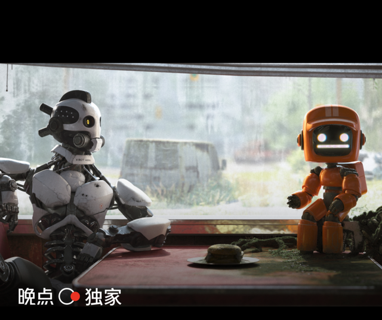
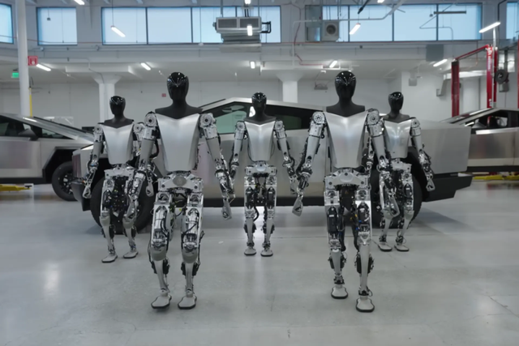

# 消息称字节跳动要造机器人，团队计划扩充到百人

字节管理层问：“为什么特斯拉要搞 100 亿台，我们只搞 1000 台？”

**文丨张家豪 程曼祺**

**编辑丨程曼祺**

《晚点 LatePost》独家获悉，字节机器人团队已有约 50
人，计划年底扩充到上百人，并生产一些服务字节自己的电商履约需求，能在仓库里分拣、打包货物的机器人。

字节机器人团队目前隶属于字节 AI Lab，其负责人是 AI Lab 总监李航。李航曾担任华为诺亚方舟实验室主任和首席科学家，2017
年加入字节，现在向字节副总裁、算法技术负责人杨震原汇报。

字节跳动的机器人探索始于 2020 年，当时字节跳动创始人张一鸣对机器人表现出兴趣，此后会不定期参与机器人项目讨论。

约一个月前，张一鸣与字节跳动 CEO
梁汝波、算法技术负责人杨震原、字节跳动产品和战略副总裁朱骏，和曾任字节战投负责人，现任集团战略负责人的赵鹏远一同参与了和 AI Lab 机器人团队的讨论。

与以往不同，这次会议的目的是探讨字节机器人的产业化落地方向与计划。此前，字节对机器人的投入以技术尝试为主。到 2021 年底，团队只有十余人，2022
年之后开始逐渐增加投入。

这次讨论中，张一鸣鼓励团队不妨把目标定得大一点。

会上有机器人团队成员提出：机器人行业的商业化门槛是 1000 台，可以此为产业化目标的参考。张一鸣、朱骏等一些参会管理层的反馈是 “1000
台有点少”：“为什么特斯拉要搞 100 亿台，我们只搞 1000 台？”

杨震原在这次讨论中提到，做机器人无非三种可能性：一是追求在技术山顶上插杆旗，就像波士顿动力那样做出一个技术领先的原型；二是用现有的相对成形的方案服务字节的内部需求；三则是用相对成熟的方案对外找客户，把规模做大。

总结这一轮讨论中字节管理层的想法，他们认为现在字节做机器人，应该：

  * _1_ 跟已有业务做结合，服务好场景和行业；
  * _2_ 探索大模型与机器人的结合，追求技术领先性；
  * _3_ 对人形机器人的商业价值要进一步观察。像波士顿动力这种做了 30 年还不盈利的行为，可能不适合字节。

近期，字节机器人团队再次讨论了业务方向，目标更明确了，分为两大部分：

一是生产一些机器人，优先服务字节的电商履约需求；二是关注前沿技术，探索把 AI 大模型能力用到机器人上。

电商履约是指在电商交易完成后，平台把货物送到消费者手中的过程，它涉及仓储里的分拣、组货和打包，以及物流环节。

字节现在已建立了一些自营仓库，主要服务字节电商中的抖音超市，抖音超市占字节电商业务的比例还很小。字节想用机器人代替人类完成拣货、搬运和打包等过程。中国的人力成本现在不算昂贵，但使用机器人还有其它好处：它更能应对大促、爆品销量大增带来的短时间仓储工作量的大增。

由此推测，字节要做的机器人，可能是具备移动能力的、能在电商仓里送货的分拣机器人，以及带有视觉感知能力、能自己打包货物的机械臂。行业里，前者的对标产品有亚马逊的
Kiva，国内公司有极智嘉、快仓等；后者的对标公司有 Mujin（日本）、梅卡曼德、XYZ 等。

它也有可能是一种新的产品和方案。据了解，字节目前还没有框定机器人的具体形态，形态最终取决于字节电商履约的需求。

字节目前并未确定今年制造机器人的具体数量目标。

对机器人的重视和投入增加，可能来自张一鸣和字节对 AI 新发展的思考。

《晚点 LatePost》曾报道，张一鸣近期时常会和一些字节人士分享 AI 论文学习心得和对 ChatGPT
的思考。从大模型开始，字节加大了对人工智能的研发投入，今年新向英伟达订购了超过 10 亿美元 GPU。GPU 是 AI 训练必不可少的算力基础设施。

机器人现在也被认为是 AI 大模型的重要方向，二者相互促进：大模型能为机器人带来 “常识”；与现实物理世界交互的机器人，则能为 AI 发展提供新类型的数据。

在这之前，字节对机器人的探索相对克制：2021 年开始，字节 AI Lab
旗下的机器人团队就曾尝试过做楼宇服务机器人，它可以在办公楼内送餐、送快递包裹；同时该团队也在字节之外寻找一些可能服务字节电商自营仓储物流的机器人，但大部分方案都不太成熟，“ROI
算不过来”。

从字节机器人团队的组织架构也可看到，它过去并不以业务为导向。2016 年成立的字节 AI Lab 目前分为两个大组：NLP（自然语言处理）与
Research，前者更多为字节的业务提供技术支持，而机器人属于的 Research 组，并不直接支持业务。

2019
年以来，字节也陆续投资了一些机器人公司。如扫地机器人公司云鲸智能，前发那科副总经理沈岗创立的盈合机器人，服务仓储物流的迦智科技、炬星科技和未来机器人等多家公司，涵盖家庭清洁、配送、物流、工业等多个领域。

_从左至右分别为云鲸智能、炬星科技和未来机器人的产品。_

这些机器人公司大多成立于 2017
年前后，共性是研发针对特定场景、解决特定问题的机器人，它们的产品因而形态各异。这是因为在此前一段时间的技术限制下，机器人无法做到真正通用，比如同一个机器人既能在工厂搬零件，又能送外卖，甚至帮你洗水果、切菜。

特斯拉在 2021 年宣布 Optimus 擎天柱人形机器人计划后，行业风向开始改变。

Optimus 的目标是让人形机器人替代人类完成一些危险、重复和无聊的工作。在特斯拉的演示中，Optimus
已能浇花、收拾桌子和搬运物品。今年特斯拉的股东大会上，马斯克说未来人形机器人的需求是百亿台，可能还不止。

_特斯拉 Optimus，与目前大部分采用轮式移动的机器人不同，Optimus
采用了双足设计，看上去更像人。_

在马斯克的大胆计划后，大模型技术进展又为行业添了一把火。一些人开始相信通用机器人可能比预期中更快到来。

今年 5 月的 ITF World 2023 半导体大会上，英伟达创始人、CEO 黄仁勋在演讲中提到，人工智能的下一个浪潮将是具身智能（embodied
AI），即能理解、推理、并与物理世界互动的智能系统。

海内外的科技公司也都在尝试把参数规模更大的 AI 大模型与机器人结合，打造更通用的机器人。

OpenAI 在今年 3 月投资了一家挪威人形机器人公司 1X Technologies，这家公司正在研发人形机器人。

_1X Technologies 已开发出了轮式双臂机器人
EVE（左），它的手部使用了双指夹具（中），它们正在研发双足机器人 NEO（右），从概念图看，手部会采用灵巧手。_

今年 6 月，Google 旗下 DeepMind 发布了 RoboCat，把大模型的能力应用到了机器人上，DeepMind 科学家 Alex Lee
在接受 TechCrunch 采访时说：“我们证明了一个单一大模型可在多个机器人实体上解决多样化任务，并且可以快速适应新任务和机器人实体。”

今年以来，腾讯 RoboticsX 机器人实验室也把 AI
模型应用到了机器狗上；在阿里巴巴的通义千问大模型的支持下，用户可在钉钉对话框直接以自然语言输入命令，远程指挥机器人。4
月，小米成立北京小米机器人技术有限公司；6 月，华为成立 “极目机器”，布局机器人与智能制造。

新一轮热潮中起步的机器人项目和公司能坚持多久，还有待验证。建立一个机器人团队并稳步推进研发工作，需要巨大的投入，更大挑战是训练机器人的数据比训练一般软件
AI 系统的数据要稀缺得多。

OpenAI 首席科学家伊利亚·苏茨克维（Ilya Sutskever）今年 4 月接受采访时，被问到 OpenAI 放弃机器人是正确的决定吗？他说
“是的，我们那时真没办法继续研发机器人了”，如果要搜集优化机器人所需的数据，需要有一个庞大团队来制造并维护机器人：“制造 100
台机器人已是巨大投入，但即使如此，你也不会获得很多数据。”

一名机器人从业者告诉《晚点
LatePost》，机器人的数据采集和自动驾驶类似，最直接的方式是用真实的机器人做各种测试去搜集数据，成本很高；另一个重要补充是以仿真技术，建设模拟的环境和各种情景（corner
case）以获得数据。目前运动控制方面没有太多可用的高质量公开数据。这背后都对应着技术与资金的资源。

字节过去在硬件上的尝试，并不如它的互联网应用那样成功，大力台灯和 VR 头显 PICO 是先例。大力台灯已不再发布新品，一度 1000
人的团队至少有一半离开；PICO 今年一季度也经历裁员，并下调 2023 年销量预期至 50 万台，比 2022 年的实际销量缩水 50%。Meta 的
Quest2 2022 年销量则超过 700 万台。

字节不缺资源，它过去擅长大力出奇迹：定下目标后，调动人力、资金等全部可用力量在短时间全力冲击。但硬件行业和前沿科技有另外的逻辑，它考验耐心、韧性与认知，需要更长期的等待与坚持。

