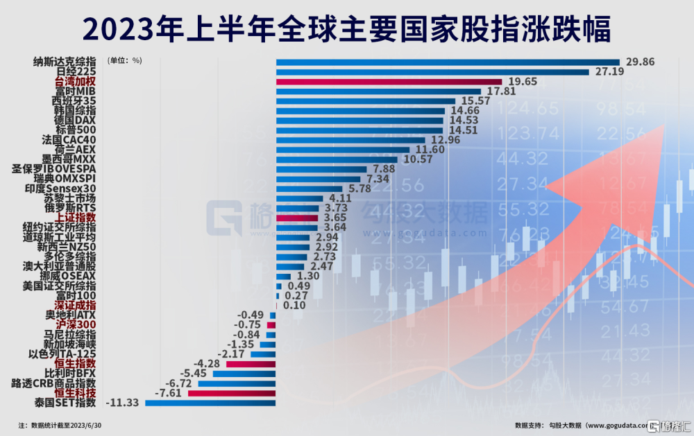
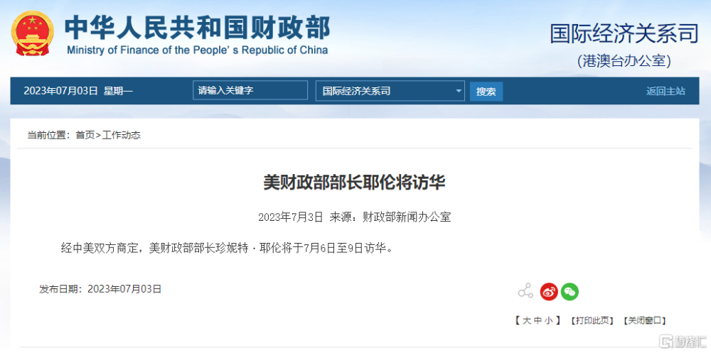

# 港股7月开门红！恒指涨超2%，恒生科指飙涨逾4％，汽车股喜迎狂欢

7月伊始，港股喜迎开门红啊！

下半年行情的首个交易日，港股三大指数集体拉涨。截止发稿，恒生科技指数尾盘继续冲高涨超4%，恒生指数现涨2.3%，新能源汽车股大涨。

盘面上，大型科技股拉升助攻大市，汽车股、航空股、博彩股、黄金及有色金属股均表现亮眼。其中，新能源汽车股成为今日份市场“最亮眼的仔”之一，小鹏汽车涨超16%，理想汽车、蔚来涨超8%,吉利汽车、比亚迪股份等纷纷跟涨。

此前，新能源车企陆续披露6月销售情况，数据显示，蔚来降价效应显著，环比大增74%，重回万辆交付水平；小鹏汽车6月共交付环比增长15%；理想汽车月度交付量首次突破三万。乘联会表示，中国新能源车企正在走出囚徒困境。

回看，港股上半年表现颇为“惨淡”。截至6月30日，恒生科技指数年内累计跌5.27%，恒指、国指皆跌超4%，整体明显跑输全球各主要市场。

多重利好因素共振

进入7月，市场或有拨云散雾之势。

今日，据财政部网站消息，经中美双方商定， **美财政部部长珍妮特·耶伦将于7月6日至9日访华。**

继美国国务卿安东尼·布林肯于今年6月18日至19日访华之后，耶伦为今年第二位访华的拜登政府内阁成员。

除了耶伦访华之外，今日6月财新制造业PMI公布。数据显示，6月财新中国制造业采购经理指数 **（PMI）录得50.5，超预期的50.2**
，较5月小幅下降0.4个百分点， **连续两个月位于扩张区间。**

从市场角度看，此前一段时间，在经济复苏节奏不及预期，美联储延续鹰派言辞令美元走强预期升温等影响下，人民币汇率出现了一轮“巨震”。

**不过目前，稳汇率大动作已经来了。** 近日，多家主要银行下调美元存款利率。
机构人士与分析人士认为，尽管银行降低美元存款利率是出于自身经营的市场化决策，但从客观影响看，这一做法有助于给汇率市场的美元单边升值预期“降温”，让市场回归理性常态，对于当前稳汇率有积极意义。这将降低市场机构对美元存款的竞争性争夺，有利于维护境内美元存款市场秩序，进而有利于人民币汇率的稳定。

**政策方面，近期也释放出一定积极信号**
。央行二季度货币政策会议指出要克服困难、乘势而上，加大宏观政策调控力度，精准有力实施稳健的货币政策，搞好跨周期调节，更好发挥货币政策工具的总量和结构双重功能。

会议认为，外汇市场供求基本平衡，经常账户延续稳定顺差，外汇储备充足，人民币汇率双向浮动，在合理均衡水平上保持基本稳定，发挥了宏观经济稳定器功能。会议强调，综合施策、稳定预期，坚决防范汇率大起大落风险，保持人民币汇率在合理均衡水平上的基本稳定。

接下来怎么看？

下半年开了个好头，接下来能否维持这个态势？不少机构也纷纷研判表示： **短期或延续震荡行情。**

中金研报认为，虽然回顾来看，港股市场整体明显跑输全球各主要市场，但整体来看，上周在人民币进一步走弱且国内增长压力犹存的情况下，港股市场能够企稳，除了低估值外，更重要的是对未来更多政策支持的预期仍然抱有期待，尽管已经有所降温。

目前国内方面，最新公布的一系列经济数据进一步证实经济增长压力犹存。外部方面，美国经济表现好于预期推动7月美联储重启加息的预期升温，这增加了人民币汇率的压力。该机构认为
**2023下半年市场整体或维持震荡，结构性机会更值得关注。**

中信证券发布研究报告称，4月中旬以来港股整体震荡走弱，市场缩量下跌。展望7月，国内经济预计延续弱复苏，政策面主要关注7月底的政治局会议。海外市场也已充分price
in美联储在7月或重启加息，但微观层面美国经济裂痕已经显现。

考虑到FOMO情绪下美股的结构性失衡， **短期资金或从大型科技蓝筹流向价值股** 。对于港股，该行判断短期或延续震荡行情， **建议关注三条主线：**
1）高股息、高ROE以及自由现金流优异的个股；2）出行产业链，特别是4月中旬以来显著回调的航空板块；3）成长板块中性价比高的生物科技和布局AI的互联网龙头。

展望下半年港股市场投资机遇，开源证券认为，当前恒生科技指数重回历史低位，接近2021年历史低点，
**重点关注二三季度低位布局机会，伴随中国经济增长动力加速、美债利率下行有望驱动港股科技板块估值上行。**

