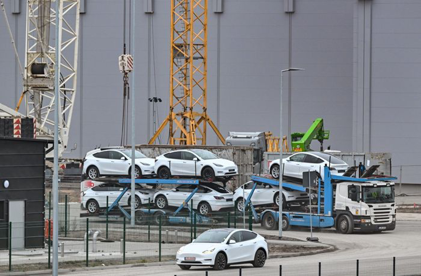

# 特斯拉打破交付量记录，马斯克降价战略奏效，以价换量策略还能持续多久？

**划重点**

  * _1_ 特斯拉公布的第二季度生产和交付数据都创造了新纪录，分析师认为这是马斯克的降价战略取得了预期效果。
  * _2_ 许多分析师担心，特斯拉的降价战略的确帮助提振了销量，但可能会导致该公司利润率下降，从而动摇投资者信心。
  * _3_ 特斯拉的库存供应正超过需求，被指越来越像传统汽车制造商，马斯克以牺牲利润来换取销量的策略还能持续多久？

腾讯汽车讯
7月3日消息，美国当地时间周日，电动汽车制造商特斯拉发布了2023年第二季度生产和交付报告。报告显示，特斯拉第二季度汽车总产量为47.97万辆，同比增长85.5%；总交付量为46.61万辆汽车，同比增长83%。特斯拉生产和交付数据双双创造了新高，这意味埃隆·马斯克（Elon
Musk）的降价战略取得预期效果了吗？这种战略是否会继续保持下去？

**电动汽车领域竞争加剧 降价和折扣使特斯拉受益**

得益于特斯拉在竞争日益激烈的市场中寻求增长，在大幅降价和大幅折扣的推动下，该公司第二季度的全球交付量飙升了83%。

好于预期的业绩为马斯克的观点提供了新的论据，即市场对其老款产品的需求依然强劲，他认为以牺牲盈利为代价追求增长的策略，将为这家电动汽车制造商带来长期好处。

今年早些时候，特斯拉公布第一季度业绩，显示消费者对该公司畅销车型Model 3轿车和Model Y
SUV的兴趣减弱，马斯克同时表示愿意牺牲部分盈利能力来换取持续增长，这动摇了投资者的信心。

马斯克在4月份表示：“我们的观点是，与更低的销量和更高的利润率相比，推动更大的销量和更大的车队是正确的选择。这是进一步扩大我们领先优势的好时机。”

今年提振销售的努力对利润的影响有多大，将在7月19日特斯拉公布财务业绩时显现出来。今年第一季度，特斯拉的营业利润率从2022年前三个月的19.2%降至11.4%。尽管如此，这个数字仍然高于许多汽车制造商。

周日公布的业绩意味着，与去年同期相比，特斯拉下半年的增长速度可能会放缓至24%，但仍将达到华尔街对今年182万辆交付量的预期。有些投资者希望，特斯拉的降价将在第二季度触底。

特斯拉的目标是年均交货量增长50%，但其为今年设定的目标较为温和。这家汽车公司一直在增加工厂产量，与此同时，在经历了多年的强劲销售增长后，对其汽车的潜在需求出现了一些疲软迹象。

**税收抵免刺激需求 促使特斯拉销量飙升**

在马斯克的领导下，特斯拉汽车交付量同比增长了83%，环比增长了10%，这得益于政府的激励措施和降价措施，使得该公司的电动汽车比同类燃油车型更便宜。

今年生效的新规允许特斯拉汽车的买家获得7500美元的联邦税收抵免。有了这一优惠，最便宜的Model
3轿车售价不到3.3万美元，比奔驰和宝马销售的同类豪华燃油轿车便宜，与丰田凯美瑞和本田雅阁等大众市场车型价格相当。

电动汽车车主还可以在节省燃料和降低维护成本方面受益。电动汽车不需要加油，而且每公里行驶的成本通常比燃油车便宜。

根据凯利蓝皮书的数据，特斯拉是美国电动汽车的主要制造商，今年第一季度的市场份额为62%。但随着通用汽车、福特和大众汽车等老牌汽车制造商开始争相推出更多电动车型，其市场份额已从2022年初的70%逐渐下滑。

在中国这个比美国或欧洲更大的汽车市场，特斯拉面临着来自比亚迪等本土制造商的激烈竞争。咨询公司艾睿铂的调查显示，中国制造商提供可以更好迎合当地人口味的内饰和外观设计、娱乐以及信息系统。

尽管特斯拉的销量持续攀升，但其盈利能力却受到了影响，因为它不得不降价以提振需求。特斯拉第一季度盈利25亿美元，低于2022年第四季度的37亿美元。

许多投资者押注，随着电动汽车需求的增长，特斯拉的增长将加速，该公司将于今年晚些时候开始销售电动皮卡Cybertruck。特斯拉同意让福特和通用汽车等其他汽车制造商使用其充电网络，这也可能成为其新的收入来源。

**特斯拉更像传统汽车公司了！**

最近，特斯拉的表现越来越像它长期以来努力避免成为的传统汽车制造商。过去，特斯拉始终在努力满足需求，而现在，它的库存供应超过了需求，这是传统汽车公司通常要面临的挑战。

这几乎就像是特斯拉与现有竞争对手交换了战略，其中许多竞争对手目前的汽车库存相对较低。尽管汽车产量在疫情后有所回升，但许多经销商的新车供应量仍处于历史低位。然而，有趣的是，新的电动汽车库存开始出现积压，而不仅仅是特斯拉。

尽管如此，有些人表示，特斯拉的挑战仅仅是个开始。最近几个月，特斯拉推出了一系列降价举措，以减少库存和应对需求疲软的困局，而且特斯拉的汽车比以往任何时候都便宜，特别是考虑到特斯拉有资格享受电动汽车税收抵免优惠。据统计，特斯拉各种车型的价格下跌了14%至28%。

在这样做的过程中，马斯克牺牲了利润来换取销量，这可能是该公司维护其全球主导地位的关键举措。尽管特斯拉在美国电动汽车市场上胜算不大，但它在中国面临着日益激烈的竞争。

特斯拉预计今年将生产约180万辆汽车，高于2022年的130万辆。但如果产量继续超过交付量，它将不得不采取进一步行动，尤其是在过去一年里库存每个季度都在增长的情况下。

德意志银行分析师埃马纽埃尔·罗斯纳(Emmanuel
Rosner)在6月26日的研究报告中写道：“我们仍然认为，在今年剩余时间和2024年，特斯拉汽车价格仍有进一步下调的风险。”

**特斯拉降价战略将持续到明年？**

特斯拉的业绩表明，其首席执行官马斯克通过降价来追求销量的战略已经达到了预期效果。美国投资公司Robert W. Baird的分析师本·卡洛(Ben
Kallo)称：“这是一个重大突破。人们仍在为另一轮降价做准备，如此高的交付数量降低了风险。”

这是特斯拉有史以来最高的季度交付纪录，比去年同期增长了83%。该公司还设法在第二季度将生产和交付之间的差距缩小到13560辆，这是分析师密切关注的一个数字。今年第一季度，该公司生产的汽车比交付给客户的汽车多出近1.8万辆。

卡洛表示：“所有人都担心库存增加，现在看来库存已趋于正常。特斯拉生产和交付之间的差距正在缩小，特斯拉说过他们会这么做。”

得益于直接向消费者销售汽车，特斯拉有很多手段来提高销量。除了在今年早些时候全面降价外，该公司还推出了一些优惠措施，比如对6月30日之前交付的汽车在美国提供3个月的免费快速充电服务。分析师预测，特斯拉降价战略将持续到明年。

**特斯拉有望实现180万辆交付目标**

特斯拉没有按地区提供交付或生产细节，因此很难判断哪里对其汽车的需求最高。德意志银行股票分析师伊曼纽尔·罗斯纳(Emmanual
Rossner)在研究报告中写道，北美可能是第二季度交付量最高的地区，其次是中国、欧洲和世界其他地区。

韦德布什证券公司分析师丹·艾夫斯(Dan
Ives)在周日的研究报告中表示：“2023年初实施的降价战略给特斯拉带来了巨大好处，因为其需求似乎仍然非常强劲，生产效率提高使得第二季度的交付量大幅增加。总体而言，我们相信，凭借这一表现，特斯拉仍有望实现今年180万辆的交付目标。”

艾夫斯还说，降价的确帮助特斯拉提振了销量，尤其是在中国市场，但要付出利润率下降的代价。他预计，特斯拉的利润率将在未来两个季度触底，明年才能恢复到正常水平。

晨星分析师塞斯·格尔斯坦（Seth Goldstein）称："我们可能会看到降价打压了利润率。"

去年年初，特斯拉的汽车毛利率(不包括碳积分收入)，即公司的毛利润与收入之比，高达30%。但随着利率上升，特斯拉去年开始降价，今年第一季度利润率降至19%，第二季度已经降至11.4%。

由于柏林和奥斯汀的新工厂于2022年初开业，过去一年的销量也稳步增长。特斯拉还准备在墨西哥建立工厂，并考虑将其制造足迹扩大到印度。

在特斯拉公布强劲的季度交付数据之前，股票分析师下调了特斯拉的股票评级，他们认为特斯拉股价近几个月上涨过快。而且，电动汽车市场的竞争日益激烈，尤其是在中国，比亚迪等本土竞争对手不断扩大市场份额。

摩根士丹利分析师亚当·乔纳斯(Adam
Jonas)认为，中国汽车制造商“可能是首批有机会颠覆投资者对特斯拉电动汽车主导地位看法的竞争者”，他将特斯拉的股票评级从“买入”下调至相当于“持有”。
（文/金鹿）

