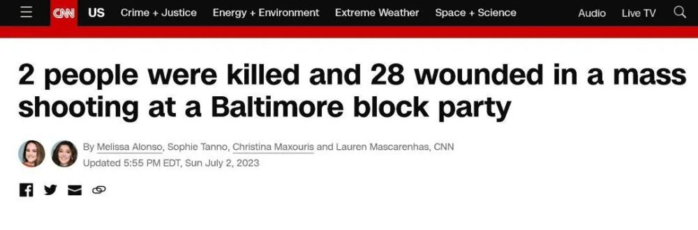
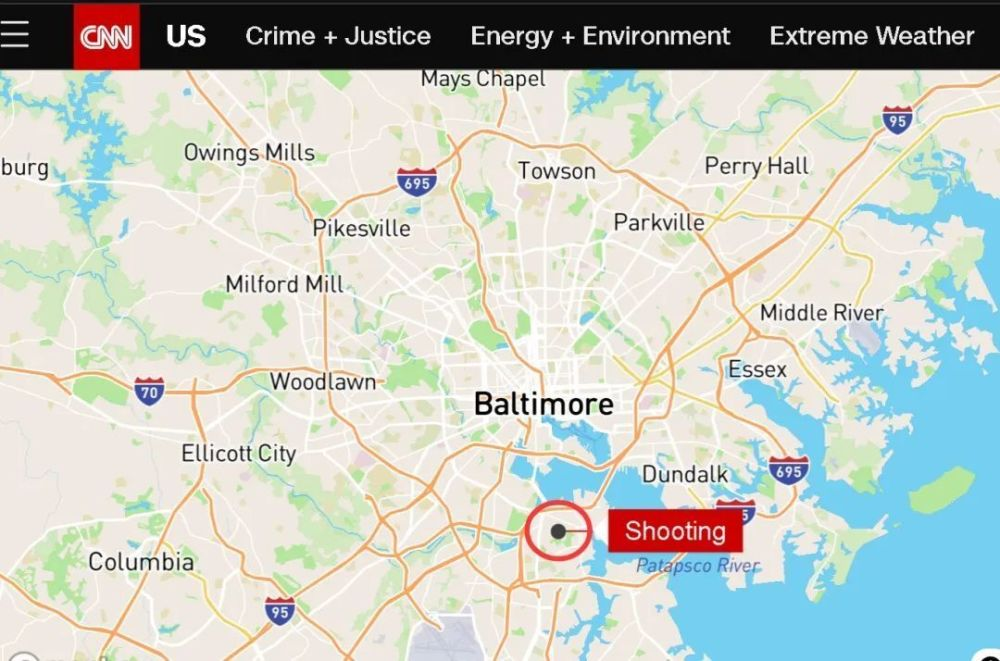
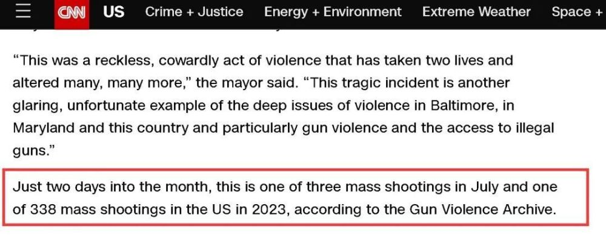

# 美媒：巴尔的摩市发生枪击案已致30人中枪、2人死亡

来源：环球时报新媒体

**据多家美国媒体报道，当地时间2日，美国马里兰州巴尔的摩市南部地区突发一起枪击案，导致30人中枪，其中28人受伤、2人死亡。**

据美国有线电视新闻网（CNN）的介绍，当地警方称，这场枪击事件发生在巴尔的摩市南部的一场在凌晨举行的街头派对上，一名18岁的女子和一名20岁的男子被杀，还有28人受伤，其中3人伤势严重。

警方还称，中枪的30人的年龄在13岁到32岁之间，其中有14人的年龄在18岁以下。

至于枪手，警方表示枪手可能有至少2人，这些枪手朝着参加派对的人群开枪，至于动机是什么目前还不清楚。

最后，CNN称，一家记录美国枪支暴力案件的网站显示，这起群体性枪击案是美国在进入2023年以来的第338起了，同时也是7月以来的第3起。

