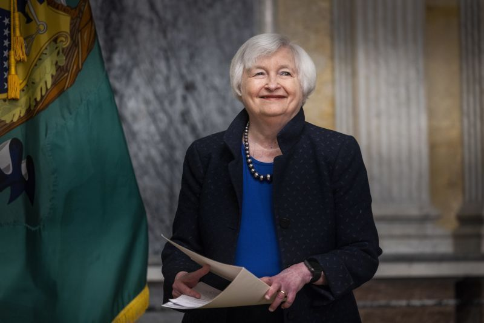

# 美财政部部长耶伦即将访华，美债、关税等或成焦点议题

6月13日，耶伦在众议院金融机构委员会的听证会上发声反对中美脱钩，称倘若美国彻底切断对华经济关系将是一场灾难。

_美财政部部长珍妮特·耶伦。图/ic_

7月3日，财政部官网发布消息称，经中美双方商定，美财政部部长珍妮特·耶伦（以下简称：耶伦）将于7月6日至9日访华。

这是继今年6月中旬美国国务卿布林肯访华后，美国又一高官访华。

耶伦不仅是美联储百年历史上首位女性掌门人，也是自1789年美国财政部成立以来的首位女性领导者，因此，其一度被媒体称为“世界上最有权力的女性”。

6月13日，耶伦在众议院金融机构委员会的听证会上发声反对中美脱钩，称倘若美国彻底切断对华经济关系将是一场灾难。

此次耶伦访华，双方交流会涉及哪些议题？

商务部国际贸易经济合作研究院研究员梅新育对贝壳财经记者表示，“20多年前我就关注到耶伦了，她曾经担任过美联储主席，的确是一位业务水平很高的官员，此次耶伦访华，我个人认为她与中国政府最可能谈的话题是美债与美国金融制裁，即中国是否会继续持有美债及买入新发行美债，以及美国方面如何确保中国持有的美国资产不会遭受像俄罗斯资产那样的命运。”

**美国经济“领航者”将访华 6月曾发声反对中美脱钩**

美国财政部成立于1789年，主要负责处理美国联邦的财政、征税、发行债券、偿付债务、监督货币发行等事务，制定与经济、财政、税务、国库收支有关的政策并提出建议。

美国财政部长是美国经济的主要领航者，负责管理公共债务、监督税收征收等，并充当政府与大小金融市场、企业之间的主要联络人。

耶伦作为美国财政部部长，近期就中美脱钩相关问题发声。

据塔斯社报道，6月13日，耶伦在众议院金融机构委员会的听证会上表示，倘若美国彻底切断对华经济关系，那将是一场灾难，耶伦指出：“尽可能开放的贸易和投资对我们和中国都有好处，如果我们试图与中国脱钩，那将是灾难性的。去风险？可以。脱钩？绝对不行。”

耶伦表示，贸易和投资在美中关系中具有决定性意义。她说：“虽然我们的确有一些问题需要解决，但断绝关系将是一个巨大的错误。”

耶伦认为，美国公民通过购买中国制造的更便宜的商品“获取了巨大利益”，中国也从美国的出口中受益，而这同时也在支撑着美国经济。

由此来看，耶伦对中美脱钩持反对态度。

值得一提的是，此次访华并非今年耶伦与中国高层的首次面谈互动。早在今年1月18日，国务院副总理、中美全面经济对话中方牵头人刘鹤与耶伦在瑞士苏黎世举行半天会谈，双方围绕落实中美元首巴厘岛会晤重要共识，就全球和两国宏观经济金融形势、应对全球共同挑战等进行了专业、深入、坦诚、务实的交流，会谈富有建设性。

双方认为，世界经济复苏处于关键时刻，双方加强宏观政策沟通协调，共同应对经济金融等领域的挑战，有利于中美两国和整个世界。双方讨论了深化宏观经济和金融领域合作的有关问题。双方认识到可持续金融合作的重要性，同意在双边及联合国、G20和APEC等多边框架下加强合作。双方同意继续支持新兴市场和发展中国家绿色低碳发展和经济转型。中方表达了对美国对华经贸和技术政策的关切，希望美方重视这些政策对双方的影响。

当时，中方便欢迎耶伦今年适当的时候访问中国。

**专家预测双方将就美债、关税等话题展开对谈**

此次耶伦访华即将成行，双方交谈会涉及哪些议题？据贝壳财经记者采访了解，美债或许将是双方沟通的一个焦点。

商务部研究院学位委员会委员白明对贝壳财经记者表示，对于美国来说，比较担忧中国抛售美债，他们甚至希望中国能继续增持美债。

梅新育也表示，个人认为她与中国政府最可能谈的话题是美债与美国金融制裁，即中国是否会继续持有美债及买入新发行美债，以及美国方面如何确保中国持有的美国资产不会遭受像俄罗斯资产那样的命运。

近年来，美债规模屡创新高，据《纽约时报》报道，当地时间6月16日，美国财政部公布的数据显示，美国国债首次超过32万亿美元，这比此前预测提早了9年。6月28日，美国国会预算办公室发布的2023长期预算展望报告也显示，公众所持美国联邦政府债务占美国国内生产总值（GDP）比重在未来30年将持续上升，预计2053财年将达到创纪录的181%。

与美债持续增长的趋势不同，过去1年中，中国主要在减持美债。根据6月中旬美国财政部公布最新的国际资本流动报告（TIC），中国仍是美债的第二大持有国，4月份中国内地所持有的美债规模小幅减持4亿美元，至8689亿美元，接近去年11-12月水平，而就在今年3月份，中国的美债持有量曾出现了自2022年7月以来的首次上升，打破了
“七连降”态势，不过，4月份中国又再度减持了美债。

其实，减持美国国债并非只是中国的做法，从年初至今的全球央行的资产负债表来看，都在减持美债，扩大黄金的储备。

一名金融行业资深分析师对贝壳财经记者表示，我认为，各经济体短期增减持美债更偏向于战术性，一方面，反映各经济体对美债、美国通胀和经济前景、美联储政策前景预期存在一定分化；另一方面，也是各经济体出于优化外汇储备资产结构、稳定外汇储备方面考虑。“长期来看，美国经济低速增长，债务不断攀升，美国财政、货币政策缺乏‘约束’等，各国出于降低美联储政策外溢影响，保持政策独立等，降低对美元依赖，多元化外汇储备将是大趋势。”

他进一步表示，目前中国减持也属于战术性操作，仍是美债第二大持有者，对美国国债影响有限。

但一个共识是，若中国抛售美债，那么将给美国带来负面影响。

而对于中国来说，白明认为，比较大的关注点是，美国对华加征关税到现在还不取消，这说不过去。“此次耶伦访华，双方是否会达成协议就看美国的态度了。”

梅新育则对贝壳财经记者表示，“我认为，目前耶伦有求于中国的方面比较多，而中国有求于耶伦的方面相对较少，但现在更大的问题是，中国是说话算话的，不管是哪个部门和国外官员谈，都可以保证中方作出的承诺会履行，但美国现在似乎没有最终拍板人，谁来谈都不一定算数，相关的承诺都难以执行，因为美国现在是非常典型的否决性政治环境，宁可损己也要损人。”梅新育称，“当然，我还是希望双方能够就某些问题达成协议，这样不仅利好中美双方，也利好全球经济的复苏，而不希望耶伦访华仅仅显示一种双方在谈话的态度。”

新京报贝壳财经记者 潘亦纯 编辑 陈莉 校对 陈荻雁

