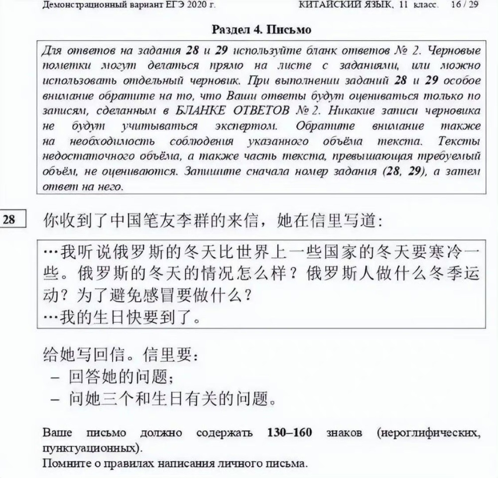

# 越南高考中文题疑似曝光！网友：原来看得懂完型填空题是这种感觉

7月2日，有网友贴出了疑似“越南高考的中文题目”的图片，引发网络热议。

这套中文题目包括单选和完形填空。看后，不少网友表示这题目难度不大，但总感觉哪里有点儿怪；也有网友称，原来做完型填空看的懂是这种感觉。

据悉，俄罗斯“高考”也从2023年起试行将汉语列入外语考试科目。下面是网友贴出的俄罗斯之前的高考部分中文题目。看看你能做对吗？

（综合自@vista看天下、微博评论区等）

编辑：赵珊珊

