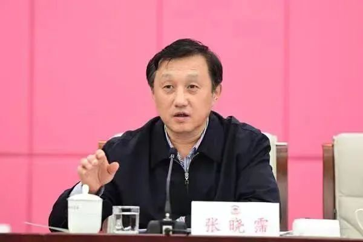
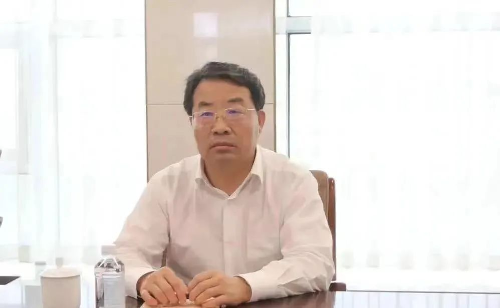

# 透露反腐信号！李春生、张福生等四个“老虎”同时被点名，都和这个问题有关

**撰文 | 蔡迩一**

7月3日，中央纪委国家监委官网发布《聚焦“国之大者”强化政治监督》一文。

文中点名四个“老虎”，并提到了四个落马“老虎”的共同点。

这四个“老虎”分别是：

广东省人大常委会原党组副书记、副主任李春生。

辽宁省沈阳市人大常委会原党组书记、主任付忠伟。

原应急管理部消防救援局党委委员、副局长张福生。

吉林省政协原党组成员、副主席张晓霈。

**四个“老虎”有个共同点**

政知君注意到， **李春生、付忠伟、张福生、张晓霈四个“老虎”都是在6月28日同日被处理的。**

其中李春生、付忠伟、张福生都是被双开，张晓霈是被开除党籍。

这四个“老虎”分别来自广东、辽宁、吉林和应急管理部。

李春生和张晓霈都是主动投案的，前者曾在河南、公安部、广东工作，担任过公安部政治部副主任，广东省副省长、省公安厅厅长；后者长期在吉林省工作，担任过吉林市市长、市委书记。

_李春生_

付忠伟长期在辽宁省工作，担任过辽宁省审计厅厅长、财政厅厅长、盘锦市委书记。

_付忠伟_

张福生长期在公安部任职，担任过公安部消防局副局长，2018年党和国家机构改革，公安部消防局划归应急管理部。张福生是应急管理部设立后，该部首位落马的中管干部。

这四人的通报有不少细节。

比如，李春生被指“违规干预和插手司法、执法和市场经济活动”；付忠伟被指“干预审计工作”“纵容亲属利用其本人职权谋取私利”；

张福生被指“违规拥有非上市公司股份；长期沉迷赌博”；张晓霈被指“大肆打探案情、干预执纪执法工作”“卖官鬻爵，严重破坏任职地区政治生态”等。

不过，这四人也有一个共同点。

中央纪委国家监委官网在7月3日的文章中写道，
**在四人的通报中，“丧失理想信念，背弃初心使命”“对组织不忠诚不老实，对抗组织审查”等违反政治纪律的情节列在首位。**

“ **这体现了纪检监察机关坚持全面从严治党首先从政治上看，查办案件首先从政治纪律查起的根本遵循** 。”

文中还提到，结合重大案件查处，及时发现、着力解决“七个有之”问题，坚决清除对党阳奉阴违的两面派、两面人。

“纪检监察机关 **将政治监督与审查调查深度融合，把严明政治纪律和政治规矩落实到具体人和事，着力纠治政治偏差，推动问题得到解决** 。”

**坚决做到“两个维护”**

违反政治纪律的“老虎”不仅仅是上述几人。

一个事实是，政治问题，任何时候都是根本性的大问题。 **强化政治监督，是纪检监察机关肩负的重大政治责任。**

政知君注意到，十八大之后落马的“老虎”中，不少人存在的第一个问题，也都与“违反政治纪律”相关。

2019年1月，中央纪委国家监察网站发布了2018“打虎”简报。

其中提到， **80%以上被通报的落马中管干部都违反了政治纪律**
，对抗组织审查是常见情形，另外还有干扰中央巡视，背离党中央的要求、弄虚作假，搞政治投机、为个人职务升迁拉关系，阅看有严重政治问题的境外书刊，搞“小圈子”、拉帮结派等。

2018年，新修订的《中国共产党纪律处分条例》把“坚决维护习近平总书记党中央的核心、全党的核心地位，坚决维护党中央权威和集中统一领导”作为出发点和落脚点，作为
**根本的政治纪律和政治规矩** 。

2018年11月，《学习时报》刊发《高级干部要作“两个维护”的表率》一文。

文中提到， **对在“两个维护”上做得不坚决、不彻底的高级干部进行果断问责、严肃查处，十分必要，势所必然。**

政知君注意到，这几年来，一些落马“老虎”的通报中，也出现了背弃“两个维护”这样的表述。

比如，严重违反党的政治纪律的公安部原副部长孙力军、全国政协社会和法制委员会原副主任傅政华、以及浙江省委原常委、杭州市委原书记周江勇等，都被指背离/背弃了“两个维护”。

孙力军被指 **背弃“两个维护”**
，毫无“四个意识”，政治野心极度膨胀，政治品质极为恶劣，权力观、政绩观极度扭曲，妄议党中央大政方针，制造散布政治谣言，阳奉阴违，欺上瞒下，捞取政治资本。

傅政华被指完全背弃理想信念，从未真正忠诚于党和人民，彻底丧失党性原则，毫无“四个意识”， **背离“两个维护”**
，政治野心极度膨胀，政治品行极为卑劣，投机钻营，利令智昏，为达到个人政治目的不择手段。

周江勇被指 **背离“两个维护”** ，政治意识淡漠，对党中央决策部署阳奉阴违，与资本勾连，支持资本无序扩张，搞迷信活动，处心积虑对抗组织审查。

中央纪委国家监委7月3日的文章中提到，新时代新征程政治监督的根本任务，就是推动党员干部深刻领悟“两个确立”的决定性意义、坚决做到“两个维护”，确保党中央重大决策部署不折不扣落到实处。

同日，中央纪委国家监委官网还发布了《带头强化政治担当 把党的自我革命进行到底》一文。

文中提到，纪检监察机关是党和人民的忠诚卫士，在“两个维护”上肩负重大使命、重大责任。

**要督促各级党组织和党员干部坚定拥护“两个确立”、坚决做到“两个维护”，确保全党统一思想、统一意志、统一行动，步调一致向前进。**

**新部署**

值得注意的是，党的二十大和中央纪委二次全会对“政治监督”提出了新的要求。

党的二十大报告提到，推进政治监督 **具体化、精准化、常态化** ，增强对“一把手”和领导班子监督实效。

如何具体化、精准化？

中央纪委二次全会公报给出了答案。

公报提到，推进政治监督具体化、精准化、常态化，
**围绕完整准确全面贯彻新发展理念、加快构建新发展格局、着力推动高质量发展等重大战略部署，围绕党中央因时因势作出的决策部署加强监督检查**
，确保执行不偏向、不变通、不走样。

换句话说，党中央决策部署到哪里，政治监督就跟进到哪里。

比如，党的二十大对全面推进乡村振兴、加快建设农业强国作出战略部署，一大批惠民政策、资金项目源源不断地投向“三农”领域。

今年2月，中央纪委印发了《关于开展乡村振兴领域不正之风和腐败问题专项整治的意见》，强调坚决整治乡村振兴领域不正之风和腐败问题。

政知君注意到，这段时间以来，中共中央政治局常委、中央纪委书记李希多次强调“政治监督”。

今年3月19日至21日，中共中央政治局常委、中央纪委书记李希到湖北调研。

调研期间，李希强调，要 **把强化政治监督摆在首位**
，锲而不舍落实中央八项规定精神，严格纪律教育和纪律执行，始终坚持严的基调，把中央纪委二次全会工作部署落实到位。

6月14日至17日，李希到云南调研。

他强调， **深刻领悟具体化、精准化、常态化的重要要求** ，聚焦“国之大者”强化政治监督。

就在6月27日，中央纪委国家监委举行学习贯彻习近平新时代中国特色社会主义思想主题教育、全国纪检监察干部队伍教育整顿主题党课报告会，李希作党课报告。

李希强调，坚定拥护“两个确立”、坚决做到“两个维护”，既要见思想，更要见行动。

他说， **要聚焦“国之大者”，强化政治监督，保障党的二十大决策部署贯彻落实。**

**资料 ｜ 中央纪委国家监委 新华社 央视 人民网等**

**【版权声明】本文著作权归政知新媒体独家所有，未经授权，不得转载。**

