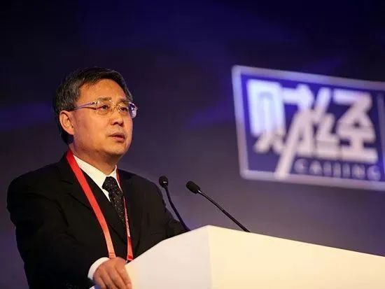

# 郭树清金融改革与监管18载：曾任银保监会主席、央行书记、证监会主席

_从建行、证监会，到山东、银保监会，无论时代需要创新发展还是严守风控底线，郭树清都延续着改革者形象_

**文｜《财经》记者 陈洪杰 丁艳**

**编辑｜袁满**

2023年7月1日下午，中国人民银行召开领导干部会议。中央组织部有关负责同志宣布了中央决定：免去郭树清的中国人民银行党委书记职务。至此，郭树清告别就职多年的监管部门。

而在1个多月之前，随着国家金融监督管理总局的成立，郭树清开始卸职中国银保监会主席，离开金融街15号。

无论在监管部门、地方政府，还是国有大行，一把手大都面临巨大压力。而郭树清干了18年，并在一行两会及国有大行担任过重要角色。

2005年3月开始，他空降建设银行，出任董事长；2011年10月，郭树清出任中国证监会主席，针对违规保荐人、老鼠仓等资本市场的顽疾，推出多项改革；2013年3月，郭树清奔赴山东。

2017年2月，郭树清重回金融街15号，这一次的任务更重：整治银行保险业乱象和化解金融风险。

每个人都有时代的宿命，郭树清也不例外。从宏观角度来看，中国金融业的发展与监管与社会经济发展阶段的需求相匹配。2017年之前，中国经济高速发展，屡次创造了世界奇迹。2017年之后，中国经济转为高质量发展，这也使得顶层设计改变了对金融业的监管策略。

若将过去18年的一把手生涯放在一起来看，不难发现：在2017年之前，郭树清的改革以进攻偏多，频繁推出新政。据不完全统计，郭树清在2011年10月至2013年3月，担任证监会主席的506天里，新政发布达70项，相当于“7天一新政”。

出任中国银监会、中国银保监会主席之后，郭树清以防守为主，兼顾进攻，推出各项改革措施防范系统性金融风险。据原银保监会网站信息，郭树清任职银保监会5年期间，发布300余个监管文件，平均6天出台一份。

作为金融监管者，无论时代需要创新发展还是严守风控底线，几乎一周一项新举措的郭树清，都延续着他“郭旋风”式的改革者形象。

在守住风险的过程中，郭树清等监管者进行拆弹：2017年-2022年银行业累计处置不良资产14万亿元以上，超过此前历年处置额总和；高风险影子银行规模较峰值压降近30万亿元；约5000家P2P网贷机构全部关停；过去五年，查办非法集资刑事案件2.2万起，涉案金额1.5万亿元等。过去三年，高风险的中小金融机构数量从600多家降到了300多家。

之前，有记者问郭树清喜欢什么运动，郭树清说：“洗碗。我觉得洗碗是很好的饭后运动，只要我在家吃晚饭，就会去洗碗。”

不过，在金融风险仍处于易发期的当下，郭树清仍将在人大财政经济委员会继续贡献出自己的力量。

房地产与金融的正常循环、中小金融机构风险处置、不良资产反弹风险以及如何化解地方政府隐性债务风险等问题依然是中国监管部门需要应对的难题，也是郭树清以及后继者思考面对的问题。

**金融业拆弹**

2017年2月23日，从上海出发、经停济南的G148次高铁，于当晚21时12分左右抵达北京南站，有“救火队长”之称的郭树清回来了。2月24日早，郭树清走到金融街15号，随后与原中国银监会第二任主席尚福林完成工作交接。

此时，中国金融业在快速发展的同时，风险有所积聚，突出表现在资金空转、层层嵌套、规避监管投向限制性行业和领域，跨市场、跨业务交叉风险隐患较高。

2016年底召开的中央经济工作会议提出，要把防控金融风险放到更加重要的位置，下决心处置一批风险点，着力防控资产泡沫，提高和改进监管能力，确保不发生系统性金融风险。

有市场人士称，2017年是中国监管的转折之年，过去监管是“一手促发展，一手抓监管”，但于此年开始回归金融本源，强化防范和处置金融风险。

这也奠定了此后五年多郭树清强监管的总基调。“如果银行业搞得一塌糊涂，作为中国银监会主席，我就要辞职。”郭树清在上任之初如此表态。

影子银行整顿是郭树清的重点工作之一。影子银行游离于监管之外，风险隐蔽，交叉传染，被认为是2008年全球金融危机的罪魁祸首之一。

有数据显示，到2016年底，中国影子银行规模已经相当庞大，广义影子银行超过90万亿元，狭义影子银行亦高达51万亿元。

“中国影子银行已犹如脱缰的野马一路狂奔，不仅使金融风险不断积累和暴露，
违法违规问题日益严重，而且也大大抬高了中国宏观杠杆水平，吹大资产泡沫，助长脱实向虚，严重影响了金融与经济的良性循环，极大扭曲了市场资源的正常有效配置，对经济金融向高质量转型发展构成重大威胁。”《中国影子银行报告》称。

由此，2017年银行业就掀起了“三三四十”专项整治行动，这是整顿影子银行的重要措施。据原中国银监会披露的数据，在2017年，原中国银监会全系统共作出行政处罚决定3452件，其中处罚机构1877家，罚没29.32亿元；处罚责任人员1547名，其中罚款合计3759.4万元，并对270名相关责任人取消一定期限直至终身银行业从业和高管任职资格。

2018年，中国银监会与中国保监会合并，原中国银监会主席郭树清，出任新成立的中国银保监首任主席。

另外，针对影子银行，郭树清采取的措施还包括：规范交叉金融监管，推动“类信贷”表外业务回表调整，按照信贷分类标准把非信贷资产纳入统一分类，将所有承担信用风险的影子银行业务实行统一授信管理，遵循相同的客户评级和大额风险暴露规定等。有序处置由工商企业违规参股控股金融机构所形成的实质性金融集团；强化穿透监管，严格股东资质，严查股权代持，隐形股东以及虚假注资、循环注资等。

多位融资租赁公司高管表示，在2017年金融去杠杆中，有“影子银行”属性的融资租赁公司较难从市场上拿到钱，即便在流动性比较宽裕的2020年，融资租赁公司依然不太容易从市场融资。

原中国银保监会数据显示，截至2022年末，高风险影子银行规模较峰值压降近30万亿元；约5000家P2P网贷机构全部关停；查办非法集资刑事案件2.2万起，涉案金额1.5万亿元等。

未来的一段时间，监管对此类业务的态度依然是“严防各类高风险影子银行死灰复燃”。当下，监管部门对20万亿元的信托业正在规范，引导行业发展服务信托、资产管理信托和公益慈善信托等本源业务。

当时光停留在2019年、2020年、2021年，监管部门的任务重点定调在“规范房地产金融”。

伴随“三道红线”监管政策进一步收紧，“房地产贷款集中度管理”及“土地供应两集中”等重磅调控政策相继出台，房地产行业融资通道受阻，并于2021年-2022年纷纷爆雷。

于是，房企艰难求生，楼市震荡：停贷潮、保交楼、花样卖房……为应对上述情况，一系列调控新举措出台，并重提房地产是国民经济的支柱产业。

2022年11月，中国人民银行和原中国银保监会出台了《关于做好当前金融支持房地产市场平稳健康发展工作的通知》，共16条措施，要求金融机构分别从房地产融资、“保交楼”金融服务、受困房企风险处置、住房租赁金融支持等多方面对房地产行业给与支持。

2023年1月，郭树清在接受采访时称，努力促进房地产与金融正常循环。落实“金融十六条”措施，以保交楼为切入点，以改善优质头部房企资产负债表为重点，促进房地产业平稳健康发展，逐步推动房地产业向新发展模式过渡。

值得一提的是，经过多年粗放发展，以科技平台为代表的互联网金融步入风险暴露期。

2020年11月，郭树清发文称，金融业务如果没有一定的资本金，那就迟早会陷入困境。巴塞尔协议的核心，就是对银行信贷确定基本的资本金约束，杠杆率必须处于安全范围。

“把握好金融创新的边界。金融创新是把‘双刃剑’，既能提高市场效率，也会酿成重大风险。监管必须趋利避害，把握好度。中国互联网金融发展初期，一些网贷平台打着创新旗号违规经营，形成巨大金融和社会风险。”他称。

此后对互联网金融平台的整顿拉开大幕。2021年，金融监管部门先后多次约谈14家平台企业，正式启动对其的整改工作。其中，整改方案的主要内容包括：纠正支付业务不正当竞争行为；打破信息垄断；蚂蚁集团整体申设为金融控股公司，所有从事金融活动的机构全部纳入金融控股公司接受监管；严格落实审慎监管要求，完善公司治理，认真整改违规信贷、保险、理财等金融活动，控制高杠杆和风险传染；管控重要基金产品流动性风险，主动压降余额宝余额。

2022年以来，国务院金融委要求按照市场化、法治化、国际化的方针，稳妥推进、严格完成大型平台企业整改工作，转入常态化监管，设置好业务领域和市场行为的红灯、黄灯、绿灯，通过规范、透明、可预期的监管。

郭树清最近对互联网平台金融业务的论述出现在2023年1月，他在接受媒体采访时称，14家平台企业金融业务专项整改已经基本完成，少数遗留问题也正在抓紧解决。后续将实行常态化监管，鼓励平台企业合规经营，在引领发展、创造就业、国际竞争中大显身手。

**学者、官员、监管者的切换**

“学者官员”是政界和金融界对郭树清的另一个评价标签。

1977年，中国中断了十年的高考制度恢复，改变了许多知青的命运，郭树清就是其中一名。1978年3月，郭树清考进南开大学哲学系读书，成为恢复高考后首批大学生；1982年2月，他进入中国社会科学院研究生院马列系科学社会主义专业学习，此后考取在职博士。1986年3月，他短暂借调到国务院经济体制改革方案设计办公室工作2个月后，赴英国牛津大学作访问研究。

青年时期的郭树清，曾在国家计委、国家经济体制改革委工作近10年。1998年国务院机构改革中，国家经济体制改革委撤销，改设为“国务院经济体制改革办公室”，郭树清担任党组成员。

在此期间，郭树清被安排到吴敬琏的课题小组工作。作为课题组成员之一，他和周小川、楼继伟、李剑阁等人提出了“整体配套、分步实施”的改革思路，主要提倡企业、市场和宏观调控三方面改革的大配套，强调价格改革是整个经济体制改革的关键等。

学而优则仕。1998年，时年42岁的郭树清被任命为贵州省副省长。当时贵州财政收入仅65.3亿元，房改启动资金成为推进改革的瓶颈。在贵州近三年时间，郭树清主导了住房货币化改革，担任房改组组长，设计改革方案。

此改革的核心是分配方式从实物分配转为货币分配。在改革开始的两年内，贵州省和贵阳市住房资金管理中心仅投入6000万元，回笼的住房资金便超过20亿元，同时也解决了职工的住房问题。

郭树清改革的思路继续贯穿他后半段职业的大部分时光。2005年3月，郭树清空降建行任董事长。在郭树清入主后200多天内，引进了境外战略投资者，建行成为中国第一家实现IPO的国有商业银行。

55岁的郭树清，再一次踏上了新征程。郭树清上任中国证监会短短数日，将矛头直指提高上市企业分红水平，完善退市制度，处罚违规保荐人、老鼠仓等。

据微博网友调侃，中国有三个职位不好干，即中国足协主席、春晚总导演和中国证监会主席。在郭树清履新中国证监会主席前一天（2011年10月28日），上证指数为2473.41点，截至2012年10月26日报收2066.21点，累计下跌407.20点，市场因此流言甚多。

不过，经济学家、耶鲁大学终身教授陈志武则表示：郭树清做中国证监会主席一年多，改变了中国金融市场的生态环境，使行业更加充满活力，竞争和创新成为现实。

2013年3月，郭树清离开中国证监会，奔赴山东任山东省委副书记、山东省代省长，后于6月出任省长。

郭树清要求“每个市都要配一个懂金融的副市长”。据了解，原证监会发行部综合处处长张望军、原人民银行国际司港澳台处处长等30多名中央金融机构处级干部先后挂职山东各地市。

与此同时，中央亦开始频繁从金融系统抽调管理干部“空降”省级政府，地市级别则更多。

有数据显示，目前，近20个省（自治区、直辖市）配备了“金融副省长”。而从他们的履历看，多出自国有大行、政策性银行以及金融监管机构。

**67岁仍在路上**

在郭树清出任中国银监会主席之前，2016年中国商业银行不良贷款余额为1.5万亿元，商业银行不良贷款率1.74%。

而在过去五年，中国银行业累计处置不良贷款约15万亿元，超过此前12年总和，2022年末不良贷款率1.71%。

改革只有进行时、没有完成时。目前，中小银行保险机构化险、不良贷款的进一步处置、房地产市场平稳发展、地方债务风险的化解等问题关系到中国经济和金融未来的发展。

3月9日，据新华社消息，第十四届全国人大财政经济委员会主任委员、副主任委员、委员名单公布。其中，郭树清任副主任委员。

全国人大财政经济委员会的工作职责是，在全国人大及其常委会的领导下，研究、审议和拟订有关议案。具体来看有：审议全国人大主席团或者全国人大常委会交付的议案；向全国人大主席团或者全国人大常委会提出属于全国人大或者全国人大常委会职权范围内同本委员会有关的议案等。

在新一届全国人大财经委中，除了郭树清，另外几位也出身于金融系统，分别是建设银行董事长田国立，原中国人民银行副行长、南开大学校长陈雨露，中国人民银行副行长刘国强，中国证监会机构监管部巡视员欧阳昌琼，中投公司副总经理兼首席策略官赵海英。

67岁的郭树清有望在人大财政经济委员会副主任委员的岗位上贡献出智慧。

多位行业人士称，2023年是贯彻落实二十大精神的开局之年，做好监管工作意义重大。金融监管部门至少面临着以下几方面工作难题：其一、中小银行改革化险，包括城商行、农信社风险化解、村镇银行的改革重组，以及如何地多渠道地补充中小银行资本。

其二、疫情后的信用风险集中反弹，以及金融机构怎样合力化解地方政府债务风险。

其三、在金融机构治理体系建设上，如何推动党的领导与公司治理深度融合、做好股东资质穿透审核和股东行为穿透监管、构建符合中小机构特点的差异化公司治理监管制度。

其四、在“房住不炒”的的定位下，“金融十六条”措施以及“因城施策”实施差别化信贷政策怎样推动房地产业向新发展模式平稳过渡，这是又一道难题。

有行业资深人士称，当前国内外形式比较复杂，任命郭树清等其他金融资深人士出任人大财经委副主任委员、委员，寄希望他们继续发挥才干，旨在于加强和完善现代金融监管，强化金融稳定保障体系，守住不发生系统性风险底线。

责编 | 张雨菲

本文为《财经》杂志原创文章，未经授权不得转载或建立镜像。如需转载，请添加微信：caijing1998041

