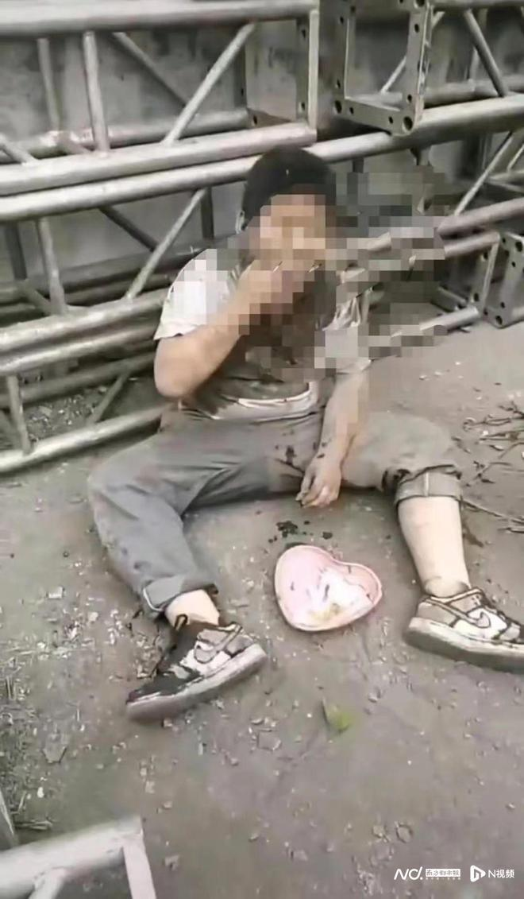

# “被逼吃屎”是怎么和解的？媒体：山西介休警方还请回应公众关切

居然和解了！日前，一段“小男孩被逼吃粪便”的视频在社交平台引发热议，涉事地方山西介休发布通报称，本案系“3名未成年人欺凌1名未成年人”，警方对施害方监护人“严厉批评教育”，责令严加管教并赔礼道歉，目前“双方家长已达成和解”。

一个手段极其恶劣的霸凌场景，还在持续刺痛围观人群的心，当事双方家长倒是达成了和解。可能由于霸凌手段的极端卑劣和霸凌现场的视觉冲击，不少网友对该涉未成年人的霸凌事件尤其无法释怀。

_当事人被逼着吃粪便的场景被拍成视频上网传播。_

《人民调解法》赋予民间纠纷当事人在“自愿、平等的基础上进行调解”的权利，外界当然应该尊重被害方选择通过和解了结事端的意愿。但还有一个值得深究的小细节，那就是
**作为直接受害人的被霸凌少年，是否也在调解介入后充分表达了意见？**
《民法典》对于作为限制民事行为能力人的八周岁以上未成年人，也同样尊重和保障其“独立实施纯获利益的民事法律行为或者与其年龄、智力相适应的民事法律行为”。少年在遭遇非人霸凌后，接受道歉、选择和解甚至获得赔偿，是否可以看作是一种纯获利益的民事行为？受害人的意愿是否在此项和解过程中得到了充分的尊重？还是说，最终落到受害人头上的，只是专业人士的一番心理疏导？

**和解不该只是双方家长的事，更不能成为一种必须选择的纠纷化解路径。**

三个未成年人逼迫另一个未成年人吃屎，并且拍摄视频上传社交网络，如此严重的霸凌行为不能仅因为涉事双方的未成年人身份就讳莫如深。未成年人合法权益需要保护，但对于一起情节恶劣、已经引发群情激愤的霸凌未成年人案件，案情通报应当尽可能详尽，比如涉案未成年人所处的具体年龄段，因为即便是《刑法》也对未成年人触犯法律的年龄段有越来越详细的区分，未成年人及其监护人具体应当承担法律责任的程度会因此有所不同。

不仅如此，对于像逼未成年人吃屎并拍摄视频上传这样极端恶劣的霸凌行为，能在有关部门介入后最终实现和解，作为调解主持方，当地有关部门应当在最大限度保护未成年人隐私的前提下，尽可能详细地披露调解全程细节，包括具体的调解时间、地点和方式，一方面疏解外界对于个案和解疑似被胁迫的个中揣测，另一方面也可以作为调解成功案例做经验分享，这同样是个谁执法谁普法、以案释法的好机会。

尊重和保护未成年人的隐私权利，并不代表凡是涉及未成年人就完全退到暗箱操作的地步。严格按照法律程序做好未成年人的隐私保护，同样可以实现个案办理过程的公开透明。不仅如此，作为可能尚不足以追究刑事责任的治安个案，调解手段的介入也并不意味着纠纷解决渠道的唯一性。
**可以调解，也要允许调解不成功。**
《人民调解法》同样明确，“尊重当事人的权利，不得因调解而阻止当事人依法通过仲裁、行政、司法等途径维护自己的权利”。和解促成的各项因素应当有一个尽可能透明的披露，这是执法公开的要求，也是结果正义的根本保障。

包括但不限于校园暴力的所有针对未成年人的霸凌行为，都应当受到全社会的摒弃，这首先要求社会规则对其的零容忍。
**要特别警惕在对霸凌行为的处置过程中由于程序的不透明和对特定结果的某种强烈追求，导致客观上对受害者一方的又一次权力霸凌。**

官方发布通报，不等于所有疑虑顷刻消弭，要允许社会各方在持续的表达和互动中最终达成法治共识。“被逼吃屎”事件是怎么和解的，介休警方不妨进一步通过以案释法来回应公众关切。

