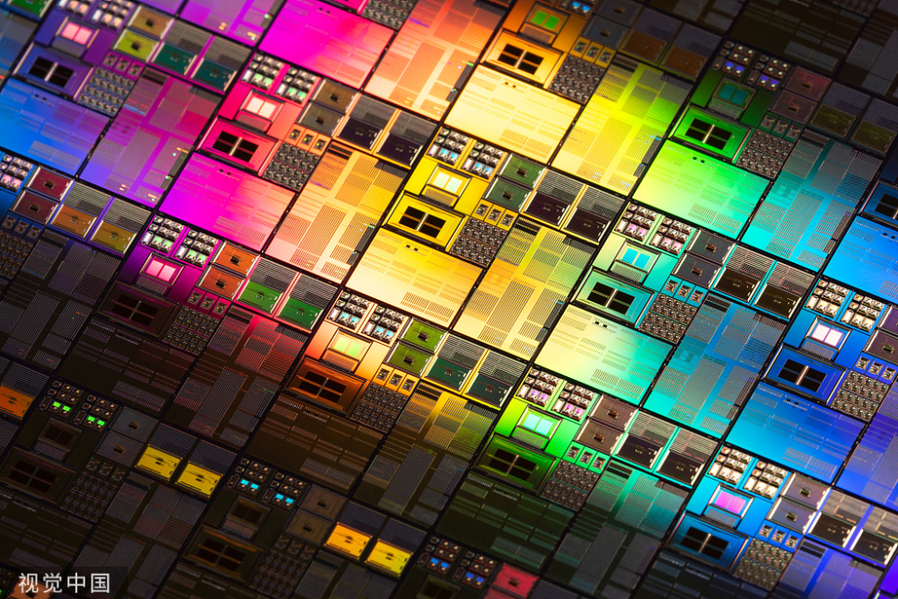
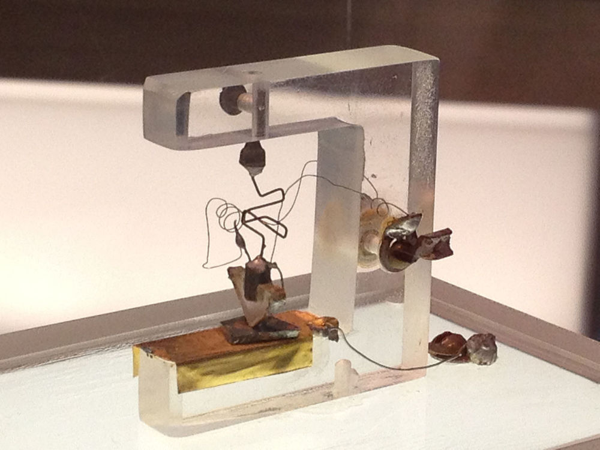
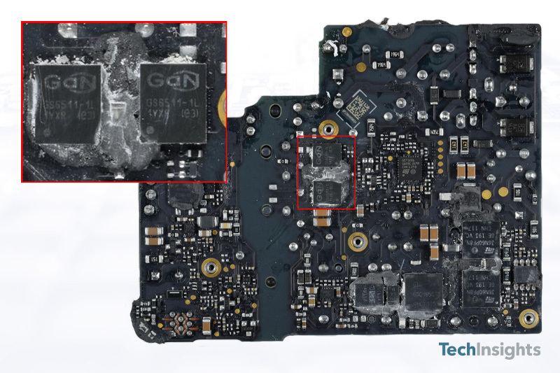
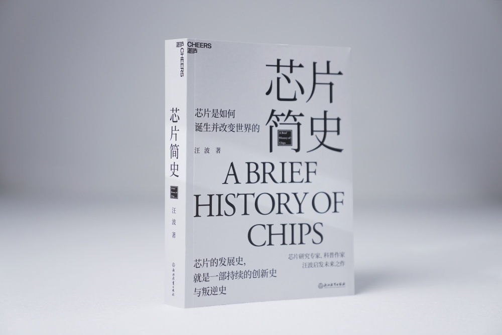

# 中国管制镓和锗出口，反制美国、日本芯片“卡脖子”？

_“芯事重重”腾讯科技半导体产业研究策划，本期聚焦半导体材料镓、锗在半导体产业发展过程中的价值分析。_

**文 / 汪波 《芯片简史》作者、资深芯片研究专家，本文独家首发腾讯新闻，未经授权请勿转载。**

2023年7月3日，中国商务部和海关总署发布公告，“为维护国家安全和利益，经国务院批准，决定对镓、锗相关物项实施出口管制。”公告中除了对镓、锗这两种材料做出限制，同时对氮化镓、砷化镓、锗外延生长衬底、四氯化锗等包含镓和锗元素的半导体材料也一同做出限制。

中国是世界上最大的镓和锗生产国，有媒体认为，这是中国回击美国的半导体限制的最新举措。

镓和锗是构成半导体的重要材料，也是芯片制造的关键元素。其中氮化镓（GaN）化合物可用于手机、电脑的LED显示屏，也广泛用于照明、电源、通信等领域。而锗主要用于光纤通信、夜视镜和卫星上的太阳能电池。此外硅锗（SiGe）是一种重要的半导体应变材料，可大大提高晶体管的速度，在高速芯片中有着广泛应用。

就在一个月前，中国宣布对美国最大的半导体存储器公司美光公司进行安全审查，中美在半导体领域的博弈正从单向的制裁转入有来有往的深度博弈阶段。

那么，这一次为什么是锗和镓？这两种元素在芯片制造中发挥什么作用？

01 没有锗，就没有第一个半导体晶体管和芯片

尽管在半导体制造中，硅占有当之无愧的主导地位，但实际上现代芯片制造早已超出了硅的范围。

_图为晶圆上的芯片高清特写，来源：视觉中国_

元素周期中的一半的元素已经被用于半导体制造中。有一个说法，为了继续推进摩尔定律，人类将穷尽元素周期表的所有元素。而锗在半导体领域是不可或缺的重要元素，并且曾为芯片产业立下汗马功劳。

1947年，贝尔实验室的巴丁、布拉顿和肖克利发明的人类第一个晶体管就是用锗制成的。 **1958年德州仪器的基尔比发明的人类第一颗芯片也是用锗制成的。**

在元素周期表中， **锗跟硅一样同属于IV族元素，但是锗位于硅的正下方，只比硅多一个电子层。**
这决定了锗具有跟硅类似的半导体特性，可以用来作为开关和放大信号。纯净的锗和硅一样都是一种闪着金属光泽的固体。但是锗的熔点远低于硅，更容易熔化后制成晶体，所以早期的晶体管都是用锗制成的。

锗的研究可以追溯到二战期间，为了研制出小巧的机载雷达，美国普渡大学的本泽尔在锗中添加了一些金属锡，使得锗二极管能够耐受高电压，从而提高了雷达的可靠性。此后，贝尔实验室受此启发，用耐高压的锗晶体发明了第一个晶体管。

**没有锗，就不可能有晶体管的发明。**

_世界上第一个晶体管——用锗制成 来源：Wikipedia_

但是锗由于多一层电子，所以电子更加活跃，特性更加趋近金属。但是这也导致了锗的禁带宽度比较小，如果温度高于70摄氏度，锗晶体管就无法正常工作了。1954年德州仪器公司的蒂尔在一次公开演示中把收音机里的锗晶体管泡进热油里，收音机里的音乐停止了。从那时起，硅晶体管开始登上历史舞台。

但是这并不意味着锗被扫入了历史博物馆。人们又为锗找到了新的应用——应变工程，可以大大提高晶体管的工作速度。

在主流的CMOS硅晶体管上，随着晶体管尺寸缩小，电子移动速度逐渐达到了极限。工程师在硅晶圆上掺入硅锗，使得表面的硅晶圆发生应变，强行将硅原子间距撑大，这样界面处的电子就能以更快的速度行进，从而提高了晶体管的开关速度，如今这已经成为现代高速芯片中必不可少的主流技术。

02 从蓝光LED、充电器到5G基站，“镓”悄然改变世界

说到镓，它在现在半导体中也不可或缺，由镓元素可以构成氮化镓和砷化镓，后两者在照明、显示屏、光电器件、功率器件和通信器件中不可或缺。

**镓元素属于III族，一般不会单独使用，而是作为化合物结合成氮化镓和砷化镓等。这两种化合物属于直接半导体，可以直接发光。**
与之相反，硅属于间接半导体，几乎发不出光线，早期用硅制造发光LED的努力都以失败告终了。

1962年，麻省理工学院用砷化镓做出了第一个红外LED，而通用电气在三个月后用砷化镓制作出了第一个红外半导体激光器。从此砷化镓半导体大放异彩，在此基础上诞生了红外激光的CD机。

_图为诺贝尔物理学奖获得者中村修二与蓝光LED设备合影，来源：互联网_

至于氮化镓，从上世纪70年代到90年代一直不被看好，直到日本的中村修二在1993年用氮化镓发明了第一个实用的蓝光LED。有了蓝光LED，就能跟此前研发出来的红色和黄色LED组成三原色，用于彩色显示，使得超薄电视和显示器变得可能。由于蓝光的频率最高，蓝光LED的研制难度最大，普通的砷化镓无法发出蓝光，只有氮化镓才能做到。

此外，有了蓝光LED，涂上一些粉剂就能制成白光照明的LED。LED灯的每瓦光通量是白炽灯的20倍，不仅更亮，还大大降低了能耗，由此氮化镓的蓝光LED引发了新一代的照明革命。

业界终于醒悟过来，转向了氮化镓的研究，在其中添加其他元素制造出了蓝色激光器等，才有了后来的蓝光光碟机。

氮化镓的应用也突破了光电领域，应用到了电源领域（如手机和笔记本电脑的快速充电）以及无线通信等领域。

_苹果氮化镓充电器拆解图，来源：TechInsight_

**由于氮化镓的禁带宽度高，因此具有优良的功率转换效率。**
在同等体积下可实现更高的充电功率，或者在同等充电功率下有更小巧的体积。氮化镓充电器是目前快速开关充电器的最佳选择。

此外，氮化镓在无线通信领域有着很大优势，氮化镓射频功率放大器（PA）具有更快的开关速度，可用于更高带宽的数据传输。在5G通信中氮化镓是主要的半导体材料之一。与其他半导体相比，
**氮化镓器件的功率更大、频率更高、体积更小、可以承受更高的工作电压。在5G通信基站中可以有效减小收发通道数，从而降低整体成本。**

在无人驾驶汽车中，需要激光雷达对周围物体和环境快速扫描，生成电子地图。氮化镓场效晶体管的开关速度是传统的MOS晶体管的十倍，使得激光雷达具有更快的响应速度和更佳的图像解析度。

由于镓和锗是最基本的半导体制造元素，而中国是最大的镓和锗的生产国，短期内中国出口的减少意味着市场上价格的上涨，进而影响这两种元素制成的半导体材料以及功率、显示、无线通信器件、高速芯片等，并改变电动汽车、5G通信、照明、显示和快速充电等产品在世界的份额。

**关于作者**

作者汪波是芯片研究专家，科普作家，在华为公司、法国里昂纳米国家实验室和北京大学深圳研究生院有二十多年的研究和教学经验，著有《芯片简史》、《时间之问》和《时间之问·少年版》。

_《芯片简史》
作者：汪波 2023出版_

