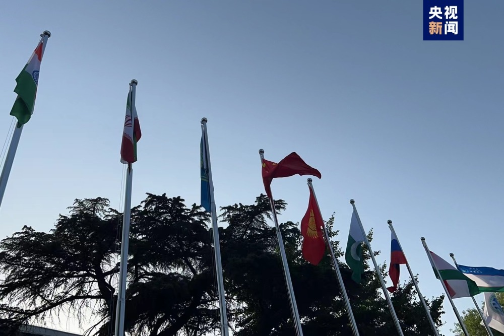

# 伊朗成为新成员！上合组织正式成员国增至9个

今天（4日）下午，上合组织秘书处在北京举行伊朗国旗升旗仪式，欢迎新成员加入。上合组织正式成员国增至9个。

去年9月，上合组织撒马尔罕峰会签署了关于伊朗加入上合组织义务的备忘录。如今，伊朗正式完成各项程序，成为上合组织正式成员国。

上海合作组织于2001年建立。2017年，上合组织完成首次扩员，印度、巴基斯坦成为正式成员国。越来越多国家申请加入“上合大家庭”，充分彰显上合组织的吸引力和影响力。

（来源：央视新闻）

