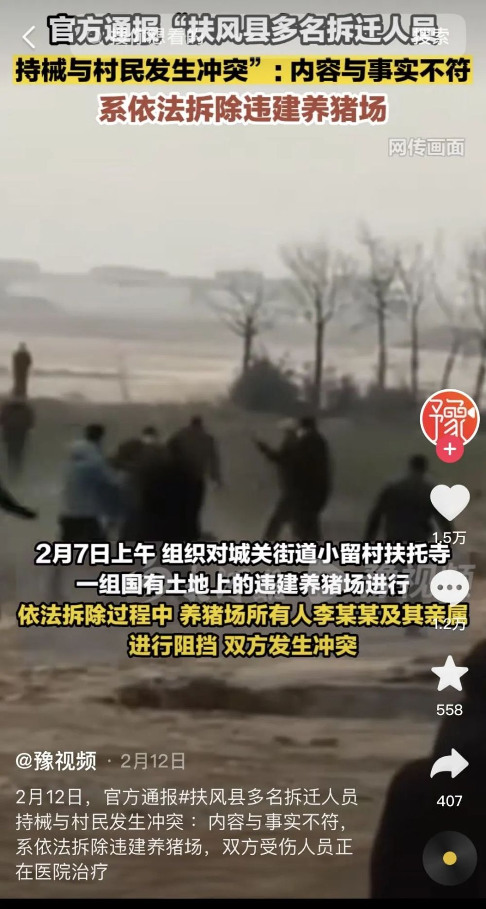
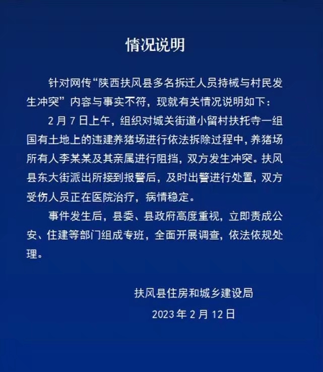
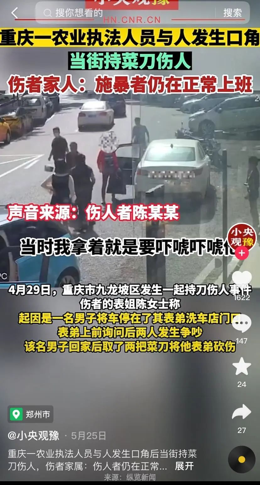
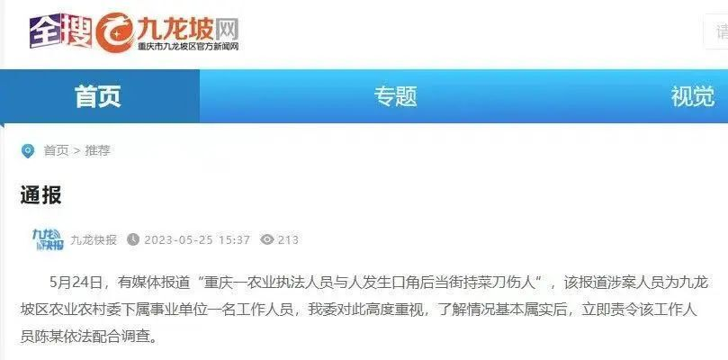
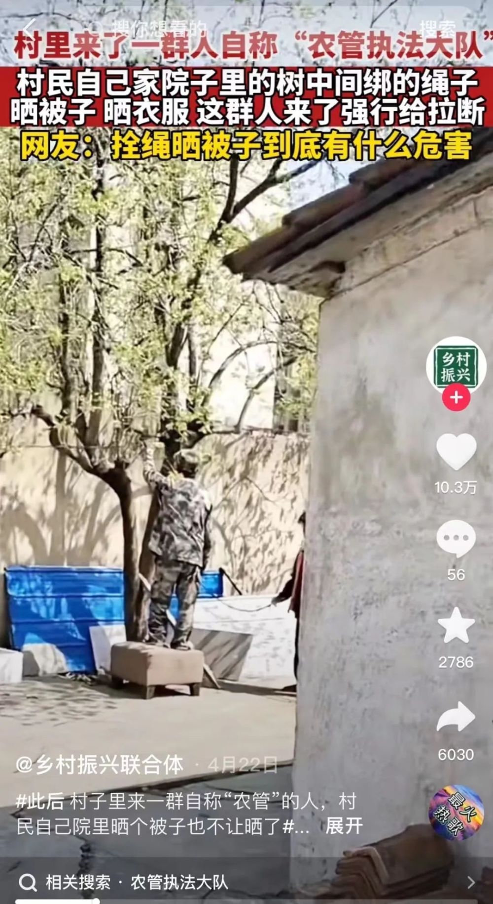
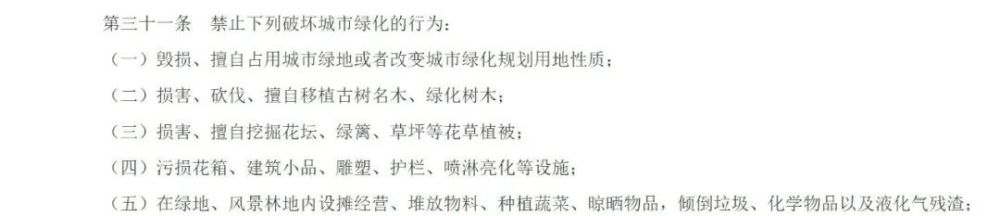
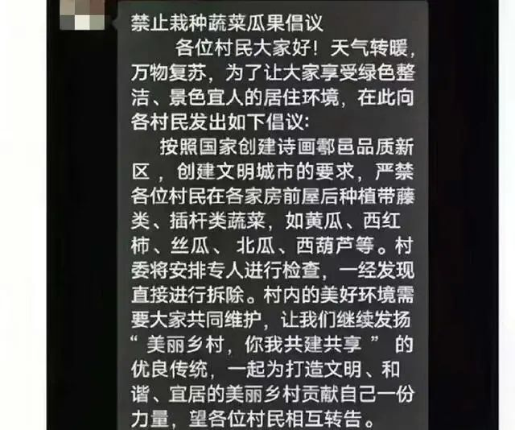
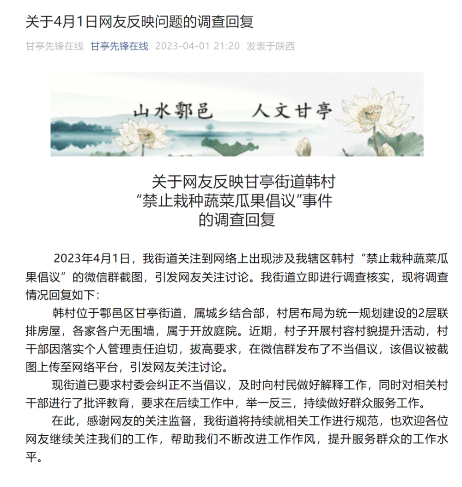
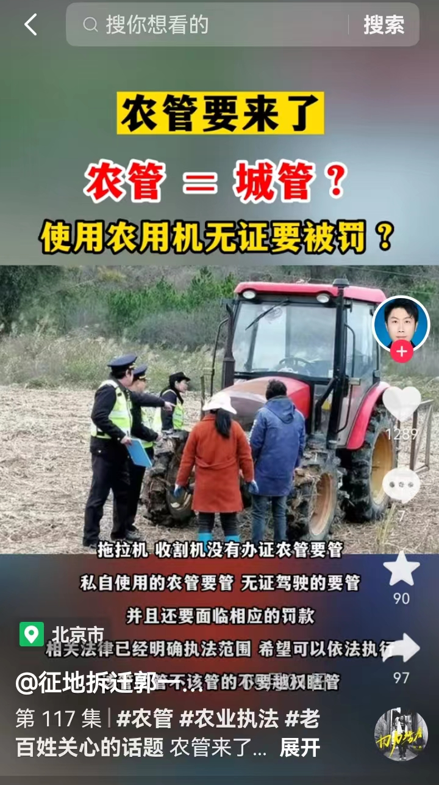
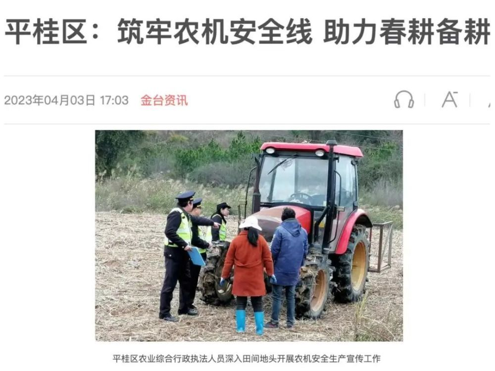

# 农业综合行政执法队， 农村的事他都管？农民日报：张冠李戴当休矣

今年4月以来，农业综合行政执法队伍引起不少网友的关注，很多人把他们称为“农管”，让人们以为农业综合行政执法队伍是“农村的事他都管”。

其实，
**农业综合行政执法队伍自上世纪90年代就已存在，有其法定的执法职责，并非网友口中农村的事都能管的“农管”。网上热议的事件绝大多数也非农业综合行政执法队伍所为。**

农民日报·中国农网记者就其中，网传量较大的信息进行了梳理，并逐一进行了核实，现整理如下：

**01**

**“农管”强拆别人猪场还打人？**

今年2月，陕西扶风某养猪场被暴力强拆事件引发网友热议。视频中双方发生激烈冲突，不少网友认为此事是“农管”所为：

当事村民李某某说，在拆迁赔偿没有谈妥的情况下，一群人要对他们家养猪场进行强拆，还围殴其亲属，导致6人受伤，其中4人住院，这一事件引发较大网络舆情。

**事情得到合理处理了吗？**
对此，扶风县住房和城乡建设局发布通报称，网传“陕西扶风县多名拆迁人员持械与村民发生冲突”内容与事实不符。事件发生后，县委、县政府高度重视，立即责成公安、住建等部门组成专班，全面开展调查，依法依规处理。

事实上， **李某某确实没有按规定办理手续扩建养猪场。**

今年2月，当地拆迁办多次和他就拆除补偿和搬迁进行沟通，但李某某仍拒不接受，在对其养猪场进行拆除时，李某某和拆除人员发生冲突。

**拆除违建不属于农业综合行政执法的职责范围，整个过程中农业执法人员并没有参与。**

同样，今年5月在福建省南平市延平区宝珠村，当地执法人员对农户卢某的猪舍进行拆除，被卢某用自制钉枪枪击，也有网友和自媒体就此推断
**是“农管”非法强拆，被农户报复。**

经记者调查了解，这也是一起拆除违建的案例， **全程没有农业执法人员参与。**

**02**

**“农管”砍人了？**

今年4月，重庆市九龙坡区农业综合行政执法支队工作人员陈某某，因为停车问题和洗车店老板发生纠纷后，回家取菜刀追砍洗车店老板，用菜刀划伤了对方脸部。

随后，陈某某被当地派出所民警带走调查，事件同样引来网友热议。

5月25日，九龙坡区农业农村委发布通报称，农业执法人员持菜刀伤人情况属实，已责令该工作人员陈某依法配合调查。

目前，公安部门已经立案，正在对受害者组织伤情鉴定，九龙坡区纪委监委也已启动对陈某某的立案调查。

因此， **陈某某确实是农业执法人员，但他这次持刀伤人跟农业执法行为没有关系，这次事件已经得到依法处理。**

**03**

**“农管”不让村民**

**在自家院子晒被子？**

最近有网友发布视频称，在自家院子的树上拴绳晒被子，结果来了一群人自称“农管执法大队”强行把绳子拉断。

这条视频引发网友热议， **不少人吐槽农民的苦日子要来了，都不能在院子里拴绳晒被子了。**

也有网友指出，这样的视频和发言属于误导，视频中的行为不属于农业综合行政执法人员的职责。

**真相究竟是什么？** 实际上 **有的是一些地方在地方性法规中作出的要求。**

《北京市市容环境卫生条例》规定：

**主要街道两侧和重点地区的建筑物的顶部、阳台外和窗外不得晾晒物品。**

**《上饶市城市管理条例》规定：**

绿地、风景林地、城市道路和公共场所等不得晾晒物品。

**还有一些地方因为** 飞机要喷施农药，开展病虫害防治，会对农民晾晒衣物提出规范性要求。

2022年4月，四川省绵阳市盐亭县自然资源局发布通告，对该县辖区部分乡镇的蜀柏毒蛾实施飞机施药防治作业，
**为杜绝安全事故发生，要求作业区居民在飞机作业时不要在露天晾晒衣物、粮食及其他物品，** 避免对人的皮肤造成过敏性药物影响。

根据法律法规和《农业综合行政执法事项指导目录（2020年版）》规定，
**上面的行为都不属于农业综合行政执法的职责范围，目前也并未发现农业综合行政执法人员有过上述行为。**

**04**

**“农管”不让村民种瓜种菜？**

今年4月，社交媒体有视频称“农管”不让村民在房前屋后种瓜种菜了。

经过我们核实，这件事其实发生在陕西省西安市鄠邑区，该区甘亭街道办辖区内的韩村村干部通过微信群聊，向村民提出“禁止栽种蔬菜瓜果”的倡议，黄瓜、西红柿等带藤类、插杆类蔬菜，都不让在房前屋后种了。

并强调，“村委将安排专人进行检查，一经发现直接进行拆除”。这一事件迅速引起网友广泛关注。

随后，甘亭街道党工委、办事处对此事件进行了回复， **称此事件系近期村子开展村容村貌提升活动，村干部因落实个人管理责任，在微信群发布了不当倡议。**

同时表示，已要求村委会纠正不当倡议，及时向村民做好解释工作，同时对相关村干部进行了批评教育。

农业农村部法规司有关负责人，就农业综合行政执法队伍建设有关情况答记者问时也指出，
**“禁止在房前屋后种瓜种菜”不属于农业综合行政执法范围，目前未发现农业综合行政执法人员从事上述行为。**

**05**

**“农管”能否查处**

**无牌证农机上路？**

最近网上出现不少关于“农管”查处农机的视频，视频称农民正在地里干活，却被执法人员拦下不让走。

首先要说明的是，上述视频和文字内容完全“张冠李戴”了。视频实际上是 **春耕备耕期间，农业综合行政执法人员在对村民开展农机安全生产宣传工作，**
并不是网友所说的查处违法农机。

其次，农机上路确实应当依法取得证件， **农业农村部表示**
农业机械种类众多，其中拖拉机和联合收割机的安全技术条件和驾驶操作水平，对农业生产安全有重要影响，过去就发生过不少拖拉机和联合收割机事故。

**国务院颁布的《农业机械安全监督管理条例》明确要求拖拉机、联合收割机应当取得牌证上路，未取得牌证擅自将农机投入使用的，由农业农村主管部门依法处罚。**

因此，为了大家的收割安全，拖拉机、联合收割机需要上牌证， **农业综合行政执法人员是在保护大家的生命安全。**

诸如以上“张冠李戴”的不实信息还有很多， **自媒体不应当在没有确切信息来源的前提下发布此类信息**

**更不该故意拼凑、嫁接博流量、博眼球，网友们也要擦亮眼睛，防止被此类不实信息误导。**

**作者：农民日报·中国农网记者 郭少雅 杜娟**

监制：梁冰清 编辑：杜娟

