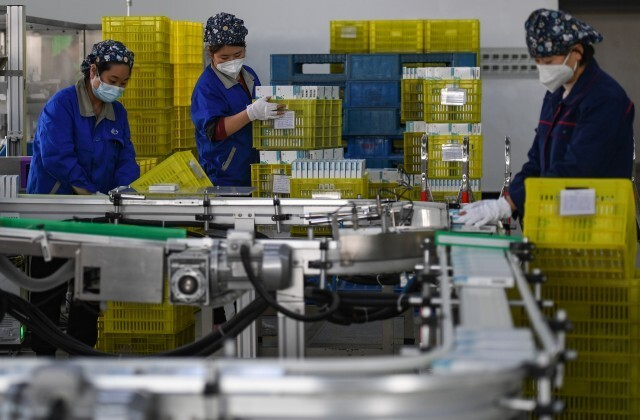

# 医保谈判新规征求意见，专家：有利于减轻药品降价压力

4日，国家医疗保障局发布了《谈判药品续约规则（2023年版征求意见稿）》与《非独家药品竞价规则（征求意见稿）》两份文件，这是2023年国家基本医疗保险、工伤保险和生育保险药品目录管理工作的重要配套文件。受此影响，医药板块午后快速走强。

这两份文件有何哪些亮点？对于市场将产生什么影响？第一财经就这些问题采访了中国政法大学政治与公共管理学院副教授廖藏宜。廖藏宜认为，医保目录谈判新规利于减轻降价压力，稳定药企预期，增强企业的医保准入积极性和动力。

**第一财经：国家医保局发布这两份文件的征求意见稿，出于哪些考虑，相关背景是什么？**

廖藏宜：这两份文件的出台是根据《基本医疗保险用药管理暂行办法》等有关文件，结合2023年国家基本医疗保险、工伤保险和生育保险药品目录管理工作重点，在前期征求了有关单位和专家的意见基础上，经过深思熟虑之后出台的。后续将根据社会各界的意见反馈，进行进一步修改完善。

**第一财经：《谈判药品续约规则(2023年版征求意见稿)》提到，谈判进入目录且连续纳入目录“协议期内谈判药品部分”超过8年的药品纳入常规目录管理。此前并未有过相关表述，这一提法将对行业产生怎样的影响，对于药品的供应和可及性会有哪些变化？**

廖藏宜：这一点表述属于国家医保局今年的创新提法和亮点，我个人理解为该表述旨在鼓励医药行业的长远发展，对于通过谈判纳入目录时间较久（超过八年）的产品，通过纳入常规目录，减轻降价压力，也有利于稳定企业预期，当然今年暂没有产品符合这个要求，但从未来长远趋势看，必将利好企业发展，优化医保准入预期，提升药品到患者的可及性及供应能力。

_2022年12月19日，西安一家药企的工作人员在外包装车间作业。新华社图_

**第一财经：《谈判药品续约规则（2023年版征求意见稿）》提到，2022年通过重新谈判或补充协议方式增加适应症的药品，在今年计算续约降幅时，将把上次已发生的降幅扣减。此前并未有过相关表述，此次提出，将产生哪些影响？**

廖藏宜：我认为，该创新表述至少可以达到两个效果：一是稳定企业信心，企业在新适应症获批后可以及时纳入医保，早日造福患者，不用考虑受到后续续约二次降价的风险。

二是有利于建立更加公平科学的续约规则和机制，事实上，2022年续约产品将新增适应症纳入医保后，其协议有效期仍然不变，但是2023年产生了额外的医保基金支出。那么在今年到期续约时，扣除去年因为新增适应症带来的额外医保基金增量影响，是比较符合逻辑和合理的。

**第一财经：《谈判药品续约规则（2023年版征求意见稿）》指出，对于连续纳入目录“协议期内谈判药品部分”超过4年的品种，支付标准在前述计算值基础上减半。为何会以4年为规定，这对相关药品将产生哪些影响？**

廖藏宜：4年的由来我相信肯定是国家医保局征求了很多专家意见得来的，4年也就意味着药品至少经历了2个完整的协议期，该产品所在领域的市场竞争格局已经基本成熟，且企业也至少连续降价2次了，对于该类品种，在原有的降幅基础上减半是完全合理的，可以稳定企业的预期，增强企业的医保准入积极性和动力。

**第一财经：《谈判药品续约规则（2023年版征求意见稿）》指出，续约时如比值A大于110%，企业可申请通过重新谈判确定降幅，重新谈判的降幅可不一定高于按简易续约规则确定的降幅。有说法认为这意味着企业获得重新选择权，降幅存在更小的机会。对此，您有何看法？**

廖藏宜：我基本同意该种看法，毕竟按照简易续约规则公式，降幅就是固定的，如果放弃简易续约申请重谈，那么基于企业在协议期内更新的临床证据和指南推荐等，如果该药品相对比参照药品具有明显优势，那理论上也是可以获得合理溢价，争取到低于按简易续约规则的降幅。

**第一财经：《谈判药品续约规则（2023年版征求意见稿）》表示，医保基金支出预算从2025年续约起不再按照销售额65%计算，而是以纳入医保支付范围的药品费用计算，梯度降价的门槛值也将从2/10/20/40亿元调增为3/15/30/60亿元。医保支付节点金额相应调增，给医保基金和患者用药住院带来哪些影响？**

廖藏宜：我认为这一点是比较合理的，毕竟每个药品的情况差异性很大，有些口服药门诊使用比例会高一些，而注射剂住院使用比例会高一些，尊重每个药品的实际情况，根据门诊和住院的比例分布，计算药品费用支出预算相较于按销售额65%更科学合理，该变化对于患者用药可能没有直接影响，但应该可以促使药品回到其合理的临床实际应用。

**第一财经：《非独家药品竞价规则(征求意见稿)》提到，非独家药品通过竞价纳入医保目录的，取各企业报价中的最低者作为该通用名药品的支付标准。如企业报价低于医保支付意愿的70%，以医保支付意愿的70%作为该药品的支付标准。这一规定对患者和企业将产生怎样的影响？**

廖藏宜：出台该限价保护措施，有利于优化参与竞价企业的报价策略，一方面企业不因为报价过低吃亏，另一方面也防止有些企业恶意竞争，故意报低价。保护企业也就意味着保护患者的利益，避免企业因生产成本过低，影响产品质量，最终还是损害患者的利益。

