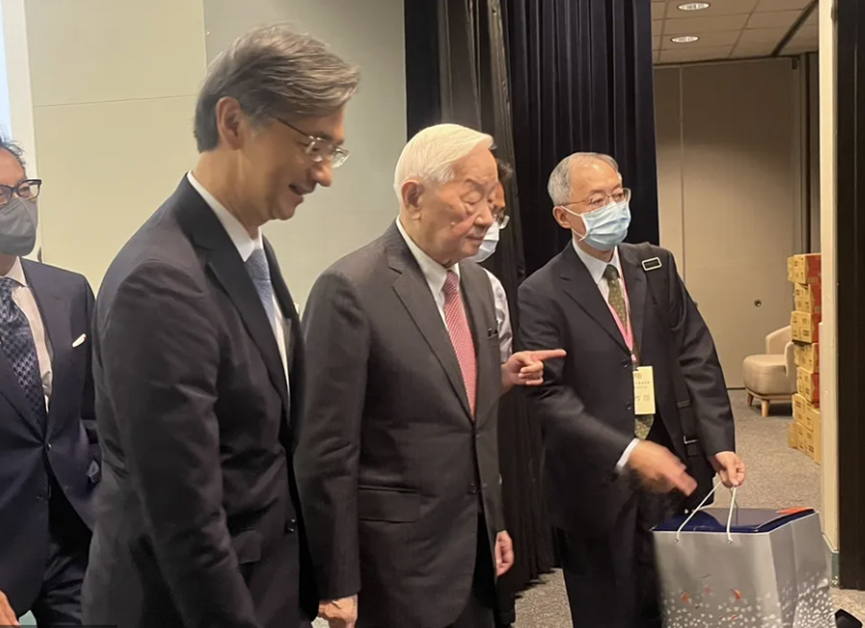

# 台积电创办人张忠谋最新演讲：重新定义全球化，拜登的话很刺耳

今日，台积电创办人张忠谋出席工商协进会的会员大会并致辞，并以《重新定义全球化》为题目进行演讲。张忠谋除了对于全球化提出全新定义，强调国安、科技领先优先于商业利益外，也对去年台积电在美国移机典礼上，美国总统拜登致词时的一席言论指出：我觉得很刺耳。

张忠谋：我觉得很刺耳

张忠谋指出的全球化的新定义为：在不伤害本国国家安全，以及现在或未来的科技经济领先条件下，允许本国企业在国外牟利，也允许外国产业及服务进入本国。换句话说，无论是美国还是其他国家，都希望在国家安全优先的前提下，允许全球化的发展。

有趣的是，张忠谋讲解完后，还反问现场出席者：那这还是全球化吗？

此外，张忠谋指出，全球化的坏处包含修昔底德（Thucydides）陷阱，即既有强权和崛起强权的战争。例如当前中、美两国之间的斗争，虽然全球化的浪潮下美国受惠，但中国也因此获得利益。张忠谋指出，美国觉得中国受惠多，即使没有要战争，也要先把对方打回去。

张忠谋分享，台积电去年12月在亚利桑那州的移机典礼时，请到美国总统拜登致词。虽然当时拜登首先感谢台积电，但接下便表示：Union is coming
back（工会要回来了）。张忠谋指出：这句话我觉得很刺耳，但我们请他来，当然会请他讲。

产业人士分析，这并非意指张忠谋反对工会，而是认为劳资一心，意即好的企业若能足够照顾员工，让劳资双方变成一体，才是最好的状态。专家指出，过去张忠谋在德州仪器时，管理团队便耗费很大的心力做到这件事，当时的德仪才会没有工会。

企业即使出海，也不会有在家乡舒适

而对于过去几十年来大家都在谈的全球化，张忠谋认为变化很大，他引用前任美国联邦准备理事会主席Alan
Greenspan过去在回忆录中对全球化定义为不顾国界，追求商业利润，以及承担商业风险。

然而他认为，基于不同国家立场，即使企业出海至他国发展，也很难做到像在自己家乡发展的程度，因此张忠谋认为，过去的全球化来说是无法完全做到的。

不过，全球化的影响好坏兼具。好处在于让全球化让全球几十亿人口脱贫，许多国家的生活水准也有进步；然而也造成了财富集中、贫富差距扩大等现象，人与人的收入差距也增加。

举例来说，张忠谋表示，当年他在德州仪器（TI）时，当时的执行长退休应该会有1600万美元。张忠谋当时为第三名，若被升上去也大概会有800万美元，是当时执行长的一半。然而，现在的专业经理人一个月就可以赚进1600万，当时的价格根本就是地板价。

3月份张忠谋在接受采访时表示，“在我看来，毫无疑问，在芯片行业，全球化已经死了。自由贸易还没有完全死去，但它正处于危险之中。”

张忠谋指出，全球供应链的“分叉”和全球化的逆转将提高价格并降低普遍性为现代世界提供动力的芯片。“当成本上升时，芯片的普及将停止或大幅放缓。”他补充说道。

另外，张忠谋称，“大陆的芯片制造技术落后中国台湾至少五六年，我看着他们正在制造的最先进的芯片，他们制造起来很困难，但台积电在五六年前制造的芯片却很容易。”

张忠谋在去年12月份台积电美国厂移机典礼便发表了对于全球化的看法，他认为地缘政治已经彻底改变了半导体制造商面临的处境，并警告说“全球化和自由贸易几乎已死”，而且不太可能卷土重来。

对于张忠谋先生“全球化已死”的说法，6月29日长江存储执行董事长兼CEO陈南翔博士在演讲中表示赞同这句话，并表示半导体产业正在经历一个新阶段——再全球化，也就是半导体产业以往的国际合作规则迅速瓦解，各国都在追求把控产业链，使芯片“本地制造”。面对再全球化这一事实，陈南翔认为企业做中长期发展规划时，应该用三把尺来衡量：系统性够不够、一致性够不够、持续性够不够。如果这三个特性满足，那么这个战略规划基本上是可以落地执行的。

*声明：本文系原作者创作。文章内容系其个人观点，我方转载仅为分享与讨论，不代表我方赞成或认同，如有异议，请联系后台。

