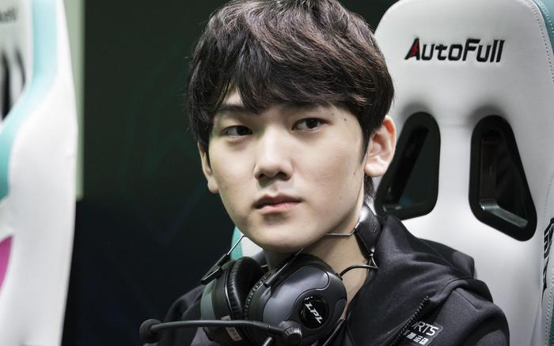
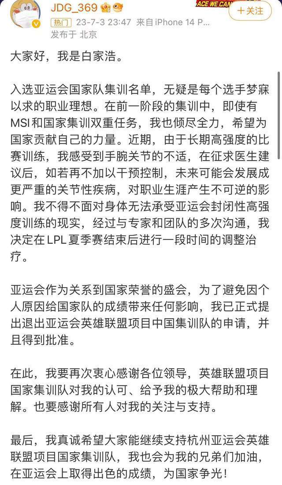
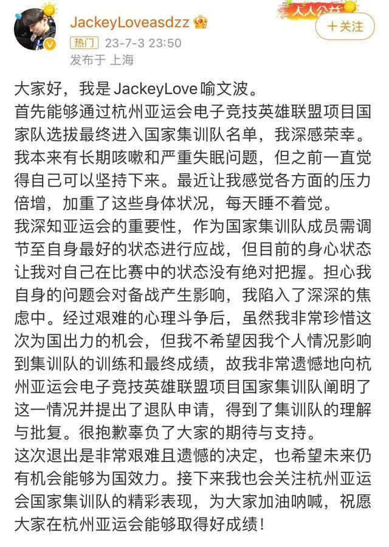
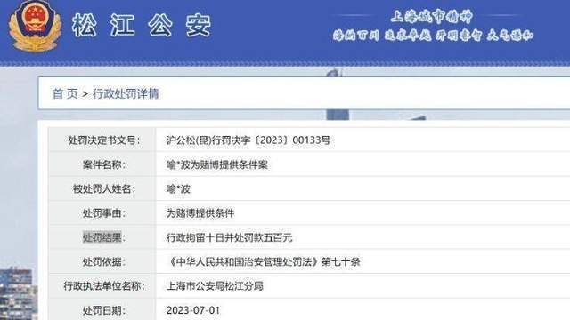
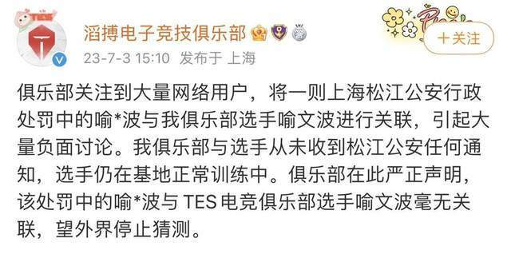

# 国家队电竞选手退出亚运会，曾被曝涉赌遭拘留，当事人及俱乐部回应

7月3日晚，中国电子竞技国家集训队微信公众号发布消息：英雄联盟项目运动员白家浩和喻文波，由于个人原因，提出退出杭州亚运会电子竞技项目国家集训队的申请。通知如下：

**关于杭州亚运会电子竞技项目运动员彭立勋和赵嘉豪参赛的公示通知**

各相关单位及个人：

2023年6月30日，杭州亚运会电子竞技项目教练员和运动员名单公示结束后，英雄联盟项目运动员白家浩和喻文波，由于个人原因，提出退出杭州亚运会电子竞技项目国家集训队的申请。

根据《杭州亚运会电子竞技国家队选拔方案》及《杭州亚运会电子竞技项目参赛人员推荐方案》的要求，教练组及相关版权方按照择优顺序提出了更换建议，现将有关情况进行公示。

一、公示名单：

英雄联盟项目：

更换运动员：彭立勋、赵嘉豪

二、公示时间：2023年7月4日至2023年7月10日(5个工作日)。

三、公示期内，如有异议，可以电话、传真或邮件的形式向国家体育总局体育信息中心反映。以个人名义反映问题的，要求实名反映。反映的情况要实事求是、客观公正，对故意捏造事实诬告公示对象的，一经查实，视情节轻重，对有关责任人或当事人给予严肃处理。

电话：010-87183053

传真：010-87182281

邮箱：esports@sport.gov.cn

体育信息中心

2023年7月3日

随后，白家浩和喻文波在微博发文回应退出一事。

白家浩表示，由于长期高强度的比赛训练，感受到手腕关节的不适，在征求医生建议后，如若再不加以干预控制，未来可能会发展成更严重的关节性疾病，对职业生涯产生不可逆的影响。不得不面对身体无法承受亚运会封闭性高强度训练的现实，经过与专家和团队的多次沟通，决定在LPL夏季赛结束后进行一段时间的调整治疗。

喻文波表示，自己有长期咳嗽和严重失眠问题，最近感觉各方面的压力倍增，加重了这些身体状况，每天睡不着觉，目前的身心状态对自己在比赛中的状态没有绝对把握，担心自身的问题会对备战产生影响。

当天中午，有传言称，著名英雄联盟电子竞技职业选手喻文波涉赌，受到行政拘留和处罚，并配以一张行政处罚决定的查询结果图，图片显示“喻*波”因“为赌博提供条件”被上海市公安局松江分局行政拘留十日，并罚款500元。

随后，TES滔搏电子竞技俱乐部发布声明，表示该俱乐部与选手从未收到松江公安任何通知，喻文波选手仍在基地正常训练中。

来源：微信公号“中国电子竞技国家集训队”、当事人微博、封面新闻等

