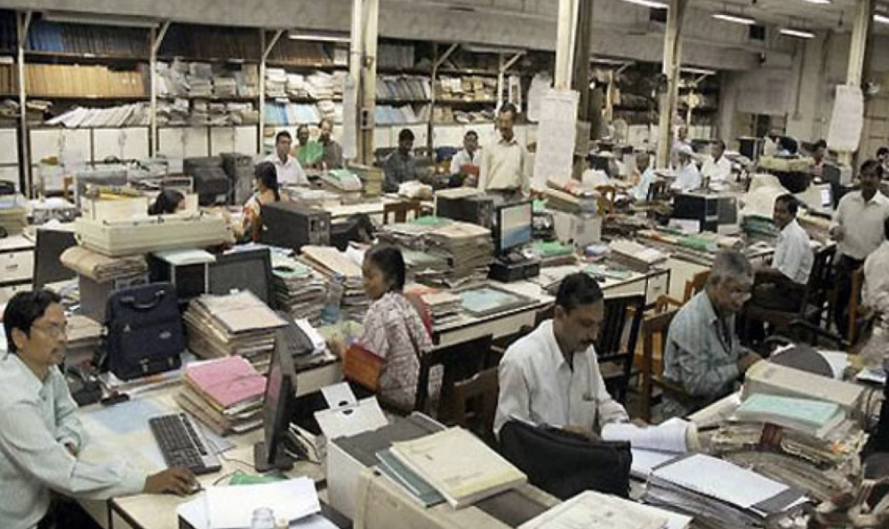
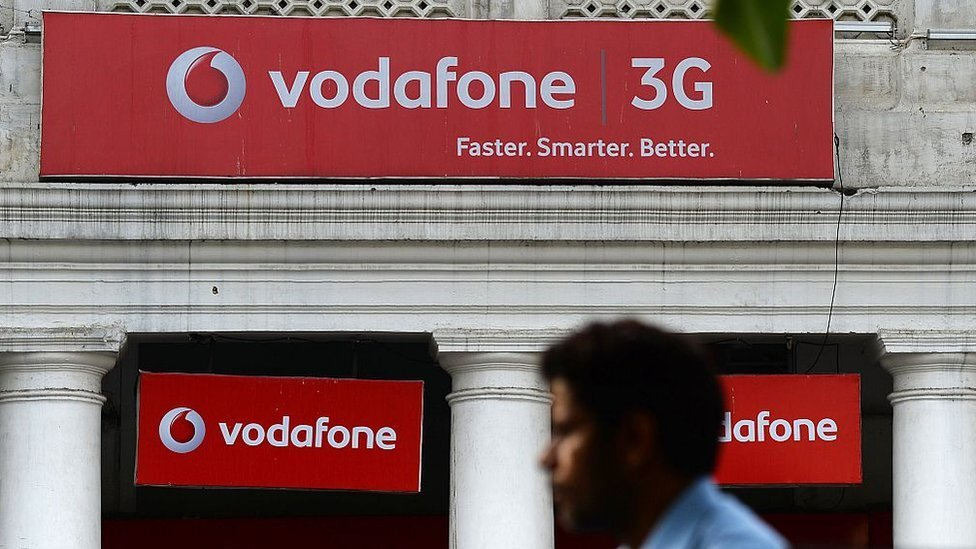
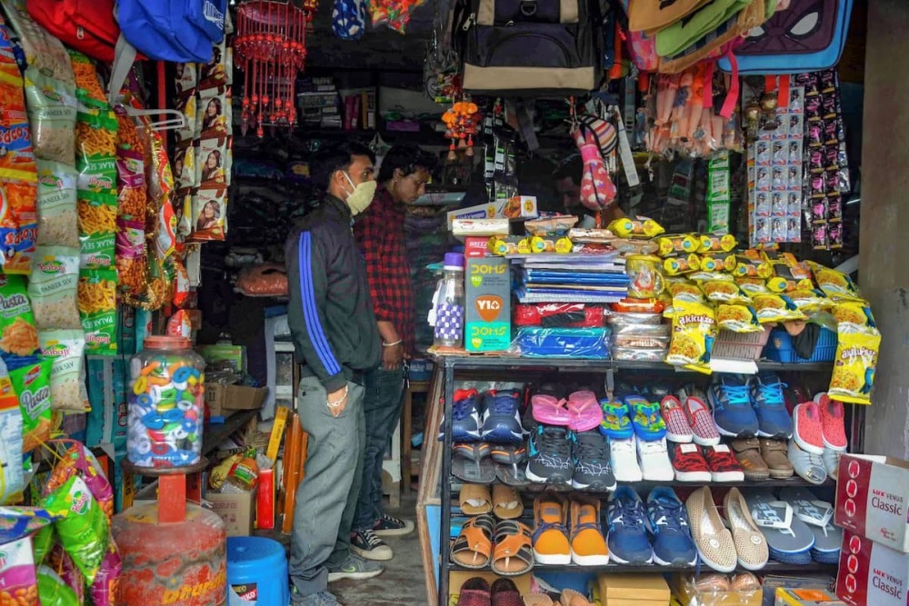
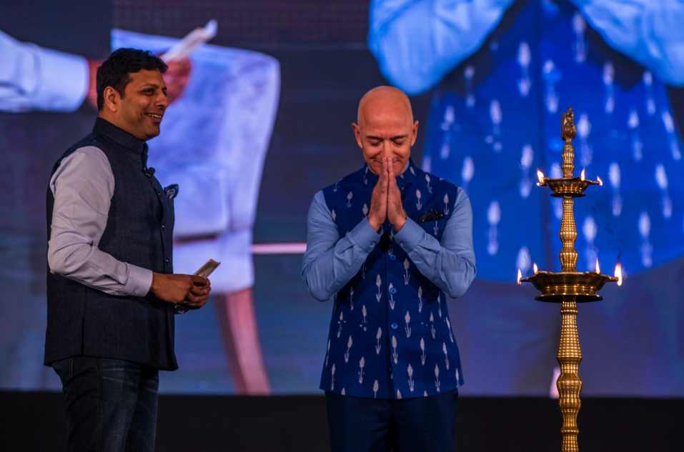

# 对中资企业下狠手的印度，正在“暴打”全球外资，5年559家外企已撤离

本文来源：时代周报 作者：刘沐轩

全球第一人口大国和欠发达的消费市场，让印度成为外资眼中的超大蓝海。但这片海的风浪很大，有时会把船推回岸上，甚至能把船拍翻。

近日，先有小米555.1亿卢比（约合人民币48.2亿元）的资金或被印度政府冻结，后是有传闻称上汽MG“被印度公司强行低价收购股份”、“上海电气被印度诈骗88亿并索赔21亿”。后两则传闻虽然被辟谣为“严重歪曲事实”，但也反映出市场的普遍担忧——在印度的中资企业似乎不可避免地会“被欺负”。

事实上，不仅仅是中资企业，全球的企业都一样。

_印度政府不会因为谷歌CEO皮查伊是印度裔，就对谷歌手软。（图源：社交媒体）_

中国社科院亚太与全球战略研究院副研究员刘小雪对时代周报表示，印度不仅仅是“针对”中国，全球的外资企业都在印度感受到了政策反复。而这种对外资“又打又拉”的态度，其实是新兴工业化国家都会经历的阶段。

以人们耳熟能详的跨国巨头为例，先有沃尔玛被罚13.5亿美元、三星被罚2.12亿美元，后有亚马逊被罚1.72亿美元、谷歌被罚2.75亿美元。外资企业的罚款进了印度政府的腰包，撤走后留下的工厂和供应链大多为印度本土企业做了“嫁衣”。

近年来，尽管仍有大量外资持续进入印度，但退出印度的外资企业数量已经超过了进入的数量。

这当然不仅仅受到疫情的影响，印度本身也有着不可推卸的责任。

**被针对的中资企业**

长期以来，印度营商环境的风评就不太好。

根据世界银行的数据，在印度注册一家公司平均需要18天，大约是经合组织国家平均水平的两倍。加上注册后必须经历的12道繁杂的手续，申请建筑许可证需要的34道手续等等，整个流程下来大约需要110天。

如果发生商业纠纷，印度法院平均需要长达1445天，也就是将近4年的时间才能解决问题，是经合组织国家平均水平的三倍。

_将效率提升到极致的中国企业，很难适应印度的节奏。（图源：社交媒体）_

美国贸易代表办公室(USTR)还在其《贸易壁垒报告》中将印度列为“世界主要经济体中”关税最高的国家，将印度的贸易政策描述为“不透明、不可预测”。

尽管如此，还是有不少中国企业想尝试。

长期以来，中国都是印度最大的贸易伙伴之一。但随着印度方面贸易逆差不断扩大，印度的贸易保护主义愈演愈烈，方法也越来越多。

据中国一带一路网报道，从2020年2月2日开始，印度对进口的太阳能电池征收20%的普遍性关税，除了这一的普遍性关税之外，中国出口印度的光伏组件，还将被征收15%的防卫性关税。

到了2020年又将壁垒扩大到虚拟产品，封禁118个中国app。据中国日报报道，2020年9月2日，印度电子和信息技术部发布公告，宣称禁用118款中国App。

2020年出台的FDI（外商直接投资）新政进一步收紧投资审查，规定来自与印度接壤国家的企业，在印度投资、增资以及收购时，必须经由印度政府审批。

而现在，上海春天律师事务所高级合伙人汤宇对时代周报表示，法律政策风险已经成为目前投资印度最不稳定的风险点。

熟悉中印投资法律环境的汤宇认为，近一年内，印度主要以“偷税、逃税，以及非合规的核查”为由，针对部分中国企业。中国出海企业如果以国内的思维处理在印度的问题，有可能会引发更多风险。

以小米被印度冻结48亿元为例，小米在印度销售手机，需要向高通缴纳专利的特许权使用费。但印度当局认为，这笔特许权使用费并没有计入完税价格。

_在印度的一家小米商店。（图源：社交媒体）_

汤宇指出，印度在税收上可能本身就存在征收漏洞，这个问题在国际上也较难认定，相似的情况也出现在OPPO和vivo身上。

2022年7月，OPPO被印度指控没有在进口手机零件时计算特许权使用费，总计逃避了439亿卢比（约合人民币38亿元）的关税。

vivo也曾被指控将6247.6亿卢比（约合人民币455亿元）汇往印度境外避税，因此被冻结vivo印度公司相关的119个银行账户和46.5亿卢比（约合人民币4亿元）。

这三家中国手机厂商中，目前只有vivo的案件得到解决。但允许vivo解冻资金的前提，是印度德里高等法院要求vivo提供95亿卢比（约合人民币8亿元）的银行担保，并在账户中保留25亿卢比（约合人民币2亿元）。

**被“暴打”的全球外资**

事实上，在中资企业大批进驻印度前，不少外资企业就已经被“暴打”过了，关税和罚款都只是常规“手段”。

比如高额的零件进口关税让通用汽车在26年内亏损了5.88亿美元，福特汽车在10年内累计亏损超过20亿美元，两家公司最终都退出了印度市场。

但这些在“追溯税”面前都是小儿科。

2007年，移动通讯网络运营商巨头沃达丰以110亿美元收购了一家总部位于开曼群岛的投资公司，后者公司持有印度Hutchinson
Essar公司的股份。印度政府随即要求从此次收购中征收29亿美元的资本利得税，并将争议提交给印度最高法院。

_英国的沃达丰是全球最大的移动通讯网络运营商之一。（图源：社交媒体）_

当时，印度最高法院判决“印度政府的税收管辖权并未延伸至开曼群岛”。但在2012年，印度议会通过了一则税法修正案，规定“如果实际资产位于印度，那么印度政府就有权追究自1962年起的所有并购交易”。根据这则修正案，17家外国企业陷入税务纠纷中。

此举让全球投资者瞠目结舌，直到2020年海牙国际仲裁法庭判决印度的税收要求“违反了公平待遇”，印度政府才草草地表示愿意与这些已经被它没收财产的外资企业和解，声称会归还一部分，前提是这些企业不追究进一步的赔偿。

值得一提的是，印度这则充满争议的税法修正案直到2021年8月才正式废除。

然而，印度并没有消停。近十年内，面对外国零售巨头沃尔玛和电商平台亚马逊的进驻，印度的保护主义又衍生出新花样。

_印度街头常见的小商店。（图源：社交媒体）_

为了保护本地零售商，印度政府禁止他们举办限时打折活动，而且不准他们在印度培育自己的供应商，只能选用印度本地的供应商。

普莱斯在担任沃尔玛亚洲区首席执行官时曾表示，印度零售商不需要遵守同样的规则，这使得外来者很难赚钱。符合印度政府扶植标准的小企业，没一家有能力按照大型零售商需要的规模进行生产。最终，沃尔玛离开了印度。

亚马逊在2020年被约2000家印度本土零售商提起反垄断诉讼后，也逐渐将电商业务撤出印度。但亚马逊不愿放弃印度市场，还想尝试在印度投资云服务。

据界面援引路透社的报道，亚马逊公司6月23日宣布，它将在2030年前将其在印度的投资提高到260亿美元。而此前，亚马逊的云计算部门亚马逊网络服务（AWS）曾表示，到2030年底，它将在印度投资1.06万亿卢比（约合129亿美元）。

_亚马逊创始人贝佐斯前往印度时双手合十，表现出融入印度文化的姿态。（图源：社交媒体）_

尽管莫迪政府表示欢迎外国企业的投资，但在经历了10年的外资流入增长后，印度在2022-2023财年首次出现外资流入下滑。据印度储备银行统计，在调整了外国投资者的遣返和撤资后，该财年印度吸引外资总量下滑16.3%到710亿美元，外商直接投资下滑了27%到416亿美元

据《福布斯》报道，印度公司事务部国务部长拉奥·英德吉特·辛格（Rao Inderjit
Singh）今年曾在议会上透露，自2018年至2022年，共有559家外资公司退出了印度，数量超过了同期进入印度的469家公司。2022年仅有64家外资企业进入印度开展业务，成为自2018年以来的最低数量。而截至2023年3月，印度仅仅迎来了一家新的外资企业。

**适得其反的保护主义**

2014年当选印度总理的莫迪曾誓言要打造“印度制造”，将制造业占GDP比重提升至25%，在制造业增加1亿个就业岗位，到2030年使印度成为世界第三大经济体。印度最大的反对党国大党，也将创造就业作为其核心目标。

可以说，印度当下的“政治正确”，就是尽快发展、扩大就业。在这条路上，印度不惜将外资当作“韭菜”，但这种保护主义堪称“损人不利己”。

“印度制造”实现了吗？没维持住，甚至在倒退。

在莫迪提出“印度制造”的2014年，印度制造业占国内生产总值（GDP）的比重还有16.3%，到了2021年却下降到14.3%。

扩大就业实现了吗？甚至不如莫迪刚上任时。

根据印度经济监测中心（CMIE）的数据，2014年印度失业率为4.9%，到了2023年4月印度失业率高达8.11%。

中印贸易逆差缩小了吗？没有，中印贸易额不断扩大，逆差也创下新高。

2022年，中印双边贸易额再创新高达到1359.84亿美元，其中印度出口175亿美元，进口1185亿美元，中印贸易逆差也创纪录地超过了1000亿美元。

_截至2022年12月，印度25岁以下人口有45.8%处于失业状态。（图源：社交媒体）_

刘小雪指出，长期被作为殖民地的历史，使得印度自独立后，长期信奉政府干预经济的策略，对私营企业和外资一直抱有怀疑。印度改革开放的历史也较短，而且不充分。

“与中国自上而下的改革开放不同，印度的改革开放从1991年才开始。”刘小雪指出，“当时印度的银行、国企等机构已经形成了庞大的利益集团，政客想要改革也得考虑选票的问题。因此直到现在，印度的改革都还处于一个共识不断形成的缓慢过程。”

莫迪上台之后，虽然整体上对改革有所推进，但他提出的“印度制造”，又和本应坚持的开放有所冲突，最终造成今天印度风评不佳的营商环境。

但值得注意的是，从长期来看，涌入印度的资本总量仍然是持续增长的。外资一边抱怨印度“割韭菜”，但有机会就会考虑投资印度。

“在国内市场竞争激烈，趋近饱和的背景下，印度是不可替代的新兴市场，进入印度市场才能抓住机遇。”刘小雪说。

_苹果CEO库克和印度总理莫迪（图源：社交媒体）_

这可能也是为何今年6月莫迪前往美国时，曾经被“坑”的亚马逊、谷歌纷纷宣布追加投资，特斯拉CEO马斯克也表示会“尽快进入印度”。

被坑也不能放弃，一家企业放弃了，对手就有机会先行占领这个庞大的新兴市场。只有熬下去，留到最后的人才有机会胜出。

