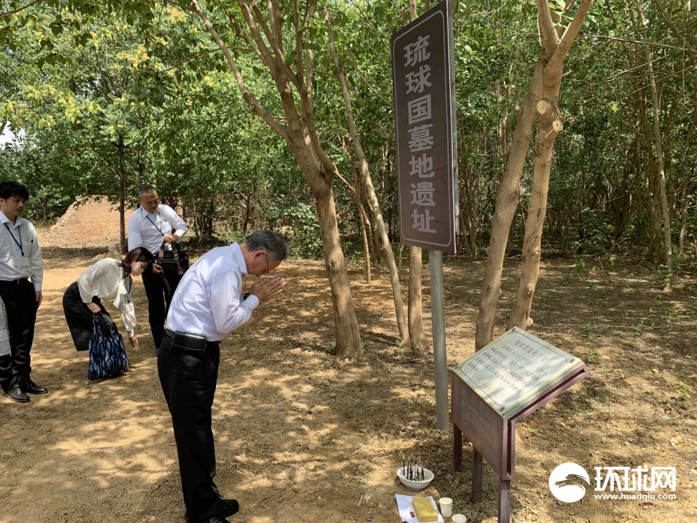
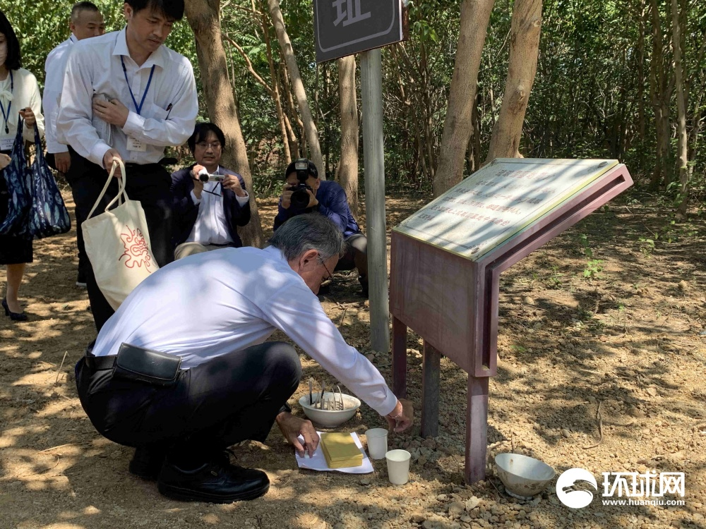
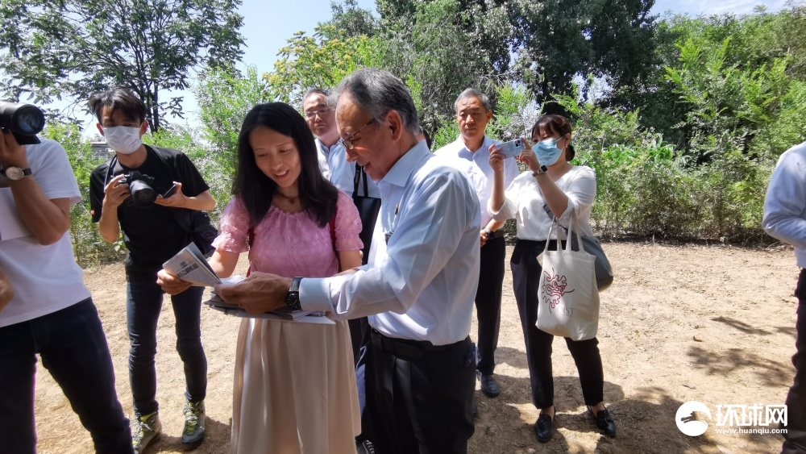

# 日本冲绳知事赴北京琉球墓地遗址祭拜：想对长眠于此的祖先说“谢谢”

【环球时报-环球网报道 记者
邢晓婧】4日，正在访华的冲绳知事玉城丹尼前往位于北京市通州区张家湾镇的琉球国墓地遗址进行祭拜。玉城丹尼对《环球时报》记者表示，如果以他的到访为契机，掀起一股在中国寻找琉球遗迹的风潮，将会“非常感激”。他说，民众乐于探寻、了解那些留在中国的琉球遗迹，可以促进中国和琉球在历史、文化等多领域的交流。

张家湾在明清时期是京杭大运河的重要码头，是外省进京的门户，清朝时期病故的琉球人多被安葬于此，一共埋葬了琉球国贡使、官生、陈情使、都通官等14人。《环球时报》记者在现场看到，玉城丹尼为逝者奉上冥币、酒水等祭祀用品，双手合十，喃喃低语，用琉球习俗祭拜。玉城丹尼介绍说，他在祭拜时使用的香其实是在古代从中国流传过去的，和日本本土用的香不一样。

玉城丹尼祭拜时间较长，结束之后他对记者透露说，祭拜时他心里想的是，想要对日夜长眠于此的琉球祖先说声“谢谢”。祖先创造的琉球（即冲绳）与中国之间的联系，他想要继续坚定不移地保持下去，为创造一个和平、繁荣的时代而努力。玉城丹尼还说，他使用了冲绳的方式进行祭拜，如果（祖先）能够接收到的话，他会感到非常高兴。

在祭拜现场，玉城丹尼提到，琉球王国和中国的友好往来长达600余年，希望将这一历史传统传承下去。他表示，这也是很多人想要守护和珍视的东西，他会考虑到这种感受，以此作为后人相互交流的纽带，创造和平、繁荣的时代。

玉城丹尼访华期间到访琉球国墓地遗址，正在掀起一股在中国寻找琉球遗迹的风潮，对于这种现象如何看待？在回答《环球时报》记者提问时，玉城丹尼表示，如果以此为契机，民众乐于探寻、了解那些留在中国的琉球遗迹，以此促进中国和琉球在历史、文化等多领域的交流，他会非常感激。

值得一提的是，《环球时报》3日在中英文同步刊发对玉城丹尼的独家专访，介绍其“日美应为缓和局势作出应有努力，决不能因为所谓‘台湾有事即日本有事’让冲绳沦为战场”等主要观点。同时，配文介绍了北京张家湾的琉球国墓地遗址，记者实地感受到历史长河中琉球王国与中国结下的深情厚谊。

4日，在祭拜活动结束之后，《环球时报》记者将中英文版报纸亲手赠与玉城丹尼留作纪念。玉城丹尼笑着对《环球时报》记者说“感谢”，他说，这组报道刊发以后立刻引发热烈反响，希望继续关注相关话题。

玉城丹尼当日在琉球国墓地遗址的祭拜过程持续约30分钟。据了解，结束在北京的行程之后，玉城丹尼还将访问与冲绳县缔结友好关系的福建省，那里与琉球王国的渊源更深，集中了琉球馆、福州琉球墓园等历史遗迹，预计7日回国。（完）

