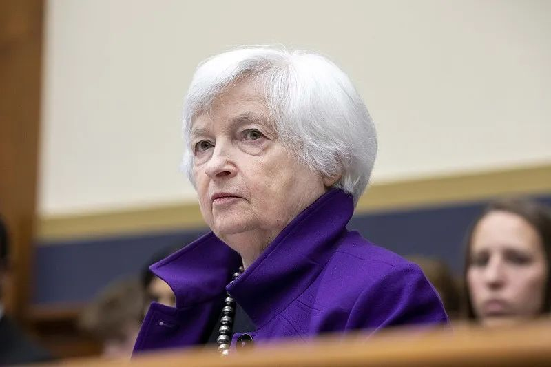

# 美财政部长耶伦将访华，四天要做三件事

美财政部部长耶伦自今年2月就在积极寻求访华，多次“放风”计划行程，终于得偿所愿。

据财政部官网消息，经中美双方商定，耶伦将于7月6日至9日访华。这将是中美紧张关系加剧以来今年第二位访华的拜登政府高级官员，也是耶伦首次以财长身份访华。

长安街知事（微信ID：Capitalnews） 注意到，两周内，两位美国重量级官员主动访华，美国急于恢复与中国对话的迫切心理可见一斑。

当前，美国破纪录的通胀水平使人们对经济前景产生了担忧，与此同时，美国的激进加息政策未能有效控制通胀，反而触发了银行危机的爆发，进一步削弱了经济的稳定性。面对内外困境，与中国的合作变得尤为关键。

_耶伦资料图。图源：视觉中国_

耶伦此行有什么计划？

总的来说，是为了稳定世界最大两个经济体之间的关系。

一位不愿透露姓名的美方官员表示，她此访的目的是加深和增进美中之间的沟通频率，稳定关系，避免沟通不畅，并尽可能扩大合作。

耶伦上周接受MSNBC采访时称，中美关系对整个世界都很重要，“良性竞争”可以使中美两国的劳动者和企业受益，“美中两国需要讨论彼此之间的分歧，这样就不会误解彼此的意图。”

综合美媒报道，耶伦在这四天内有三件事要办：

第一，与中国同行举行高层经济会谈，就全球挑战和共同关心的问题展开讨论。

话题可能包括中美共同利益领域，如关税、汇率、债务等宏观经济问题；也会涉及双方的分歧领域，如耶伦或会对中国针对美光科技的禁令提出反对，重提所谓的“新疆人权问题”，让中国替多边金融机构和商业债权人，特别是去年疯狂加息的美国“背锅”，采取更多措施为发展中国家提供债务减免，以及对中国在俄乌冲突中的立场和中俄关系提出质疑等。

另外，对于7月1日起施行的新修订的《中华人民共和国反间谍法》，耶伦或将表达对这项法律适用范围的担忧。

第二，与在华开展业务的美国公司的相关人士会面。

第三，再次强调不支持“脱钩”的态度，并为美国行“脱钩”之实进行辩解。

耶伦打算辩解一番，试图让中国相信美国打压和围堵中国仅仅只是为了“国家安全利益”，并非“为了使自己获得竞争性经济优势”。

美国国务卿布林肯的最新讲话或许可以视作参考。布林肯上周在纽约的外交关系委员会发表讲话时称，阻止中国获得“可能被用来伤害美国的技术”，符合美国的利益。

布林肯提到的“技术”，指的是中国的核武器计划、高超音速导弹研发以及人工智能的运用。他坚信，如果调换立场，中国也会做同样的事情，并称美国正在实施“非常具有针对性的管控措施”。

果然，“美国指控别人的事，一定是他自己做过的事”，这个定律从来没错过。

长安街知事（微信ID：Capitalnews）
注意到，耶伦访华这“三件事”，与今年4月她在约翰斯·霍普金斯大学就中美经济关系发表讲话时，概述的美中关系三个经济优先事项基本吻合，即：

确保美国“国家安全”；不寻求“脱钩”，但将与盟友共同应对所谓“中国的不公平做法”；希望与中国合作应对气候变化和债务困境等全球挑战。

这表明拜登政府一以贯之的对华强硬立场，不会因耶伦访华而发生任何松动。

而且，为了减少中国能获得的技术研发投资，就在耶伦访华的消息传出之际，白宫还准备出台新的投资限制。

据悉，拜登政府即将批准一项涉华行政命令，旨在监管并有可能切断美国在人工智能和量子计算等领域的对华投资。消息人士称，相关工作已经加快，最早在7月下旬准备就绪，具体颁布时间和最终细节尚未确定。

长安街知事（微信ID：Capitalnews）
注意到，美国深知中国维护核心利益的坚定决心不可动摇，因此美国政界和学界对耶伦此访可能获得的成果，以及对双边关系的整体预期都不抱太大期望。

彭博社援引不具名官员的话表示，拜登政府并不期望耶伦此行取得“重大突破”。只有在中美拥有共同利益的部分领域，预计耶伦可以取得进展。

前白宫官员、乔治城大学中国问题专家埃文·梅代罗斯表示，耶伦此行“只是不确定过程中的下一步”，“这样做很好，但很难看出此访如何在大国竞争的复杂游戏中发挥作用。”

7月3日，中国前驻美大使崔天凯在世界和平论坛上谈及中美近期接触“重启”时表示，最近两国间的高层交往是好事情，双方见面坐下来谈，总比不见面、不谈要好。

他指出，中国从来没有指望美国说的话、做的事会让中国喜欢，中国也从来没有承诺过会说美国喜欢听的话，会做美国喜欢看到的事情。中美要找到相互尊重的办法来处理双方的关系，真正在相互尊重的基础上实现和平共处、合作共赢。

