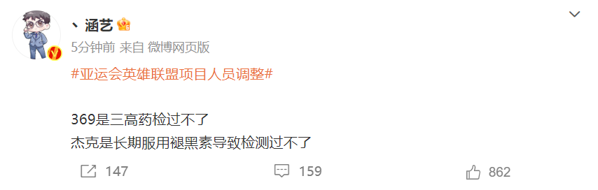

# 英雄联盟杭州亚运会名单变更：JKL和369退赛，XUN和ELK替补上阵

这几天关于LPL的超级大瓜传播得沸沸扬扬，目前主要牵扯到的选手是JKL，甚至上海松江分局都出现了喻X波被行政拘留的消息，一时间猜测纷纷。但是随着TES官博辟谣，表示喻X波并不是JKL，JKL仍然在正常训练中，暂时平息了这场风波。然而没想到的是，更大的来了，就在当天晚上，中国电子竞技国家集训队更新了英雄联盟项目，亚运会的正式名单，369和JKL退出，ELK和xun代替上场！

具体官宣消息如下，表示亚运会英雄联盟项目大名单公示结束后，
**369和JKL由于个人原因，提出退出杭州亚运会的申请，根据英雄联盟项目的教练组以及版权方的建议，亚运会正式名单做出更换，更换为xun和ELK。**

这个消息可以说是相当炸裂了，因为JKL才被曝出负面消息，虽然TES官博辟谣，但是质疑声还在，没想到这么快亚运会就换人了。不过官方的说法是两位选手主动申请退出，所以很快JKL和369也发文回应了。JKL的回应如下，
**简单来说就是因为长期咳嗽以及失眠，让自己对于自己的身心状态没有绝对的把握，为了不影响到最终的成绩，所以向官方提出了退出申请，非常遗憾，希望未来有机会可以为国效力。**

之后369也回应了，369的回应如下，他也是因为身体原因，
**表示由于高强度的比赛训练，自己手腕关节不适，在征求医生的建议后，为了不发展为严重的关节性疾病，不得不选择退出亚运会，并且自己将在夏季赛结束后进行治疗。**

只能说这个消息太突然了，而且在同一天内，这么多消息的轰炸下，大家不怀疑不太可能。但是既然现在结果已经出来了，JKL和369退出亚运会，那么至少对于亚运会阵容的质疑应该没有了。

现在上单bin，打野xun和jiejie，中单knight，下路ELK加meiko。其实账面实力看起来强了不少，主要是大家之前担心的野辅问题，现在看起来都增强了，xun和jiejie轮换，meiko最近状态有所提高，ELK在不面对Ruler时也打得不错，至少以夏季赛的状态来看，这套阵容还可以。

而在官宣发布后，前V5教练涵艺也发文回应了这件事情，他表示两人都是因为吃药，导致检测过不了。但是为什么初选的时候，没有去检测呢？按照当时公布的初选流程，是有这一项的，所以还是存在一些质疑的。

那么，对于这则消息，你们有什么想说的吗？欢迎在评论区留言探讨。

