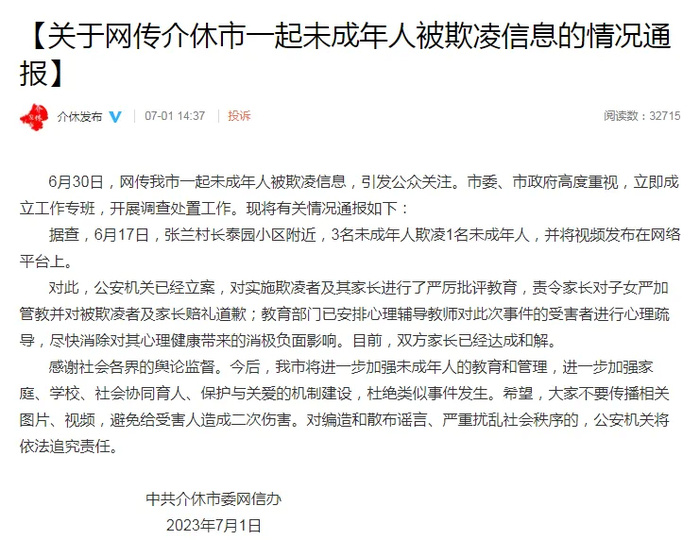

# 13岁男孩被逼吃粪便，据称收到4.5万元后和解，其父发声：没有和解

日前，山西介休“13岁男孩被三名未成年逼吃粪便”事件引发舆论关注。7月1日，山西介休市委网信办发布通报称，针对3名未成年人欺凌1名未成年人一事，公安机关已经立案，目前双方家长已经达成和解。另据媒体报道，被欺凌男童的父亲李先生表示，对方出了45000元和解。

双方和解的消息被曝出后，再次引发舆论热议。由于此事性质十分恶劣，很多网友对于“达成和解”表示难以理解。7月5日，孩子父亲李先生告诉新黄河记者，他身体不舒服目前在家输液打针，孩子受到刺激仍在医院治疗当中。针对和解一事，李先生称确已收到45000元，但对和解一事表示否认：“孩子现在这么个情况，还能和解了？”李先生称，“当时是当时，以后是以后。”

**“男孩被逼吃粪便”一事，通报和解后再引争议**

7月1日，山西介休市委网信办发布一则“关于网传介休市一起未成年人被欺凌信息的情况通报”。通报称，6月17日，3名未成年人欺凌1名未成年人，并将视频发布在网络平台上。对此，公安机关已经立案，对实施欺凌者及其家长进行了严厉批评教育，责令家长对子女严加管教并对被欺凌者及家长赔礼道歉。目前，双方家长已经达成和解。7月4日，被欺凌孩子父亲接受媒体采访时表示，事发次日他即向当地派出所报警。后于6月30日晚11点至次日凌晨近3点，在当地派出所内以45000元和解此事。

据此前网传视频显示，小男孩坐在地上，手里拿着粪便，吃进嘴里后发出咳嗽干呕的声音，而旁边有一个声音要求小男孩“咽了”。之后有人说“他想要吐出来”，不知欺凌者用何种方式威胁小男孩，视频中听到小男孩用带有恐惧的声音说“不不不，不用，我吃”。

此后，自称被欺凌小男孩舅妈在网上发布视频称，6月30日晚上10点多，小男孩父亲被带到派出所，“不让相跟的人进，办到7月1日凌晨2点多，签了谅解书”。同时，小男孩舅妈声称，事件发生后小男孩精神出现波动，“痴痴呆呆的”。

_视频截图
受欺凌男孩家属提供_

此事经多家媒体报道后，引发各界高度关注。随后，有多家媒体刊发评论，提出质疑，直指此次欺凌行为极度恶劣，并对涉事家长选择和解方式解决此事表达不同意见。有媒体评论认为，从舆论反馈来看，人们对目前的处置并不满意。与事件的恶劣程度相比，事件处理若止于此，对于受害者一方不公平，对于霸凌一方，也不能起到足够的惩戒效果。

7月5日，被欺凌孩子父亲告诉新黄河记者，此事由当地张兰派出所介入处理。新黄河记者致电张兰派出所，相关工作人员表示不清楚此事。针对和解一事，李先生称确已收到对方45000元，但否认双方已经和解：“孩子现在这么个情况，还能和解得了？”

**律师观点：三大疑问待解，希望官方披露更多细节**

“此事是否构成犯罪？是否可以和解？和解是否有效？”针对这起事件，上海大邦律师事务所律师黄佳德指出，因相关官方通报未透露涉事3名未成年人真实年龄、未提及3名未成年人是否道歉及被欺凌者是否愿意谅解、被欺凌者父亲是否属于自愿签署和解协议等，导致上述疑问真实存在，“接下来，希望官方通报能够披露更多细节。”

此事是否构成犯罪？黄佳德说，3名未成年人逼迫1名未成年人吃粪便，并上传到网络，被害人父亲报案，公安机关已经立案，有两种可能：一是构成治安处罚，二是涉嫌侮辱罪。根据媒体报道，被害人的精神产生严重问题，应当属于“情节严重”，构成事实阶层的犯罪。但《刑法》规定十六周岁的人犯侮辱罪，才可追究刑事责任。官方通报没有透露三名未成年人的年龄，所以无法判断。如果不满十六周岁，虽然不予刑事处罚，但可以责令其父母或者其他监护人加以管教；在必要的时候，依法进行专门矫治教育。

此事是否可以和解？黄佳德指出，即使在刑事程序中，也可以和解。侮辱罪一般情况下属于自诉案件，但“严重危害社会秩序和国家利益的”，可以转为公诉案件。三名未成年人的行为，从目前情况来看已经严重危害社会秩序，可以作为公诉案件。针对公诉案件的和解，根据《刑事诉讼法》第二百八十八条的规定，必须具备几个前提条件：犯罪嫌疑人、被告人真诚悔罪；通过向被害人赔偿损失、赔礼道歉等方式获得被害人谅解；被害人自愿和解；犯罪嫌疑人、被告人在五年以内未曾故意犯罪。

最后，和解是否有效？黄佳德表示，和解是否有效，核心问题是需要判断和解是否自愿、合法。针对此事，第一，和解的自愿性尚待核实。被欺凌的孩子显然受到严重创伤，尚不清楚其是否可以清晰认知并表达是否谅解的意见。其父亲即使有权利代为和解，根据《民法典》中法定代理人不得损害被代理人的利益的精神，其父亲也不应当不顾孩子以后精神出现问题可能需要的治疗、生活费用，从而损害孩子的利益；第二，和解的程序受到质疑。通过媒体报道来看，和解程序有些不太正常：被欺凌孩子的父亲深夜被公安带去，不让其他人跟随，不知在什么情况下达成和解。在此过程中，孩子父亲是否受到威胁、在不自愿情况下签署了和解协议，不得而知。在此，建议孩子家属向检察院反映，申请检察监督。

新黄河记者：刘钊 编辑：周全

