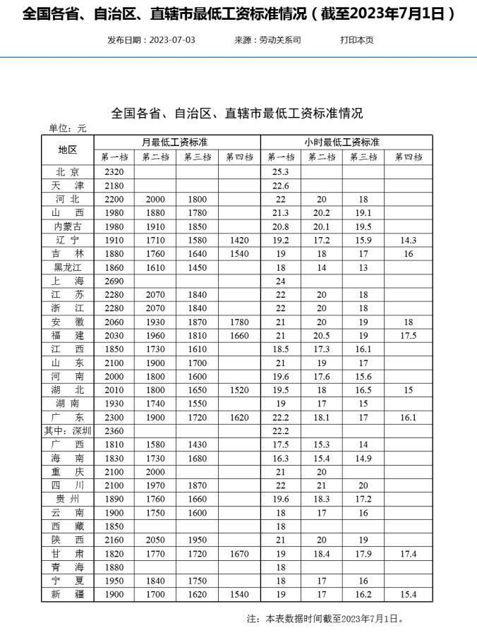

# 31省份最低工资标准出炉！上海2690元最高，这15地超2000

中新经纬7月5日电 (董湘依)日前，人社部网站最新发布了全国各省、自治区、直辖市最低工资标准情况(截至2023年7月1日)。
**15个省份月最低工资标准在2000元及以上，其中，上海以2690元仍居榜首。**

_人社部网站_

**15地最低工资标准在2000元及以上**

月最低工资标准适用于全日制就业的劳动者，劳动者在法定工作时间或依法签订的劳动合同约定的工作时间内提供了正常劳动的，用人单位支付的月工资不能低于月最低工资标准。

**根据《最低工资规定》，省、自治区、直辖市范围内的不同行政区域可以有不同的最低工资标准。**

人社部数据显示(截至2023年7月1日)， **第一档月最低工资标准在2000元及以上地区有15个。**

中新经纬梳理发现，这些地区分别是上海(2690元)、北京(2320元)、广东(2300元，其中深圳2360元)、江苏(2280元)、浙江(2280元)、河北(2200元)、天津(2180元)、山东(2100元)、四川(2100元)、重庆(2100元)、安徽(2060元)、福建(2030元)、湖北(2010元)、河南(2000元)、陕西（2160元）。

上海市人社局此前发布消息称，上海将从2023年7月1日起调整最低工资标准。月最低工资标准从2590元调整到2690元，增加100元；小时最低工资标准从23元调整到24元。

据了解，上海月最低工资标准不含劳动者个人依法缴纳的社会保险费和住房公积金，由用人单位另行缴纳。劳动者延长工作时间的加班费、夏季高温津贴、中夜班津贴及有毒有害等特殊工作环境下的岗位津贴以及伙食补贴、上下班交通费补贴、住房补贴也不作为月最低工资标准的组成部分，由用人单位另行支付。

**多地上调最低工资标准**

据不完全统计，今年还有河北、山西、贵州、青海、安徽、陕西等地先后上调最低工资标准。

河北省自1月1日起执行新的月最低工资标准，三档分别为2200元、2000元、1800元。调整后，对应的小时最低工资标准分别为第一档每小时22元，第二档每小时20元，第三档每小时18元。

山西省自1月1日起，全日制用工月最低工资标准由1880元、1760元、1630元3档调整为1980元、1880元、1780元。

贵州省新的最低工资标准自2月1日起执行。根据新标准，全日制用工月最低工资标准，一类地区为1890元，上涨100元；二类地区1760元、三类地区1660元，均上涨了90元。非全日制用工的小时最低工资标准，一类地区19.60元，二类地区18.30元，三类地区17.20元。

青海省也从2月1日起调整全省最低工资标准。月最低工资标准由现行的1700元调整为1880元；小时最低工资标准由15.2元调整为18元。此次调整是青海自1995年建立最低工资制度以来，第11次调整提高最低工资标准。

安徽省3月1日起执行最低工资新标准，新的月最低工资标准共有四档，分别为：2060元、1930元、1870元、1780元。
**安徽人社厅指出，这次最低工资标准的调整，综合考虑了社会平均工资水平、劳动者及其赡养人口的基本生活保障、经济社会发展水平和就业状况、居民消费价格指数等变动情况。**

**多地调整会加快全国调整节奏吗？**

北京中银律师事务所高级合伙人杨保全对中新经纬表示， **多地调整最低工资标准并不意味着全国的调整节奏就必然会加快**
，因为最低工资标准的制定与调整要综合考虑各地居民每年的生活费用水平、职工平均工资水平、经济发展水平、职工缴纳社保和住房公积金水平、失业率等因素。

**未来如何提高低收入群体收入水平？**

北京大学国民经济研究中心主任苏剑接受中新经纬采访时表示，首先发展经济是最根本的解决办法，随着经济发展，老百姓的收入会提高，意味着低收入者的收入水平也会随之提高；其次可以通过税收和转移支付提高其收入水平，建立健全社会保障体系也是必要之举。此外，最低工资标准、收入指导线等政策一般情况下能够起到一定作用，但也应权衡此类政策对劳动力市场带来的影响。

杨保全律师指出，要处理好保障职工最低劳动报酬权益和企业承受能力这两者之间的平衡关系，既要满足保障低收入劳动者及其赡养人口基本生活的需要，又要确保企业能够承受最低工资上涨推动的人工成本增加并实现可持续发展，这两者要把握好一个相互协调平衡的度。(中新经纬APP)

