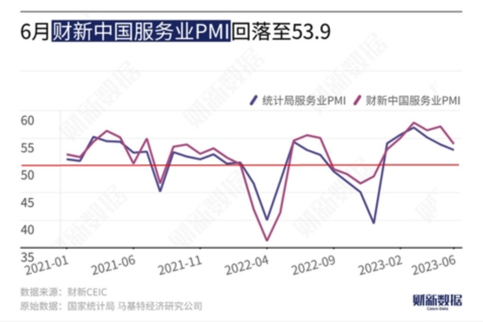

# 6月财新中国服务业PMI降至53.9 连续六个月扩张

【财新网】6月中国服务业景气度连续第六个月高于临界点，但增速放缓，与需求转弱有关。

7月5日公布的2023年6月财新中国通用服务业经营活动指数（服务业PMI）录得53.9，较前月回落3.2个百分点，已经连续六个月位于扩张区间，不过为六个月次低，仅高于2023年1月。

此前公布的2023年6月财新中国制造业PMI录得50.5，较5月小幅下降0.4个百分点，连续两个月位于扩张区间。两大行业景气度回落，拖累当月财新中国综合PMI下降3.1个百分点至52.5，显示企业生产经营仍延续扩张态势但动能放缓。

这一走势与国家统计局PMI并不完全一致。此前国家统计局公布的2023年6月制造业PMI录得49.0，较5月的年内低点回升0.2个百分点，连续三个月位于收缩区间；服务业PMI为52.8，较5月下降1.0个百分点。服务业PMI回落幅度大于制造业回升幅度，拖累5月综合PMI产出指数下降0.6个百分点至52.3。

从分项数据看，服务业供求继续扩张，但增速放缓。6月服务业经营活动指数和新订单指数连续六个月高于荣枯线，但分别录得近六个月次低和最低值。外需保持稳健，新出口订单指数同样连续六个月位于扩张区间。企业普遍反映，疫情限制解除后，服务业持续受益于旅游业及交通出行的复苏。

市场恢复，企业有增加用工恢复产能的需求。服务业就业指数连续五个月高于荣枯线，但6月扩张幅度有限。虽然用工规模进一步扩张，市场新增订单继续累积，导致积压工作量继续上升。

价格方面，6月服务业经营成本明显上涨，企业普遍表示与用工成本上升及原料涨价有关。为了应对投入成本的上升，不少企业选择上调收费价格，但是收费端的提价空间仍然受制于市场激烈竞争，销售价格指数仍处于收缩区间，只是降幅收窄。

6月服务业界的信心度五个月来首次回升。业界普遍预期，未来一年经济状况将会改善，对销售和经营的增长构成支持。

财新智库高级经济学家王喆表示，当前经济恢复基础不牢固，修复速度不及预期，经济增长内生动力不足、需求偏弱、市场预期差仍是突出问题。6月财新中国PMI显示制造业景气度显著弱于服务业，制造业就业水平下降、通胀压力增加、乐观预期淡化，服务业仍处在后疫情复苏周期，但恢复动能趋弱。未来一段时期，相关政策在宏观层面应加强支持力度，微观层面应提高效率，确保政策红利直达市场主体，切实改善就业和市场预期。

