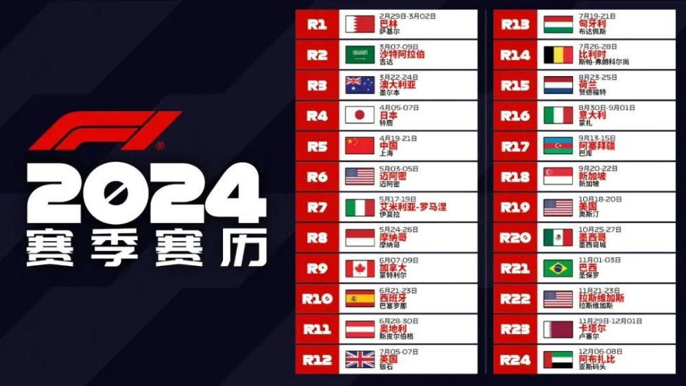
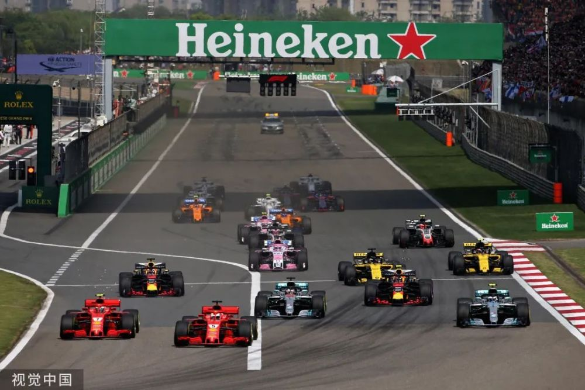
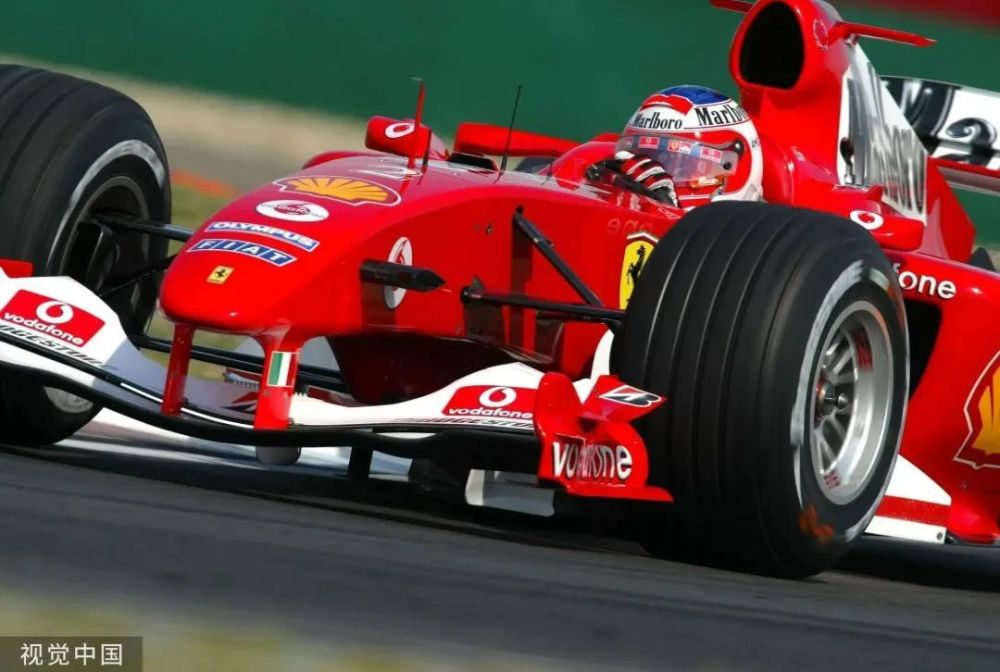
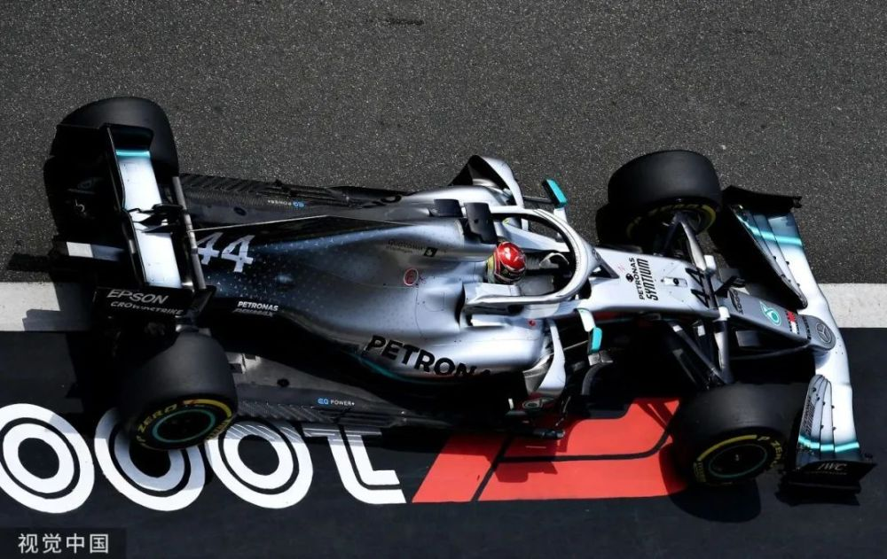
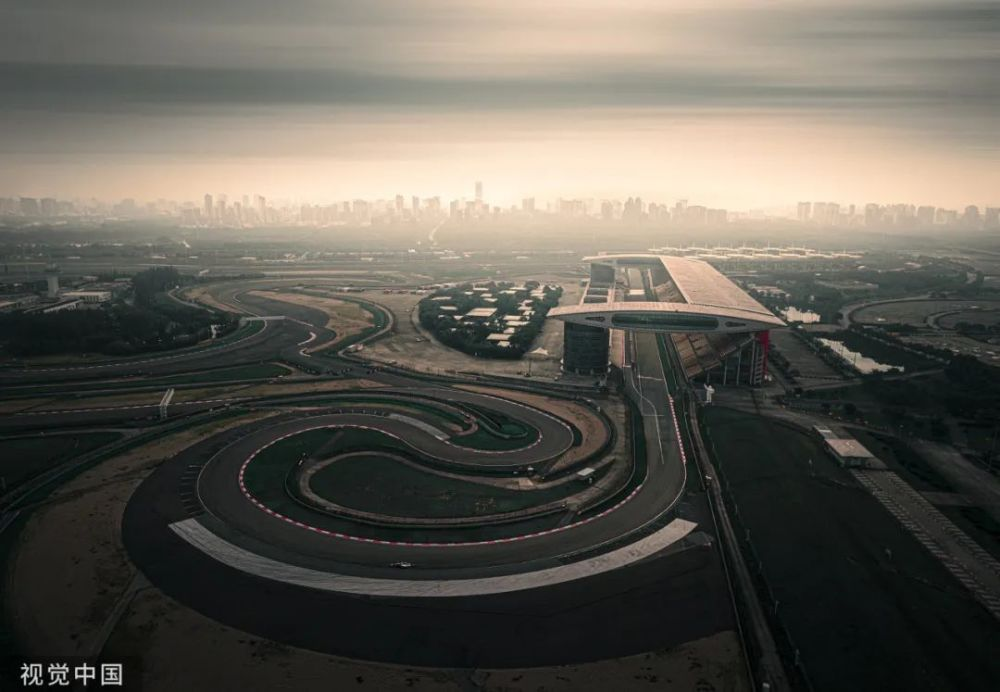

# F1中国站回归！F1官方发布2024年赛历，上海站定于明年4月下旬

7月5日晚间，F1官方公布了2024赛季的初版赛历，中国站赫然在列！

根据目前的初排赛历，相较于本赛季，日本站被挪到了全年的第四站，而阿塞拜疆则是被调整到了新加坡站之前。西班牙站与加拿大站也对换了先后，卡塔尔站则被挪到了倒数第二站。
**中国站则被排在了4月19日至21日。**

2004年9月，F1大奖赛首次在中国举办，正赛当天，14.6万观众涌入上海国际赛车场，见证巴里切罗最终夺冠。

2019年，F1历史第1000场大奖赛落户申城，汉密尔顿在无数车迷的见证下加冕“千站之王”。

而后整整4年，中国站都无缘最终赛历。终于，在2024年，上赛场投入使用二十周年之际中国站将再度回归！就在今年5月份的时候，作为举办地的上海国际赛车场也完成了国际汽联新一轮的一级赛道认证。

而接下去，

**周冠宇，**

**这位中国历史上首位F1正式车手，**

**让我们期待他出现在中国站的正赛舞台。**

