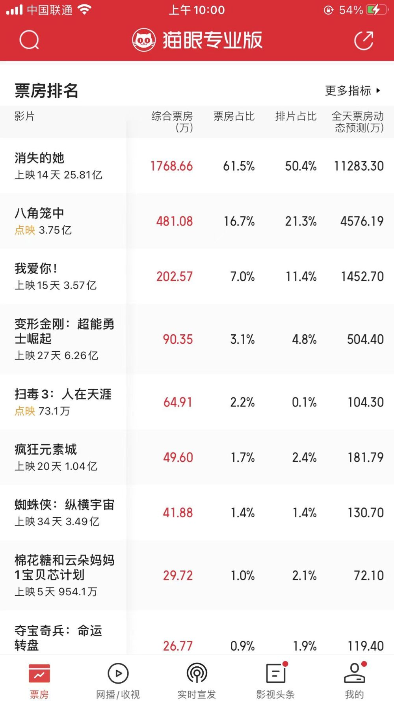

# 《消失的她》大火，陈思诚爆赚上亿？吴京、邓超全分到一杯羹

**文/圈内师老师（资深媒体人、视频博主）**

毫无疑问，《消失的她》正在成为2023年的现象级电影。

按照票务平台预测，该片最终票房将超过34亿。对一部投资成本可能仅1亿多的爱情悬疑片来说，这会是一个相当夸张的成绩。理论上，
**如果票房能达到34亿的预测值，该片各投资出品方的票房分成将会超过11亿元，不仅陈思诚有望爆赚上亿元，吴京、邓超等明星全都分到了一杯羹。**

但和节节高升的票房相比，影片在口碑上却遇到了点小麻烦：影片从豆瓣开分7.5已经掉到了6.5，在微博和B站上，都有不少批评影片太套路的声音，一些资深影迷表示，看到开头就能想到结局了，片子的反转部分“陈思诚味”太浓。

可如果你熟悉陈思诚的作品，对于口碑和票房间的矛盾，就不会感到奇怪了。之前他主导的《唐人街探案3》和《误杀2》，也都是在一片争议声里越卖越好——《消失的她》走红并不是偶然，陈思诚和他旗下的年轻导演们，已经摸索出了一套虽不得专业影迷欢心，却足够挑动市场神经的内容创作套路。

那对中国电影市场来说，这种“陈思诚味太浓”的电影大爆，到底是好是坏？

_陈思诚和他旗下的年轻导演们，已经摸索出了一套足够挑动市场神经的内容创作套路_

**谁在《消失的她》背后掘金**

按照网传的数据，即便算上明星的片酬，《消失的她》制作成本也不会超过1.5亿元。要是影片真的卖到了34亿，出品方到手的分账数大概能有票房的三分之一，除去成本，出品方分到的利润能高达10亿左右。

最大的赢家，肯定是陈思诚。影片的第一出品方壹同是他和父亲陈胜奇全资控股的公司，这类电影的第一出品方，投资占比一般能在15%-40%，再加上父子二人名下另外3家公司也参投了这部电影，
**理论上陈思诚少说能分两三亿，多则能分到四五亿。** 即使只看截止到今日的成绩，按照20%的低占比来算，陈思诚的收益也早就远超亿元。

_截止发稿时《消失的她》累积票房已达25.81亿元_

除了陈思诚相关的4家公司，影片背后另外12家出品方，也算得上星光熠熠：既有淘票票、上影集团、猫眼和珠江影业等电影行业中坚力量和老牌国企，也有明星和行业大佬参与投资的行业新贵——而相比于前者，后面这些公司或许更能反映出电影行业的一些发展趋势。

比如影片的出品方中有家并不出名的公司， **上海人马，但其实这家公司背后站着吴京、邓超等明星。**
上海人马隶属厦门人马文化，而厦门人马文化的股东里，则出现了柠萌影视、北京登峰国际和橙子映像三家影视公司的身影。柠萌影视是国内做都市剧集的龙头企业，《三十而已》《二十不惑》《小欢喜》这些热播剧全都是这家公司出品的。

另外两家公司，来头同样不小：登峰国际是吴京姐弟的全资公司，《战狼2》爆红之后，开始在电影圈崭露头角，因为有吴京这层关系，它这些年陆续投资了《流浪地球》《长津湖》等大片，收获颇丰；橙子映像则是邓超和光线传媒投资成立的公司，因此在《银河补习班》《深海》等光线出品的电影背后经常能看到它的名字。值得一提的是，吴京和邓超，还会互投对方投的电影，比如登峰投了邓超导演的《中国乒乓》，橙子则投了吴京主演的《巨齿鲨2》，现在俩人又一起投资了人马文化，可见私交是相当不错的。

_吴京的登峰国际投了邓超导演的《中国乒乓》，邓超的橙子映像投了吴京主演的《巨齿鲨2》，俩人还一起投了人马文化。_

不过，这些公司会组局投电影，不光是因为私交，应该也和人马的大股东康利有关系。康利此前更知名的身份，是猫眼娱乐的前COO，2020年从猫眼离职前后创办了这家公司。虽说是家新公司，但人马文化光是今年就押中了《保你平安》《人生路不熟》两部热门喜剧。
**从投资风格来看，这是一家专注于容易以小博大的强类型片的公司，未来我们可能会在更多黑马电影身后看到它的名字。**

除了人马，还有一家以投资眼光稳准狠著称的企业也在出品名单里，那就是儒意影业。

儒意影业算是陈思诚的老朋友了，早在2015年《唐人街探案》还不是大IP的时候，儒意影业就投资了这部电影，影片的制片人正是现儒意影业总裁陈祉希。而这家公司10年前就投拍过《老男孩》《小时代》《致青春》等热卖影片，因此严格来说并不算是行业的新锐。很多观众之所以并不太熟悉它，主要是因为之前儒意自己主控的大项目不多，这几年其仍然以参投的形式在参与影片，比如《送你一朵小红花》《你好，李焕英》《独行月球》等热卖电影。

_儒意影业2015年投资了陈思诚的《唐人街探案》，并在过去几年参与过多部热卖电影_

除了能不断押中爆款，儒意还多线开花。其背后的母公司中国儒意，这几年在影游联动上投入颇多，推出了《传奇天下》等游戏；此外，中国儒意旗下公司还是乐华娱乐IPO的基石投资者，因此这家公司算是王一博的幕后老板之一。正因如此，中国儒意过去两年净赚了近20亿，是同期国内最赚钱的娱乐公司之一。

在《消失的她》的出品名单上，“抖音文化”四个字也赫然在列。抖音文化过去4年就参与投资了40多部电影，除了《流浪地球2》这类大制作，它还和上面提到的几家公司一起投资了《保你平安》《热烈》等类型化电影。不过抖音能入局这些电影，主要还是因为短视频在电影宣发当中，扮演的角色越来越重要。

总体来看， **这次《消失的她》背后的出品方中，有不少这些年在电影圈里投资积极且偏爱投中等体量类型片的新势力**
，而它们会选择押宝《消失的她》，一方面和陈思诚在影视行业的影响力与人脉有关系，但一方面，或许更是因为中体量类型片，在中国电影市场越来越吃香，而在这类内容上陈思诚和他的壹同影视已经摸索出了一套很得市场欢心的内容创作模式了。

**陈思诚味太浓，是好是坏？**

和之前上映的《误杀》与《误杀2》一样，《消失的她》并不是陈思诚导演的，但如果你在不知情的情况进入影院，看到影片的叙事节奏、故事反转和影像特点，很难不感叹一句：这太陈思诚了。有人觉得这是陈思诚“翻车”了、做得东西太套路化了，殊不知，这正是陈思诚布局多年的成果。

_《消失的她》虽然不是陈思诚的导演作品，但影片的叙事节奏和影像特点，都是观众很熟悉的陈思诚风格_

崔睿，《消失的她》的导演之一，是一个刚毕业没几年的新人。但翻开他的履历，能看到他还是网剧《唐人街探案之青年侦探团》（待映）的导演，而该剧的编剧和监制都是陈思诚，可以说，崔睿完全就是陈思诚一手栽培出来的。而这样的情况，已经不是个例了。

早在2017年，《唐人街探案2》上映之前，陈思诚就已经在筹划将这个IP做大、做成系列了。但光靠他一个人，显然没法完成如此巨大的工作量，为此他规划了网剧版《唐人街探案》，并开始接洽适合执导网剧的新导演——
**这部网剧，既是做大“唐探宇宙”的开始，也是他挖掘新人的试验场。**

最终，青年导演柯汶利以及陈思诚的表弟戴墨脱颖而出，不仅分别执导了网剧的不同单元，还在项目杀青后先后拿到了两部改编电影的剧本，而那正是后来上映的《误杀》与《误杀2》。
**用自己做出来的成熟IP来让新导演“练手”，再带着他们翻拍类型化悬疑片，陈思诚在培养新人方面已经形成一套成熟模板了。**

功成名就的导演，做自己的公司并培养新导演，这在国内外都不是新鲜事了，之前在国内更出名的是宁浩的坏猴子，成功培养出了文牧野和《我不是药神》。但坏猴子系的电影，还是能看出比较浓烈的作者个人风格，相比之下，壹同系导演的个人风格，则没有那么明显，陈思诚才是其作品最大的标签。

_宁浩的坏猴子影业出品过文牧野《我不是药神》、黄渤《一出好戏》等各具导演风格的影片。相比之下，陈思诚的壹同系，他才是作品最大的标签_

这种“陈思诚味”太浓，究竟是好是坏呢？

如果单把电影看做一种艺术品，这类纯工业化的创作体系，确实会抹杀掉一些作者个性化的内容，和我们所熟知的张艺谋大片、冯氏喜剧这种作者电影截然不同，观众很难感受到导演本身的烙印。而在这么做的并不只有陈思诚，以漫威为代表的好莱坞大片，早就把去导演化，玩转得得心应手了。

但如果着重去看电影的另一个属性，商品属性，陈思诚的套路无疑是成功且成熟的，这一点从票房上就能看得出来。这是因为经历过多部电影的试验后，对于市场喜欢什么，陈思诚已经熟稔于心了，相比之下，作者向电影即使口碑再好，也很难保证每部都能得到市场青睐。

**如果站在电影市场的角度来看，行业对于这类套路化的内容，需求量其实也是在不断变大的。**

早在疫情之前，中国电影市场的观影人次增长，就已经进入了一个瓶颈期，全年票房还在不断增长，主要是因为电影票越来越贵，同时时不时会有几部像《流浪地球》《哪吒之魔童降世》这样的大爆款。但这样的电影，为了实现票房最大化，一般都会在春节、暑期和国庆上映，这导致一年中大部分时间，电影院是没生意可做的，大量银幕资源没有得到充分的利用，电影市场的可能性没有得到完全释放。

大片的拍摄周期长、制作难度高，我们不能指望一年12个月，每个月都有一部《流浪地球》，即使好莱坞也做不到。想要填补那些空白档期，就需要大量票房在三四亿到十几亿之间的类型片。以前，像春节档到暑期档中间，这些冷门时间都是靠好莱坞电影撑起来的。

但现在，好莱坞电影在中国明显卖不动了，口碑不错的《闪电侠》两周才卖了不到两亿，这进一步暴露了中国电影市场冷热不均、缺片子的问题。
**今年如此火爆的春节档后，电影院冷了将近四个月时间，在《消失的她》上映前，只有一部电影票房超过了10亿。**

_好莱坞电影在中国卖不动了，这进一步暴露了中国电影市场冷热不均、缺片子的问题_

这部电影正是前面提到过的、豆瓣评分仅有6.3分的喜剧《人生路不熟》。豆瓣短评里，随处可见对于这部电影套路化的批评，但并不否认，这种电影就是比观影门槛较高的电影更接地气，更适合社畜年轻人在下班之后或者周末约会时，花30块钱图一乐，是真正能打到普通消费者日常生活里的消遣内容。

事实上，这类电影早就不是第一次在票房上出人意料了，前些年就有过《无名之辈》这样的案例。
**中国电影行业要发展，既需要《流浪地球》这样能让人眼前一亮的大制作，也需要《路边野餐》这样有深度的艺术佳作，但能让普通观众把看电影当成一种日常习惯的，还得是像肯德基麦当劳一样的工业化产品。**

这也是为什么，壹同、人马这些近年来涌现的新公司，现在会扎堆来做悬疑、爱情类型片。传统大片成本太高、风险太大，入局门槛太高，更适合中影、博纳这类家底够厚的企业来做，而中间市场的影片不仅操作起来更加容易，同时理论上来说，可挖掘的空间也更加广阔——毕竟，一年有八九个月时间适合这样的影片。

不过需要强调的是，就算《消失的她》真能卖到33亿，这样的成绩也不会是常态， **这个成绩也和最近几个月市场的空白与饥渴有关。**

正常情况下，这个体量的强类型电影，如果市场反响不错，更多应该会和《误杀》系列的成绩相近，在6亿到13亿这个区间，但考虑到这类影片投资一般不会超过2亿，且拍摄周期短，即使只卖了10亿左右，出品方们的利润也能在亿元上下，回报率相当出众了。

况且，类型电影做得够成熟、形成了足够响亮的IP，再去做衍生品等，总吸金能力未必比大片差。

_《消失的她》的出品方之一，光影时代酒店管理公司的大股东是陈思诚的父亲陈胜奇_

在《消失的她》出品名单的最后，可以看到一家做酒店业务的公司，光影时代酒店管理公司。这家公司的股东，是陈思诚的父亲陈胜奇，其名下还有其他餐饮和酒店类的公司。目前暂不清楚，陈家父子布局这些只是单纯的股权投资，还是另有计划。毕竟为很早之前，陈思诚就透露过想做迪士尼那样的企业。向线下业务进军，会不会是他们借助《唐人街探案》等IP，拓展商务版图的信号呢？

实际上，电影圈里有这样野心的，远不止是陈思诚，很多公司都提过要做全产业链布局，但以往总是概念先行，大口号喊了不少，实际上却缺少能撑起构想的好作品。从这个角度看，不管是陈思诚，还是其他做系列类型片的新公司，已经开始实践另一条路子。一旦有一家公司，能率先跑通一鱼多吃的模式，一定会在全行业引发更多的效仿，这对于电影产业的意义，肯定远大于单一影片的成功。

