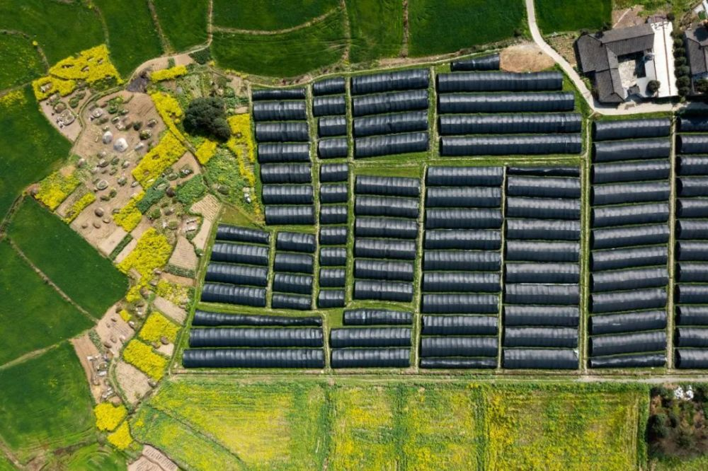

# 一亩羊肚菌“吃”掉千斤麦，富民产业急需节粮技术

*本文为《半月谈》2023年第12期内容

近年来，本生长于高山林地间的羊肚菌逐渐为人熟知。因其市场价格高、管护难度低等优点，多地开始大规模推广人工种植羊肚菌，拉动农民增收。美中不足的是，羊肚菌生长需要大量小麦提供营养。科研人员测算，1亩羊肚菌基本上要“吃”掉1亩地的小麦，有的地方甚至“2亩才能换1亩”。种植规模不断扩大之下，羊肚菌种植节粮技术攻关越显紧迫。

**羊肚菌爱“吃麦”，农民却“无感”**

适逢羊肚菌采摘旺季，半月谈记者在多地农村地区走访，看到不少种植户穿梭于菌垄间，一朵朵破土而出的羊肚菌被小心翼翼地摘下。

一名种植户告诉半月谈记者，他第一年种了13个大棚的羊肚菌，纯收入超过30万元，每亩纯收益至少超过3万元。羊肚菌从种到收约3个半月，只在种、收两头用人工，其余时间管护成本较低，被称为“懒汉菇”，而且可以与其他蔬菜轮作。黎城县一家农产品公司负责人说，公司现有3个生产基地，实行羊肚菌和蔬菜季节轮作，每年盈利超过300万元。

_农民采收羊肚菌
杨文斌 摄_

比较效益高的羊肚菌，却天生有一副“大胃口”。种植户介绍，培植羊肚菌需放置以小麦、麸皮等为主料的营养包，为羊肚菌生长提供外接营养源，“1亩羊肚菌小麦用量在1000斤左右”。

这一数字也得到了中国食用菌协会副会长常明昌的印证。他表示，羊肚菌种植出现了小麦替代技术，但产量不如使用小麦高，为确保收益，种植户普遍用小麦种植羊肚菌。从全国范围内来说，1亩羊肚菌平均耗麦约1000斤。一些农田技术员表示，有的羊肚菌高产试验田每亩小麦用量达到1400多斤，基本相当于当地2亩旱地小麦的产量。半月谈记者了解到，为了方便，种植户普遍使用新麦为羊肚菌提供营养，而非陈麦。

羊肚菌种植技术员李照全说：“目前，一亩羊肚菌纯利润普遍是成本的3至5倍，高利润率导致种植户对耗麦量‘无感’，更不会关心节麦技术。”采访中，一位县委书记表示，县里进行产业帮扶时更多考虑了经济效益，没认真考虑粮食消耗过大的问题。

**市场持续走热，技术攻关遇冷**

羊肚菌富含多种氨基酸，被市场视为高级补品。与其他人工种植的食用菌相比，羊肚菌价格高出不少，鲜菌每斤价格在50元至100多元，干菌每斤价格在600元以上；加上更容易管护、人工成本低等，羊肚菌投入产出比高，增收效果好。

市场优势让羊肚菌产业迅速升温，各地纷纷抢抓先发契机，作为乡村振兴特色产业大力扶持。在中部地区某县，2年时间，羊肚菌种植基地从1个增加到6个，种植面积从十几亩增加到100多亩。当地一位农业干部说，除了联系农科院提供技术支持外，他们正在研究具体补贴政策。由于收益更高，一些传统食用菌种植户也开始自发调整种植结构，不少农民已将香菇大棚改种羊肚菌。

_羊肚菌种植大棚
沈伯韩 摄_

中国乡镇企业协会食用菌产业分会数据显示，2012年全国羊肚菌种植面积仅为1000亩左右，2018年从2万多亩猛增到7万亩；2022年全国羊肚菌种植面积达到34万亩，5年时间增长了数倍。

常明昌预测，6年后全国羊肚菌种植面积会达到100万亩。中国科学院地理科学与资源研究所研究员成升魁说，羊肚菌种植面积持续快速增加，粮食消耗也会同步增加，应尽快加强技术攻关，让羊肚菌种植的小麦用量降下来。

半月谈记者了解到，羊肚菌并不是非“吃”小麦不可，替代技术在部分发达国家已有应用，但我国尚未有明显突破。常明昌说，国内已有以木屑为主的羊肚菌种植技术，但产量较低，种植户不愿用。“目前农业专家关注羊肚菌产业的不多，相关科研立项较少，研究节粮营养袋的人更少。”常明昌说。

**让好产业既富农又省粮**

羊肚菌广受欢迎的同时，相关种植节粮技术的科技攻关却出现滞后，无麦、少麦技术难以改进增产，不被种植户接受。只有羊肚菌少“吃粮”、不“吃粮”，才能兼顾产业增收效果和粮食安全保障，也才具备在全国大规模种植的牢固基础，更广泛地惠及农民群体。受访专家表示，找到一个农民增收效益好的特色产业不容易，应积极帮扶和引导，使其既利当下，更利长远。

一是应尽快加强科研立项，保证资金投入，充分调动农业科研人员积极性，加快羊肚菌无麦、少麦替代技术的攻关改良速度。常明昌说，关键是要进一步加大新型基质开发利用，从菌种生产到营养袋制作，都要减少小麦使用量。

二是通过出台优惠政策、给予资金补贴等方式，引导农业科研机构和龙头企业加大工厂化、标准化、机械化、智能化栽培技术的研发力度，用科技力量助力羊肚菌无麦、少麦技术提高亩产量，进一步降低种植成本，增强新技术的吸引力。

三是各地政府部门主动提高服务水平和对接新技术的能力，积极帮助羊肚菌种植技术新成果尽快落地转化、推广，尤其是要加强新种植技术的本地适应性研究，并引导种植户优先使用陈麦，促进羊肚菌产业健康有序发展。山西农业大学功能食品研究院研究员凌亮认为，有关部门要向广大农民做好科普宣传，羊肚菌对气候、温度等都有较高要求，要结合本地区实际情况综合考量，引导农民理性种植。

半月谈记者：吕梦琦 李紫薇 赵阳 唐诗凝

编辑：孙文豪

责编：秦黛新 / 校对：郭艳慧

