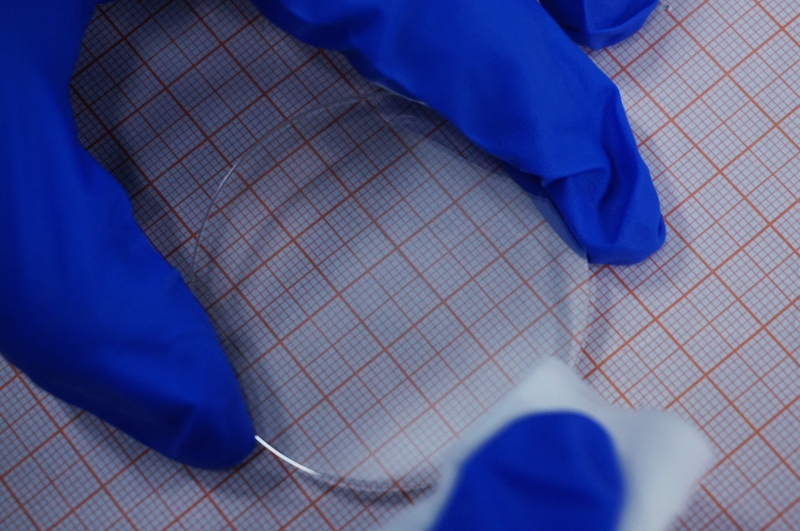

# 中国对镓锗相关物项实施出口管制，多国企业准备申请镓锗出口许可

【环球时报综合报道】中国商务部和海关总署3日宣布从8月1日起对镓、锗相关物项实施出口管制后不久，已有多国企业准备申请出口许可，或联系中国供应商尽快囤货。

_2022年5月30日，在位于杭州市萧山区浙江大学杭州国际科创中心拍摄到的直径2英寸（50.8 mm）的氧化镓晶圆。（IC photo）_

路透社4日报道称，总部位于美国加州的AXT公司表示，其中国子公司北京通美晶体技术公司将立即着手准备采购镓和锗的申请材料。AXT首席执行官莫里斯·扬表示：“我们正在积极寻求必要的许可，并努力将客户可能受到的干扰降至最低。”AXT在声明中称，今年第一季度，从中国出口的砷化镓和锗基板，给该公司带来了约430万美元的收入，这些产品主要用于消费、汽车、显示器和工业应用。此外，一家中国锗生产商的经理对路透社表示，其所在的公司已收到来自欧洲、日本和美国买家的询问，希望在出口管制生效前囤积产品。

据外媒报道，作为两种金属的主要进口国，日本、韩国政府均对中国的出口管制做出反应。据俄罗斯卫星通讯社报道，在4日的记者会上，日本经济产业大臣西村康稔表示，不认为中国此举是针对日本采取的应对措施。日本将在确认中国措施意图的基础上，观察对日本的影响并采取对应措施。据韩联社4日报道，韩国产业通商资源部产业政策室室长朱泳俊当天表示，预计中国的管制措施对供需格局带来的短期影响将有限，但有关措施将持续多久尚不明确且限制出口品目或进一步扩大，政府将严密检查相关动向，迅速采取应对措施。

另据中时电子报报道，台当局经济部门负责人王美花4日表示，大陆对镓、锗实施出口管制，“短期内影响不大”，但长期对价格与供应是否有影响，该部门会密切注意。

4日，在中国外交部例行记者会上，有记者提问称，有人说中国对镓和锗的出口管制是对美日荷半导体设备出口管制的反击，发言人是否同意？中国外交部发言人毛宁表示，中国政府依法对相关物项实施出口管制，是国际通行做法，不针对任何特定国家。（甄
翔）

