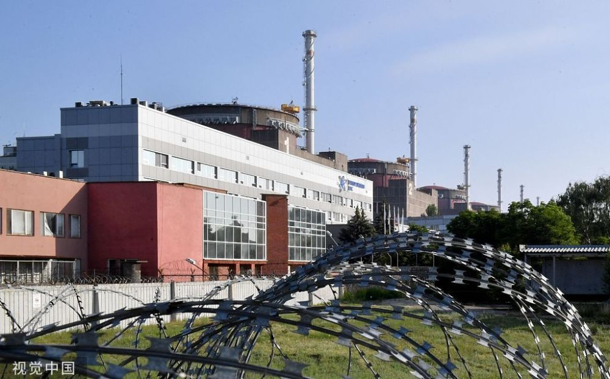

# 俄乌互指对方将攻击扎波罗热核电站，国际原子能机构：情况脆弱且危险

_当地时间2023年6月15日，扎波罗热地区，扎波罗热核电站。
视觉中国 图_

7月5日，乌克兰总统泽连斯基与俄罗斯国家原子能电力公司（Rosenergoatom）分别发出警告，称对方国家正准备对扎波罗热核电站发起攻击。扎波罗热核电站再次成为双方相互指责和利用的焦点，并引发国际社会的担忧。对此，国际原子能机构（IAEA）总干事格罗西表示，当前核电站情况“极其脆弱和危险”。

**扎波罗热核电站再度引发俄乌相互指责与猜疑**

据路透社7月5日报道，泽连斯基当日在其社交平台Telegram上的一条视频中援引情报机构消息称，俄罗斯在扎波罗热核电站动力装置的屋顶上放置了“类似爆炸物”的物品。泽连斯基表示，俄罗斯“要么是为了模拟对核电站的攻击，要么是有一些其他的设想”，一旦炸药被引爆，反应堆不会受到损害，但会造成一种此次攻击是由乌方发起的假象，而乌军已做好“随时采取行动的准备”。

泽连斯基另外在推特上发表声明称，他在一次电话交谈中告诉法国总统马克龙，俄罗斯正准备在扎波罗热核电站进行“危险的挑衅”。同时，他和马克龙已同意与国际原子能机构一起“对局势保持最大限度的控制”。

此外，当地时间7月4日晚，乌克兰卫生部还在社交媒体发布了核事故应对指南，提醒潜在辐射事故区民众做好可能撤离的准备，如接到乌当局撤离建议，应随身携带好证件、食物、水、急救药品等必要物品。

俄罗斯方面同样声称乌克兰将对扎波罗热核电站发起攻击。据塔斯社报道，俄罗斯国家原子能电力公司首席执行官顾问雷纳特·卡恰（Renat
Karchaa）7月4日在俄罗斯国家电视台24频道节目中表示，乌克兰武装部队将在7月5日晚间试图使用高精度远程武器和“神风”无人机攻击扎波罗热核电站，其所使用的弹药可能装载有7月3日从南乌克兰核电站取出的放射性废物。

卡恰强调：“如果不阻止这种疯狂的行为，将会发生巨大的灾难。”

近日，俄乌双方已多次因扎波罗热核电站对彼此进行指责。据美国政治新闻网站POLITICAL
7月3日报道，乌克兰情报部门称，一支俄罗斯军事特遣队以及由俄罗斯支持的核电站工人正在逐渐离开该工厂，而留在核电站的人员被指示“在出现任何紧急情况时指责乌克兰”。俄外交部发言人扎哈罗娃则在一份声明中表示，乌克兰官员在几个城市进行了放射安全事件演习，并设置了额外的辐射测量设备，这意味着“基辅正在准备开展‘假旗’行动”。

目前，俄乌双方均未提供证据以证明其指责的真实性。

**国际原子能机构总干事警告：核电站“极其脆弱和危险”**

扎波罗热核电站是欧洲最大的核电站。2022年2月俄乌冲突爆发后不久，俄罗斯宣布控制该核电站。2022年9月11日，该核电站全面中断运作。一年多来，俄乌双方不断指责对方炮击扎波罗热核电站及其周边地区，置民众安危与国际安全于不顾。6月6日卡霍夫卡大坝爆炸后，扎波罗热核电站安全问题再度成为关注焦点，国际原子能机构代表及专家随即前往核电站视察，此后开始长期驻留并定期进行专家轮换。

据塔斯社7月4日报道，国际原子能机构总干事格罗西当日表示，该机构代表将继续留在扎波罗热核电站。格罗西回应乌方关于核电站员工被命令撤离的声明称：“我们哪里也不去，我们就在那里。”他强调，国际原子能机构每天都会从其在当地的代表那里了解核电站情况。

此外，格罗西重申，国际原子能机构认为扎波罗热核电站情况“极其脆弱和危险”。他说：“一直以来我都有一个明确的立场——核电站绝不能被攻击，核电站绝不能被用作军事基地。国际原子能机构知道应如何防止核事故，我们也希望所有负有责任的人都能采取相应行动，避免灾难性核事故发生。”

路透社报道称，自俄罗斯控制扎波罗热核电站以来，格罗西已三次赴核电站视察，希望确保核电站的非军事化，降低核事故风险，但目前尚未就此达成任何协议。

但是对于国际原子能机构做出的工作，乌克兰总统泽连斯基的高级顾问米哈伊洛·波多利亚克（Mykhailo
Podolyak）认为，格罗西未能有效维护核电站安全，并指责国际原子能机构在处理该问题时态度摇摆。“如果（格罗西）从一开始就态度坚定的话，扎波罗热的任何灾难都可以避免。”波多利亚克说，“这个人（格罗西）现在的行为像是一个小丑。当灾难真的发生时，他会说他们与此无关，而且已经警告过可能发生危险。”

俄罗斯方面并没有过多质疑国际原子能机构，据今日俄罗斯电视台（RT）6月24日报道，
俄罗斯国家原子能集团公司（Rosatom）总经理阿列克谢·利哈乔夫（Alexey
Likhachev）在23日与格罗西会晤时表示，俄罗斯希望国际原子能机构采取具体措施以防止对扎波罗热核电站的攻击。

另据乌克兰媒体当地时间7月4日报道，乌克兰国家核能公司（Energoatom）当天发布消息称，扎波罗热核电站750千伏主外部输电线路于当日凌晨1时21分断电。此后，扎波罗热核电站不得不切换到唯一可用的330千伏备用输电线路。

