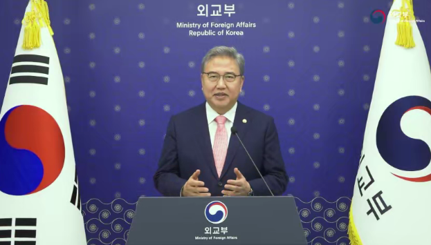
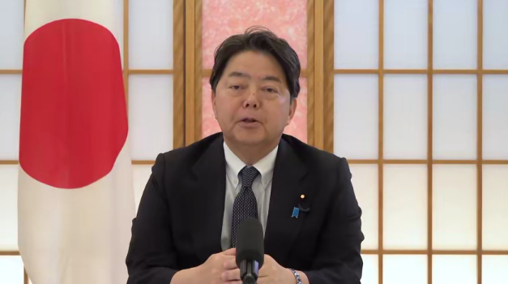
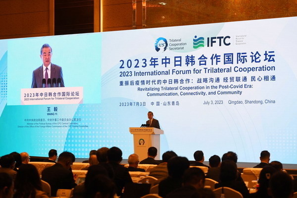
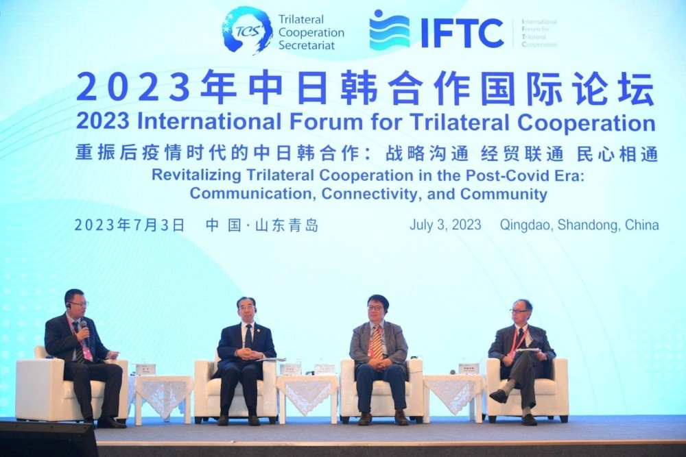
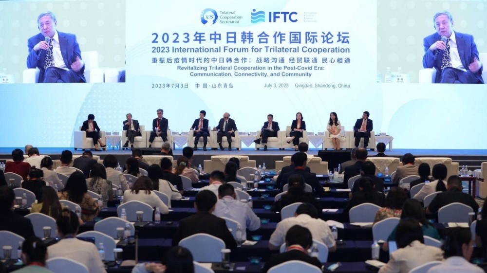
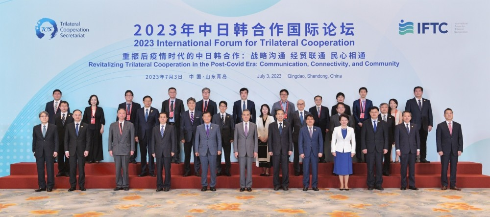

# 关于“中国总在会上提台湾问题”，中日嘉宾现场交锋

【文/观察者网 童黎】

“朝鲜半岛和中国非常近，据说当孔子的故乡——山东半岛的公鸡鸣叫时，在黄海道的熊津或忠清道的唐津都能听到。韩国企业家乘坐早上的航班来青岛，再乘坐下午的航班返回首尔吃晚饭。”

“韩国和日本也非常近，天气晴朗时，可以从釜山附近的海面看到对马岛。周末，许多年轻的韩国人去东京或大阪进行乌冬面和拉面之行。”

7月3日，主题为“重振后疫情时代的中日韩合作：战略沟通 经贸联通
民心相通”的2023年中日韩合作国际论坛在青岛举行，现场韩国嘉宾这样描述了“一衣带水”的中日韩三国关系。

这是中日韩合作国际论坛自2020年以来首次线下举办。山东与日韩隔海相望，吸引了5900多家日韩企业投资兴业，是本次论坛举办地的不二选择。

_去年12月，山东省赴韩国经贸促进团从青岛胶东国际机场出发，另有24家企业代表从这里飞往日本。图自半岛都市报_

在当前“微妙”的中日韩关系下，三国嘉宾畅谈中日韩合作、如何扫除“排外民族主义的幽灵”、“亚洲的事情一定要亚洲人自己来解决”、媒体责任等话题，以及中日韩共同面临的问题——人口老龄化。

关于曾经有日本参会者说“中国总不能在会上老提台湾问题吧？老生常谈”，中日嘉宾也在现场交换了意见。

中共中央政治局委员、中央外办主任王毅出席论坛开幕式并致辞，强调要通过此次论坛，在青岛发出中日韩合作重整行装再出发的明确信号。

**“‘排外民族主义’的幽灵在心中盘旋，我们现在必须扫除它”**

中日韩位于欧亚大陆的东端，领土约占地球陆地的7%，人口总和达到全世界的20%，国内生产总值之和占世界经济的25%，比整个欧洲还要多……三国合作对亚洲乃至世界繁荣发展具有重要意义。

本次论坛由中日韩合作秘书处、中国公共外交协会和青岛市人民政府共同举办，并围绕“公共外交与大众传播：中日韩相互认知”、“从排斥到包容：与数字化世界接轨”、“提升中日韩相互认知：以地方和社区交流为视角”举行三场分论坛，来自中日韩三国的专家学者、媒体代表等出席论坛。

观察者网注意到，韩国外交部长朴振在开幕式致辞中，多次引用中日韩三国的“老话”。

**他说，日本有句谚语，“三个人聚在一起，就有了文殊菩萨的智慧”。中国大文豪鲁迅在短篇小说《故乡》中写道：“其实地上本没有路，走的人多了，也便成了路”。韩日中三国有一个共同的术语，“转祸为福”。**

他期待从论坛中看到许多创造性的想法，以加强三国之间在全球挑战方面的合作。

韩国前国会议长、云耕财团理事长姜昌熙描述了中日韩的紧密关系，同时表示“好事多磨”，“中国国家实力的崛起，引发了与美国的竞争和冲突，以及三年席卷全球的疫情，使得我们三国之间的交流与合作萎缩。正所谓‘离久情疏’，如今中日韩国民互相认为对方是最讨厌的人。”

“‘排外民族主义’的幽灵在我们心中盘旋，我们现在必须要扫除它。”他呼吁通过高层的面对面交流来增进理解，促进三国民众求同存异。

日本外务大臣林芳正表示，自1999年在日本前首相小渊惠三的倡议下开始日中韩合作以来，三国合作在经济、环境、体育、青少年交流等领域得到全面发展。“即使在疫情期间，我们也充分利用线上线下混合形式，在各个领域和层面进行协商和合作。”

他认为，中日韩三国对确保东亚地区的和平与繁荣负有共同责任。

中共中央政治局委员、中央外办主任王毅表示，20多年来，三国合作从无到有、从小到大，逐步成长为亚洲最具影响力的次区域合作机制，为三国和亚洲的现代化发展提供了重要动力。

近年来，个别域外大国为了谋求地缘私利，刻意渲染意识形态差异，大肆编织各种排他性小圈子，试图以对抗取代合作、以分裂取代团结。

王毅强调，亚洲是我们的共同家园。站在时代的十字路口，中日韩三方应当坚定维护三国合作的正确方向，
**坚持独立自主，团结自强，不受霸凌霸道的胁迫，把本国和本地区的命运牢牢把握在自己手中。**

**“中日韩把对方看作是朋友，还是敌人？”**

从开幕式看，现场嘉宾都认为，三国国民之间的关系亟需“呵护”。

在第一场分论坛上，三国的外交官、媒体、智库专家，共同探讨“公共外交”和“大众传播”如何影响三国民众相互认知。

日本中曾根和平研究所国际事务顾问、前驻美大使藤崎一郎用“微妙”一词来形容中日韩关系，并表示日方要教育年轻一代，让他们牢记历史。

但他同时称，“如果你光是关注历史的话，有可能会造成消极的认知和心态。中日韩三国都有责任改进自己的工作，三个国家的媒体工作者也有责任改进自己的工作，而日本媒体工作者尤其如此，不要光去谈中韩联合反日的‘可能’情绪。”

藤崎一郎着重呼吁“求同存异”，他试图以台湾问题和日本核废水排放大海为例称，“如果过度强调这两个问题的话，我觉得其实不太适合放到中日韩合作国际论坛上来谈，因为我们这样的非政府合作论坛并没有办法去解决这些问题。我们应该更多地关注中日韩之间的共同利益，要对下一代的中国人、韩国人、日本人做工作，帮助三国尽快实现关系正常化。”

但对于这种观点，第一个作分论坛发言的中国公共外交协会会长吴海龙，已经在现场给出了不同看法。

他坦率表示，对于当前中日韩关系，“任何一个关心和希望三国友好的人都忧心忡忡，深感焦虑和不安”。这种情况下，能在青岛召开一场中日韩论坛是非常不容易的，也是非常必要的。

**“中日韩把对方看作是伙伴，还是对手？是朋友，还是敌人？是机遇，还是挑战？”吴海龙提出，想要提高三国民众的认知度，“怎么看待对方”的问题至关重要,如果一国与另一国发展关系，以针对第三方为目的，以邻为壑，与邻为恶，那大家就都没有好日子过了。**

他回忆，日本的一个参会者曾经说，“中国总不能在会上老提台湾问题吧？老生常谈。”

“我不知道他是不了解台湾问题对中国的重要性，还是想故意回避这个问题。台湾问题是中国的核心利益，不管是日本还是韩国，只有坚定不移地奉行‘一个中国’的原则，尊重中国的主权和领土完整，双边关系才能走稳走顺。”

这两年日韩在台湾问题上的态度都发生了一些变化，如果不能正确地认识和妥善处理好与中方关系中的涉台问题，双边关系不但不会改善，还会出现倒退甚至进一步恶化，
**“这也是我一而再、再而三在各种会议上强调这个问题的理由”。**

吴海龙希望，中日韩三国都能把对方看作是合作伙伴，看作是朋友，都能把对方的发展看作是自己的机遇，都可以相互成就、互利共赢。

**“亚洲的事情一定要亚洲人自己来解决。”**
中国人民大学重阳金融研究院执行院长王文也在现场呼吁，突破来自域外国家的干预，在台湾问题上慎重发声。中日韩有共同的历史和文明，在欧洲、美洲，他们很难认出咱们谁是中国人、韩国人、日本人。我们真要想一想，这么好的历史和文化基础，为什么就不能把合作搞得更好呢？

相反的，在当今的智能科技下，尤其是像ChatGPT出来以后，中日韩三国都面临着来自西方的巨大挑战。

王文发现，中日韩三国的形象，都受到了基于英文的ChatGPT误解。

“你问它韩国是什么？它给你搜到更多的是泡菜。你说日本是什么？搜到更多的可能就是核污水。英语世界并没有客观地反映中国、日本、韩国的基本形象，这时候中日韩更加需要团结。”

**“我们日中韩三个国家，在老龄化领域不可能不引领世界”**

“年轮”一路滚到2023年，人口老龄化渐渐成为中日韩三国的共同挑战。亚太地区拥有全球最大的老龄化人口，占到全球老龄人口的60%。

前一天的晚宴上，日本国际协力机构人类发展部高级主任驹泽大佐在跟山东经济发展相关部门官员聊天时，提到徐福称，后者就是为了寻找长生不老之药到日本去的，恰巧从青岛出发。（观察者网注：徐福东渡，最早见于司马迁的《史记》，是指秦始皇时期派遣徐福出海采仙药，一去不返的事件。）

对于老龄化，他提出了积极看法。“大家可能认为老龄化是一个问题，但也是人类的一种成功，我们已经进入了长寿的时代。”

**“而且中国是老龄化人口最多的国家，日本是老龄化率最高的国家，韩国是出生率最低的国家。像我们这样三个国家，在这个领域不可能不引领世界。”**
日本嘉宾建议，必须要构建一个由中日韩三国引领的老龄化健康世界，携手为老年人提供更好的环境。

_分论坛二“从排斥到包容：与数字化世界接轨”现场_

2022年，中国人口形势发生转折，出现自1962年以来（近61年来）正常发展状态下的首次人口负增长。

据日本共同社7月5日最新报道，日本厚生劳动省4日公布了2022年国民生活基础调查结果，有儿童（未满18岁未婚者）的家庭数为991.7万户，首次低于1000万户。在所有家庭的占比也比2019年的上轮大规模调查下降3.4个百分点至18.3%，创历史新低。数据再度反映出少子化的加速。“老人护理老人”比例创历史新高，达到63.5%。

在少子化问题的严重影响下，韩国的老年人口也呈几何式增长，预计2025年达到超老龄社会。

韩国嘉宾介绍，因为相比其他国家，韩国的年金保障制度起步较晚，所以老年贫困率仍然处于比较高的水平。目前，韩国60%以上的老年人希望进行就业，韩国政府也希望能够给他们提供相关支持，使老年人活跃地参与到经济社会当中。

而对一部分老年人来说，现代科技的发展，反而给他们融入社会制造了门槛。

“我的婆婆90多岁了，我很难说服她使用智能手机，她还是在用老年机，没有办法接受新的技术。”韩国科学技术院科学技术政策大学院院长崔文祯“现身说法”道。

日本的研究则显示，老年人口社会地位越高，受教育程度越高，他们使用网络的频率就会越高，社会参与度就越高，死亡率就越低。

_2021年1月，特别养护老人院的工作人员正给入住者（左）的手消毒。_

“数字鸿沟”成为本场分论坛的关键词汇。

因为发展得太快，老年人口有可能被抛离在这样的技术变迁之外，产生老年人口和整个社会变迁的数字鸿沟。

老年人有没有智能设备，能不能获得智能服务？老年人会不会使用现代科学技术？老年人有可能既有智能设备，也会用，但是并不使用这些数字服务，正如同老年人可能会打车，但是没有打车的需求。中国复旦大学社会发展与公共政策学院教授任远指出，这些都是数字鸿沟的表现。

他在现场强调了一个本质问题：技术应该服务于老年人口，服务于社会，而不是让老年人口被技术所控制。

所以，一方面要发展数字技术，对于不会使用数字设备的老年人口，也应该提供一个窗口和通道，特别是乘公共汽车、医疗服务等最基本的社会服务，通过慢慢的技术进步，逐步达到未来社会的图景。

“老话说的好，往者不可谏，来者犹可追。”闭幕式上，中日韩合作秘书处秘书长欧渤芊呼吁大家一起拿出具体的行动，来提升三国人民的福利，来捍卫地区的和平和稳定，来为全人类创造一个更加美好的未来！

_合影_

