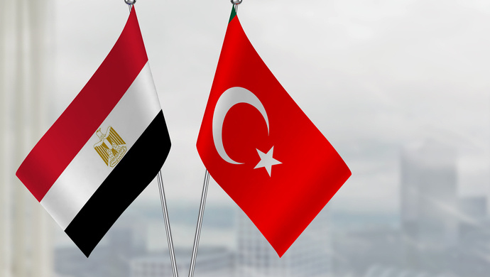

# 反目十年后埃及与土耳其重新互派大使，分析人士：中东和解潮成催化剂

当地时间7月4日，埃及与土耳其宣布恢复两国外交关系至大使级并互派大使。这是自近十年前双方互相驱逐大使以来，两国外交关系迈向正常化的重要一步。分析认为，土埃恢复大使级外交关系，发生在中东多国走向和解的大背景下，可谓水到渠成。尽管这两个地区大国在热点问题上仍存在难以调和的矛盾和分歧，但并不影响双方关系的缓和势头。

**没有分开的奢侈**

当地时间7月4日，土耳其政府同埃及政府发表联合声明称，土耳其和埃及已将两国外交关系恢复到大使级，并已任命派驻对方国家的大使。

声明称，此举意味着双方外交关系恢复正常，反映出两国均出于人民利益考虑，推动双边关系发展。

土耳其新任外交部长菲丹表示，互派大使意味着两国关系正常化已迈入“重要阶段”。他表示，土耳其和埃及是两个“兄弟般的强大国家”，由于历史、地理、文化、战略和宗教方面的关系，两国没有“分开的奢侈”。

十年前，土耳其与埃及关系曾一度跌入低谷。

2013年，埃及现任总统塞西领导的埃及军方将时任总统穆罕默德·穆尔西解职。由于土耳其执政党同穆尔西所属的埃及穆斯林兄弟会关系紧密，土耳其总统埃尔多安多次声援穆尔西，两国关系也因此恶化。

同年11月，埃及驱逐土耳其大使并将两国外交关系降至代办级，土耳其也采取对等举措。此后，两国在利比亚内战和东地中海油气开发等议题上也分歧严重。

但自2020年以来，随着土耳其方面频频伸出橄榄枝，尝试修复与周边国家的关系，土埃两国关系也出现解冻迹象。

2021年起，土耳其与埃及开启高级别外交官员磋商，此后双方互动增多。

在2022年11月举行的卡塔尔足球世界杯开幕式期间，埃尔多安同塞西首次“同框”，并且历史性握手，同意加速和解对话。这消除了两国在领导人层面恢复沟通的一大障碍。

今年2月，土耳其与叙利亚交界地带发生强烈地震后，埃及也借赈灾之机表达善意，再次给两国外交创造空间。不仅塞西第一时间致电埃尔多安表达哀悼，埃及外交部长舒凯里2月27日也访问叙利亚和土耳其，这一级别访问为近十年来首次。

3月，土耳其时任外长恰武什奥卢回访埃及，讨论两国恢复双边关系的步骤。5月29日,塞西与埃尔多安同意尽快提升两国外交关系并互派大使。

**背后有何“催化剂”？**

从关系降至冰点到再次互派大使，土耳其和埃及花了十年。是什么推动两国关系恢复正常？双方又各自有哪些考量？

分析人士指出，土埃外交关系恢复正常，发生在中东和解潮的大背景下。

今年以来，多个中东国家走向和解：沙特阿拉伯与伊朗恢复外交关系，叙利亚回归阿拉伯国家联盟，卡塔尔和巴林恢复外交关系，阿联酋和卡塔尔恢复驻对方外交代表机构……

半岛电视台称，过去让土埃危机复杂化的地区环境，如今已成为两国关系和解的“催化剂”。

“土埃恢复大使级外交关系，可以说是顺理成章。这也是埃尔多安进入新任期以来，土耳其对中东地区外交路线的体现。”
**上海社会科学院历史研究所所长、上海大学土耳其研究中心主任郭长刚** 说。

过去，由于土耳其的政治理念以及“阿拉伯之春”以来对穆兄会的支持，土耳其与周边国家关系紧张。当时，土耳其前外交部长达武特奥卢提出的“邻国零问题”甚至被戏称为“零国零问题”。

但郭长刚指出，近年来，随着土耳其外交转向，致力于与周边国家修复关系，其与沙特、阿联酋、以色列、叙利亚等国的关系都开始缓和，与埃及恢复关系也处在这一背景之下。此外，土耳其近年来致力于在撒哈拉沙漠以北的阿拉伯世界拓展影响力，土埃和解也将对此有所裨益。

**复旦大学中东研究中心研究员邹志强**
也认为，从2021年土耳其开始与周边国家缓和关系，到现在土埃两国外交关系恢复正常，可以说是水到渠成。在中东地区缓和潮的大背景下，地区国家战略自主性增强，已意识到阵营化的对抗不利于国家利益。

此外，分析也指出，埃及和土耳其都有提升两国关系的强烈意愿。

近年来，土耳其受内外多重因素影响，经济面临困难，失业率高企，通胀严重。

郭长刚认为，土埃和解中的经济因素不容忽视。对于埃尔多安而言，他需要兑现竞选时的承诺，改善土耳其的就业和通胀问题。土耳其急需为产品寻找更大市场，有着一亿多人口的埃及是土耳其极为看重的市场。

郭长刚指出，此前，尽管土埃外交裂痕犹存，但两国仍保持强有力的经贸关系。2022年，土耳其与埃及双边贸易额已增至77亿美元。埃及对土耳其的出口额达到创纪录的40亿美元，比前一年增长32%，土耳其则成为埃及天然气最大进口国。

邹志强也认为，受经济、国际环境等内外因素挑战，土耳其希望通过与周边国家合作，塑造一个更为有利、积极的外部环境，吸引更多投资，扩大对外贸易，并获取务实的利益。

从埃及角度而言，邹志强表示，2021年以来，土耳其已对穆兄会成员和团体在其领土上的活动加以限制，满足了埃及方面的要求。此外，埃及与周边国家关系在很大程度上受到沙特影响，随着沙特与土耳其、伊朗关系的改善，这方面障碍也已不复存在。

郭长刚也认为，埃及要想在阿拉伯世界维持大国地位并发挥重要影响力，需要与土耳其、沙特等国维持良好关系。尤其在土耳其与其他阿拉伯国家修复关系之际，埃及也不会游离在外。

**和解将形成合力？**

埃及与土耳其外交关系正常化，为中东地区和解潮又添新浪花。不过，分析人士也指出，由于土耳其与埃及在诸多热点问题上存在分歧，未来两国关系仍可能面临挑战。

邹志强认为，相比土耳其与沙特、阿联酋、以色列的关系缓和，土埃关系缓和进展最慢，这体现出双方政治互信仍较低、戒心较重。具体来看，双方在利比亚问题和东地中海油气资源开发等方面的分歧仍在持续，因为牵涉多方利益，至今无法达成政治解决方案。此外，土埃在巴勒斯坦、叙利亚等问题上的立场也存在微妙差异。

不过，邹志强认为，尽管双方在地区热点问题上仍存在难以调和的矛盾和分歧，但并不影响双方关系的缓和势头。

郭长刚则认为，近年来在与周边国家修复关系时，土耳其方面都扮演了更为主动的角色，与各方关系的改善也都以土耳其的适当克制为前提。因此，只要土耳其在利比亚、东地中海油气开发等问题上不采取激进措施，与埃及的矛盾预计不会再度尖锐激化。

不仅土埃和解可能面临挑战，由于地区不安定因素犹存，中东和解潮也可能出现波折。

7月3日，以色列国防军对约旦河西岸北部杰宁地区发起20年来“最大规模”军事行动，再次提醒人们约旦河西岸局势的不稳定和不可预测。7月4日，也门政府军也与胡塞武装在也门西南部塔伊兹省发生激烈交火，这表明出现积极进展的也门和平进程也出现反复。

对此，郭长刚认为，中东地区的一些长期矛盾无法在短期内消解，几十年来的争斗也无法突然回归平静。不过，和解潮的趋势已经出现，谋求发展与合作、加强战略自主也已成为地区国家共识。

邹志强也表示，地区热点问题并非近期存在，而是长期形成。因此，无论地区大国的关系是起是落，这些问题都难以很快得到解决。在部分学者看来，地区和解潮能否持续、会否被逆转，仍存在不确定性。

不过，邹志强指出，在地区大范围和解潮中，土埃等双边关系的缓和预计将形成合力，对利比亚、巴勒斯坦问题等地区热点问题的降温以及和谈的推进起到积极作用。这让各方得以坐在谈判桌前，提出诉求和解决方案，而不是“针尖对麦芒”，以武力解决问题。

