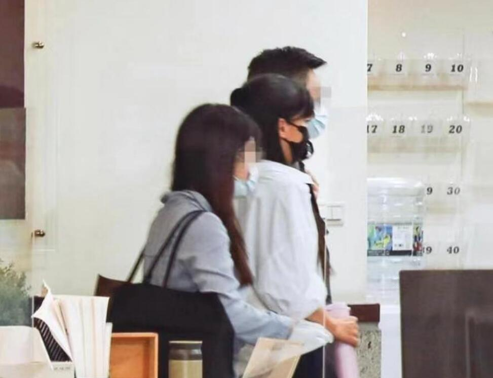

# 王力宏李靓蕾再次同框出席家事法庭，台媒：纽约法院已判离婚获准

据台媒报道，6月28日李靓蕾王力宏在再次同框出席家事法庭，又一次公开同台，此前，两人在网络上通过律师发表声明驳斥对方言论隔空交锋，可见关系依旧没有缓和的迹象。

台媒称目前，两人在美国的一部分官司已经告一段落，纽约法院已经判定离婚获准，以及强制执行过去裁定。

还称，美国法律规定，由于王力宏是起诉离婚的原告，所以对方诉讼费用需要他来支付，这笔费用超过新台币百万元（人民币20万左右）。

报道称，6月28日早上10点50分左右，王力宏乘坐白色保姆车抵达法庭门口，与律师及工作人员同行走进法庭。

在下车时，王力宏见到媒体表情显得惊讶，在走入法庭时，甚至还时不时回头看。不知道是否因为许久未见媒体，所以内心有些紧张。

而李靓蕾在王力宏进入法庭之后抵达法庭，面对台媒拍摄，台媒称她眼神有些许怒气，还即刻背对镜头，不想被媒体拍到正脸。

李靓蕾身边的律师也将她护在中间，快步走进法庭。

庭审大约过了1个多小时后结束，王力宏与工作人员走出法庭，被媒体询问“两人是否已有共识？”他很礼貌的简单回答了“谢谢”二字，之后向媒体挥手告别。

王力宏很有素质，上车后主动帮助工作人员调整座位，之后还拉起座椅，等到工作人员就坐后，他又把座椅调整回原位，方便律师上车。

保姆车准备启动开走时，他也不忘再次向媒体挥手示意，显得亲和力十足，很是礼貌。

而李靓蕾依旧是全程一言不发，选择继续保持沉默。

今年2月份，王力宏终于顺利复出，在美国拉斯维加斯举行了演唱会，并且还为孩子们写了新歌。

但却遭到李靓蕾隔空发文暗讽，称“不要再消费孩子、摘下面具很难吗”，还强调一直有再看王力宏的动向。

王力宏尽管因为离婚风波遭遇了事业低谷，但是却人气不减，演唱会依旧场场爆满。而李靓蕾也不甘落后。

在社交平台开设了自己的播客，传递女性正能量，并且还在内容中讲述了自己在离婚时低谷的心情。

李靓蕾与王力宏在6月7日时，已经在中国台湾法院首度正面交锋，现在第二次开庭，也不知道具体两人在法庭上面对面的情况如何。

不过，希望两人为了孩子们的快乐成长多多考虑一点，能够和平解决的问题就和平解决，不要再互相伤害对方了。

李靓蕾在个人播客中表示自己在美国的官司中胜诉，但王力宏的律师又来却反驳称，是她自己幻想的胜诉。

而对此李靓蕾也没有再回应，但愿他们的官司能够得到双方都满意的结果。

